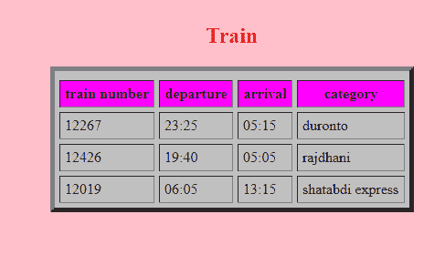

# 使用表格标签及其属性设计表格

> 原文:[https://www . geesforgeks . org/design-a-table-use-table-tag-and-its-attributes/](https://www.geeksforgeeks.org/design-a-table-using-table-tag-and-its-attributes/)

在本文中，我们将使用 HTML 创建一个表。要创建这个表，我们必须知道创建表所需的标签。首先，我们将创建表的结构，并使用属性来设计表。

**方法:**要创建表格，我们必须使用<表格>标签，并且我们将使用<表格>标签的属性来设计表格。我们用来设计表格的属性有:[单元格间距](https://www.geeksforgeeks.org/html-table-cellspacing-attribute/)、[单元格填充](https://www.geeksforgeeks.org/html-table-cellpadding-attribute/)、[边框](https://www.geeksforgeeks.org/css-borders/)、bg 颜色等。

**示例:**

```html
<!DOCTYPE html>
<html>

<body bgcolor="pink">
    <table bgcolor="silver" align="center" 
        border="5" cellspacing="5" 
        cellpadding="5">

        <tr bgcolor="purple">
            <caption align="top">
                <h2 style="color: #ff3300;">
                    Train
                </h2>
            </caption>

            <th bgcolor="magenta">train number</th>
            <th bgcolor="magenta">departure</th>
            <th bgcolor="magenta">arrival</th>
            <th bgcolor="magenta">category</th>
        </tr>
        <tr>
            <td>12267</td>
            <td>23:25</td>
            <td>05:15</td>
            <td>duronto</td>
        </tr>
        <tr>
            <td>12426</td>
            <td>19:40</td>
            <td>05:05</td>
            <td>rajdhani</td>
        </tr>
        <tr>
            <td>12019</td>
            <td>06:05</td>
            <td>13:15</td>
            <td>shatabdi express</td>
        </tr>
    </table>
</body>

</html>
```

**输出:**


因此，使用表标签的属性，我们可以设计表。