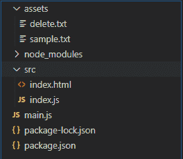
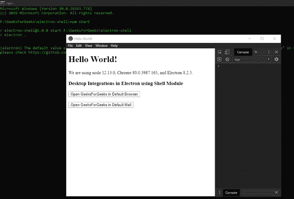

# 电子表格中的桌面操作

> 原文:[https://www . geesforgeks . org/desktop-operations-in-electronijs/](https://www.geeksforgeeks.org/desktop-operations-in-electronjs/)

[**electronijs**](https://www.geeksforgeeks.org/introduction-to-electronjs/)是一个开源框架，用于使用能够在 Windows、macOS 和 Linux 操作系统上运行的 HTML、CSS 和 JavaScript 等网络技术构建跨平台的本机桌面应用程序。它将 Chromium 引擎和 [NodeJS](https://www.geeksforgeeks.org/introduction-to-nodejs/) 结合成一个单一的运行时。

电子可以与本地操作系统环境交互，如文件系统、系统托盘等。Electron 为我们提供了内置的 **Shell** 模块，该模块有助于使用本地操作系统环境中的默认应用程序来管理文件和 URL。本模块提供与桌面集成相关的功能，如打开外部链接、创建快捷方式、阅读快捷方式等。外壳模块可以直接在应用程序的**主进程**和**渲染器进程**中使用。本教程将演示使用电子外壳模块的桌面集成。

我们假设您熟悉上述链接中介绍的先决条件。电子要工作， [**节点**](https://www.geeksforgeeks.org/introduction-to-nodejs/) 和 [**npm**](https://www.geeksforgeeks.org/node-js-npm-node-package-manager/) 需要预装在系统中。

*   **项目结构:**



*   **sample.txt:**

```
This is a Sample Text file
```

*   **delete.txt:**

```
Sample Text FIle to delete
```

**示例:**我们将按照给定的步骤开始构建基本的电子应用程序。

*   **步骤 1:** 导航到空目录设置项目，运行以下命令，

```
npm init
```

生成**包. json** 文件。安装 [**电子**](https://www.geeksforgeeks.org/introduction-to-electronjs/) 如果没有安装，使用 npm。

```
npm install electron --save-dev
```

该命令还将创建**包-lock.json** 文件，并安装所需的**节点 _ 模块**依赖项。一旦电子安装成功，打开**包. json** 文件，并在**“脚本”**键下执行必要的更改。

**package.json:**

```
{
  "name": "electron-DesktopOperation",
  "version": "1.0.0",
  "description": "Desktop Operations in Electron",
  "main": "main.js",
  "scripts": {
    "start": "electron"
  },
  "keywords": [
    "electron"
  ],
  "author": "Radhesh Khanna",
  "license": "ISC",
  "dependencies": {
    "electron": "^8.2.5"
  }
}
```

*   **第二步:**根据项目结构创建 **main.js** 文件。该文件是**主进程**，作为应用程序的入口点。复制 **main.js** 文件的样板代码，如以下[链接](https://www.electronjs.org/docs/tutorial/first-app#electron-development-in-a-nutshell)所示。我们将修改代码以适应我们的项目需求。
    **main.js:**

## java 描述语言

```
const { app, BrowserWindow } = require('electron')

function createWindow() {
  // Create the browser window.
  const win = new BrowserWindow({
    width: 800,
    height: 600,
    webPreferences: {
      nodeIntegration: true
    }
  })

  // Load the index.html of the app.
  win.loadFile('src/index.html')

  // Open the DevTools.
  win.webContents.openDevTools()
}

// This method will be called when Electron has finished
// initialization and is ready to create browser windows.
// Some APIs can only be used after this event occurs.
app.whenReady().then(createWindow)

// Quit when all windows are closed.
app.on('window-all-closed', () => {
  // On macOS it is common for applications and their menu bar
  // To stay active until the user quits explicitly with Cmd + Q
  if (process.platform !== 'darwin') {
    app.quit()
  }
})

app.on('activate', () => {
  // On macOS it's common to re-create a window in the app when the
  // dock icon is clicked and there are no other windows open.
  if (BrowserWindow.getAllWindows().length === 0) {
    createWindow()
  }
})

// In this file, you can include the rest of your app's specific
// main process code. You can also put them in separate files and
// require them here.
```

*   **步骤 3:** 在 **src** 目录下创建**index.html**文件。我们还将从上述链接中复制**index.html**文件的样板代码。我们将修改代码以适应我们的项目需求。
    **index.html:**

## 超文本标记语言

```
<!DOCTYPE html>
<html>

<head>
    <meta charset="UTF-8">
    <title>Hello World!</title>

    <!-- https://electronjs.org/docs/tutorial/security#csp-meta-tag -->
    <meta http-equiv="Content-Security-Policy"
          content="script-src 'self' 'unsafe-inline';" />
</head>

<body>
    <h1>Hello World!</h1> We are using node
    <script>
        document.write(process.versions.node)
    </script>, Chrome
    <script>
        document.write(process.versions.chrome)
    </script>, and Electron
    <script>
        document.write(process.versions.electron)
    </script>.

    <!-- Adding Individual Renderer Process JS File -->
    <script src="index.js"></script>
</body>

</html>
```

*   **输出:**此时，我们的基本电子应用程序设置完毕。要启动电子应用程序，请运行命令:

```
npm start
```


**电子中的壳模块:**所有的壳模块用下面的例子解释:

**1。以系统默认方式打开外部网址。我们可以通过外部链接或邮件标识，它将根据提供的协议来解决。
外壳**。**返回**承诺**。它接受以下参数，**

*   **网址:字符串**要解析的外部网址。Windows 中最多允许 2081 个字符。将根据系统默认行为解析网址。
*   **选项:对象(可选)**它是由以下参数组成的对象，
    *   **激活:布尔型**仅 **macOS** 支持。它用于将打开的应用程序带到前台。默认设置为**真**。

**index.html:** 在该文件中添加以下代码片段。

## 超文本标记语言

```
<br>
  <h3>
   Desktop Integrations in Electron using Shell Module
  </h3>
  <button id="external">
   Open GeeksForGeeks.org in Default Browser
  </button>

  <br><br>
  <button id="mail">
   Open GeeksForGeeks in Default Mail
  </button>
```

**index.js:** 在该文件中添加以下片段。

## java 描述语言

```
const electron = require('electron');
const path = require('path');

// Importing the Shell Module from the electron 
// in the Renderer Process
const shell = electron.shell;

var external = document.getElementById('external');
var externalOptions = {

    // Supported by macOS only
    activate: true,
}

external.addEventListener('click', (event) => {

    // Returns a Promise<void>, Hence we can use 
    // the .then( function() {} )
    shell.openExternal(
        'https://www.geeksforgeeks.org/', externalOptions)
        .then(() => {
            console.log('Link Opened Successfully');
        });
});

var mail = document.getElementById('mail');

mail.addEventListener('click', (event) => {

    // Resolving the External URL to the Default Mail Agent
    // Because we have specified 'mailto'
    shell.openExternal(
        'mailto: https://www.geeksforgeeks.org/', externalOptions)
        .then(() => {
        console.log('Link Opened Successfully');
    });
});
```

**输出:**



**2。解析给定的**字符串**文件路径，并在窗口/文件浏览器中显示该文件。如果可能，也选择该文件。此方法没有任何返回类型。**

**index.html:** 在该文件中添加以下代码片段。

## 超文本标记语言

```
<br><be>
  <button id="show">
    Show sample.txt in File Explorer
  </button>
```

**index.js:** 在该文件中添加以下代码片段。

## java 描述语言

```
var show = document.getElementById('show');

show.addEventListener('click', (event) => {
    // Providing a dynamic file path to the 'sample.txt'
    // file in the 'assets' Folder. Using the path Module.
    // '__dirname' automatically detects current working directory
    shell.showItemInFolder(path.join(__dirname, '../assets/sample.txt'));
});
```