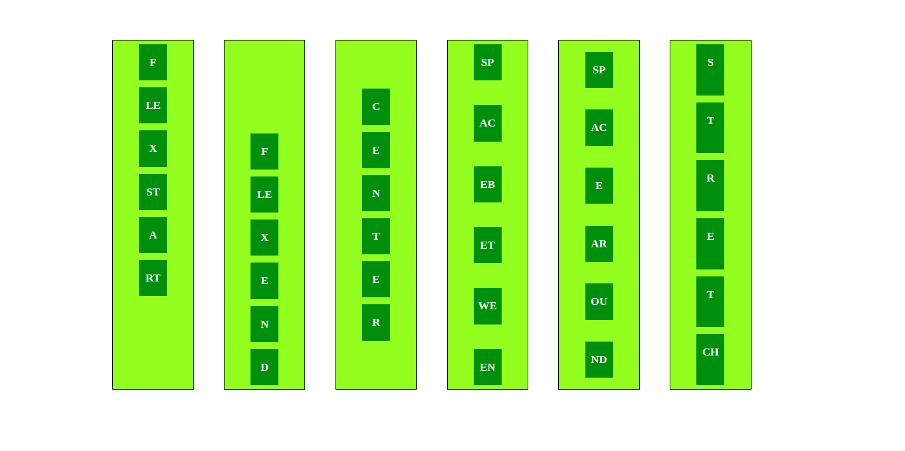
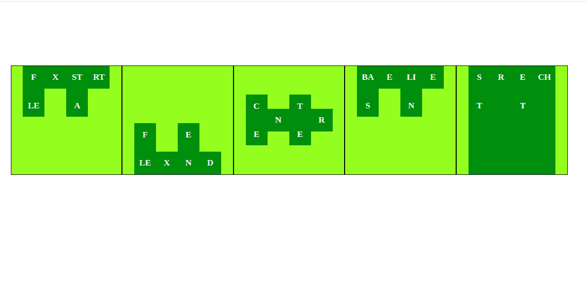

# 对齐内容和对齐项目的区别

> 原文:[https://www . geesforgeks . org/align-content-and-align-items 之间的差异/](https://www.geeksforgeeks.org/difference-between-align-content-and-align-items/)

[对齐内容](https://www.geeksforgeeks.org/css-align-content-property/)和[对齐项目](https://www.geeksforgeeks.org/css-align-items-property/)都在横轴上起作用。flexbox 中的交叉轴取决于 flex-direction，并且垂直于主轴，如果 flex-direction 是 row 或 row-reverse，则交叉轴是垂直的，如果 flex-direction 是 column 或 column-reverse，则交叉轴是水平的。

| 对齐内容 | 对齐项目 |
| flex-box 的这一属性使挠曲线沿着横轴相互对齐。 | flex-box 的这个属性会将 flex-line 中的 flex-items 沿着横轴对齐 |
| 该属性仅在**“伸缩缠绕:**属性设置为**缠绕**时有效 | 该属性即使在**“伸缩缠绕:**属性未设置为**缠绕**时也有效 |
| 当伸缩线的数量为 1 时，此属性无效。 | 该属性不依赖于伸缩线的数量。 |
| align-content 属性接受 6 个不同的值:

*   **Flex-start:** The line is packed to the beginning of the container.
*   **Flex-end:** The line is packed to the end of the container.
*   **Center:** The line is packed to the center of the container.
*   **spacing:** rows are evenly distributed; The first line is at the beginning of the container and the last line is at the end.
*   **left and right space:** rows are evenly distributed, and the.
*   There is equal space stretching between **(default):** lines stretch to occupy the remaining space.

 | align-items 属性接受 5 个不同的值:

*   **Flex-start:** The edge of the intersection starting margin of the item is placed on the intersection starting line.
*   **Flex-end:** The edge of the crossing end margin of the project is placed on the crossing end line.
*   **Center:** The item is centered on the cross axis.
*   **Baseline:** Project alignment, such as their baseline alignment.

 |

**语法:**

*   **对齐-内容:**

> 元素{
> align-content:stretch | center | flex-start | flex-end | space-with | space-round | initial | inherit；
> // CSS 属性

*   **align-items:**

    > 元素{
    > align-items:stretch | center | flex-start | flex-end | baseline | initial | inherit；
    > // CSS 属性

    **对齐内容示例**

    ```
    <!DOCTYPE html>
    <html lang="en">

    <head>
      <title>Align-content</title>
      <style>
        /* flex-container(flex-box) */
        .flex {
          background-color: greenyellow;
          margin: 2% 2%;
          padding: 0% 3%;
          float: left;
          height: 500px;
          width: 50px;
          border: 1px solid black;
          display: flex;
          flex-wrap: wrap;
          flex-direction: row;
        }
        /* flex-start */
        .flexStart {
          align-content: flex-start;
        }
        /* flex-end */
        .flexEnd {
          align-content: flex-end;
        }
        /* center */
        .center {
          align-content: center;
        }
        /* space-between */
        .spaceBetween {
          align-content: space-between;
        }
        /* space-around */
        .spaceAround {
          align-content: space-around;
        }
        /* stretch */
        .stretch {
          align-content: stretch;
        }

        ul {
          list-style: none;
        }

        .flex-item {
          background: green;
          padding: 5px;
          width: 50px;
          margin: 5px;
          line-height: 10px;
          color: white;
          font-weight: bold;
        }
      </style>
    </head>

    <body>
      <ul class="flex flexStart">
        <li class="flex-item">
          <p>F</p>
        </li>
        <li class="flex-item">
          <p>LE</p>
        </li>
        <li class="flex-item">
          <p>X</p>
        </li>
        <li class="flex-item">
          <p>ST</p>
        </li>
        <li class="flex-item">
          <p>A</p>
        </li>
        <li class="flex-item">
          <p>RT</p>
        </li>
      </ul>
      <ul class="flex flexEnd">
        <li class="flex-item">
          <p>F</p>
        </li>
        <li class="flex-item">
          <p>LE</p>
        </li>
        <li class="flex-item">
          <p>X</p>
        </li>
        <li class="flex-item">
          <p>E</p>
        </li>
        <li class="flex-item">
          <p>N</p>
        </li>
        <li class="flex-item">
          <p>D</p>
        </li>
      </ul>
      <ul class="flex center">
        <li class="flex-item">
          <p>C</p>
        </li>
        <li class="flex-item">
          <p>E</p>
        </li>
        <li class="flex-item">
          <p>N</p>
        </li>
        <li class="flex-item">
          <p>T</p>
        </li>
        <li class="flex-item">
          <p>E</p>
        </li>
        <li class="flex-item">
          <p>R</p>
        </li>
      </ul>
      <ul class="flex spaceBetween">
        <li class="flex-item">
          <p>SP</p>
        </li>
        <li class="flex-item">
          <p>AC</p>
        </li>
        <li class="flex-item">
          <p>EB</p>
        </li>
        <li class="flex-item">
          <p>ET</p>
        </li>
        <li class="flex-item">
          <p>WE</p>
        </li>
        <li class="flex-item">
          <p>EN</p>
        </li>
      </ul>
      <ul class="flex spaceAround">
        <li class="flex-item">
          <p>SP</p>
        </li>
        <li class="flex-item">
          <p>AC</p>
        </li>
        <li class="flex-item">
          <p>E</p>
        </li>
        <li class="flex-item">
          <p>AR</p>
        </li>
        <li class="flex-item">
          <p>OU</p>
        </li>
        <li class="flex-item">
          <p>ND</p>
        </li>
      </ul>
      <ul class="flex stretch">
        <li class="flex-item">
          <p>S</p>
        </li>
        <li class="flex-item">
          <p>T</p>
        </li>
        <li class="flex-item">
          <p>R</p>
        </li>
        <li class="flex-item">
          <p>E</p>
        </li>
        <li class="flex-item">
          <p>T</p>
        </li>
        <li class="flex-item">
          <p>CH</p>
        </li>
      </ul>
    </body>

    </html>
    ```

    **输出**
    

    **对齐项目示例**

    ```
    <!DOCTYPE html>
    <html lang="en">

    <head>
      <title>Align-items</title>
      <style>
        /* flex-container(flex-box) */
        .flex {
          background-color: greenyellow;
          margin:0;
          padding:0% 2%;
          float: left;
          height: 200px;
          width: 160px;
          border: 1px solid black;
          display: flex;
          flex-direction: row;
        }
        /* flex-start */
        .flexStart {
          align-items: flex-start;
        }
        /* flex-end */
        .flexEnd {
          align-items: flex-end;
        }
        /* center */
        .center {
          align-items: center;
        }
        /* baseline */
        .baseLine {
          align-items: baseline;
        }
        /* stretch */
        .stretch {
          align-items: stretch;
        }

        ul {
          list-style: none;
        }

        .flex-item {
          background: green;
          padding: 0px;
          width: 40px;
          margin: 0px;
          line-height: 10px;
          color: white;
          font-weight: bold;
          text-align:center;
        }
      </style>
    </head>

    <body>
      <ul class="flex flexStart">
        <li class="flex-item">
          <p>F</p><br>
          <p>LE</p>
        </li>
        <li class="flex-item">
          <p>X</p>
        </li>
        <li class="flex-item">
          <p>ST</p><br>
          <p>A</p>
        </li>
        <li class="flex-item">
          <p>RT</p>
        </li>
      </ul>
      <ul class="flex flexEnd">
        <li class="flex-item">
          <p>F</p><br>
          <p>LE</p>
        </li>
        <li class="flex-item">
          <p>X</p>
        </li>
        <li class="flex-item">
          <p>E</p><br>
          <p>N</p>
        </li>
        <li class="flex-item">
          <p>D</p>
        </li>
      </ul>
      <ul class="flex center">
        <li class="flex-item">
          <p>C</p><br>
          <p>E</p>
        </li>
        <li class="flex-item">
          <p>N</p>
        </li>
        <li class="flex-item">
          <p>T</p><br>
          <p>E</p>
        </li>
        <li class="flex-item">
          <p>R</p>
        </li>
      </ul>
      <ul class="flex baseLine">
        <li class="flex-item">
          <p>BA</p><br>
          <p>S</p>
        </li>
        <li class="flex-item">
          <p>E</p>
        </li>
        <li class="flex-item">
          <p>LI</p><br>
          <p>N</p>
        </li>
        <li class="flex-item">
          <p>E</p>
        </li>
      </ul>
      <ul class="flex stretch">
        <li class="flex-item">
          <p>S</p><br>
          <p>T</p>
        </li>
        <li class="flex-item">
          <p>R</p>
        </li>
        <li class="flex-item">
          <p>E</p><br>
          <p>T</p>
        </li>
        <li class="flex-item">
          <p>CH</p>
        </li>
      </ul>
    </body>

    </html>
    ```

    **输出**
    