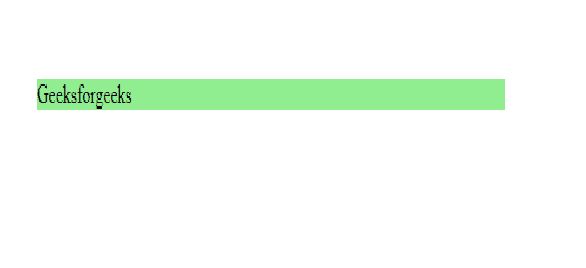

# 背景和背景色的区别

> 原文:[https://www . geesforgeks . org/background-and-background-color 之差/](https://www.geeksforgeeks.org/difference-between-background-and-background-color/)

1.  **[Background Property](https://www.geeksforgeeks.org/css-background/)**
    The background property in CSS is very commonly used and contains many variants. The background property consists of all the following properties:
    *   背景色
    *   背景图像
    *   背景位置
    *   背景尺寸
    *   背景-重复
    *   背景-起源
    *   背景剪辑
    *   背景-附件

    **背景色:**
    **句法:**

    ```
    body
    {
       background-color:color name
    }
    ```

    颜色名称也可以给出为:*“绿色”*，HEX 值为*“# 5570 F0”*，RGB 值为*“RGB(25，255，2)”*。

    *   **Example:**

        ```
        <style>
            h1 {
                background-color: blue;
            }
        </style>

        <body>
            <h1>
             Geeksforgeeks
        </h1>
        </body>
        ```

         **输出:** 
        

        **背景图像:**该属性指定用作元素背景的图像。默认情况下，图像是重复的，因此它覆盖了整个元素。

        **语法:**

        ```
        body
        {
           background-image : link;
        }
        ```

    *   **Example:**

        ```
        <style>
            body {
                background-image: url(gfgpolaroidimagefunction.png);
            }
        </style>

        <body>
            <h1>
        Geeksforgeeks
        </h1>
        </body>
        ```

         ****输出:**
        ** 

2.  **[Background-color Property](https://www.geeksforgeeks.org/css-background-color-property/):**
    The background-color property in CSS is used to specify the background color of an element. On the other hand, if you **only use “Background:” Property**, you can either specify it’s valued as an image URL or as a color code or specify the value of each background property in the below-given order.

    **语法:**

    ```
    element {
        background-color property
    }
    ```

    **示例:**

    ```
    <!DOCTYPE html> 
    <html> 
        <head> 
            <title>background-color property</title> 
            <style>  
                body { 
                    text-align:center; 
                    background-color:green; 
                } 
                h1 {  
                    color:white; 
                    background-color:blue; 
                }  
                h2 { 
                    color:white; 
                    background-color:black; 
                } 
            </style>  
        </head> 
        <body>  
            <h1>Geeksforgeeks </h1>  
            <h2>background-color: color_name;</h2>      
        </body>  
    </html>
    ```

    **输出:**
    