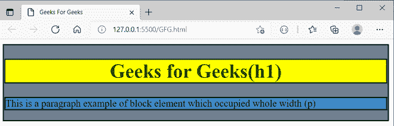
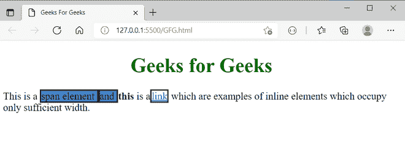

# 块元素和内联元素的区别

> 原文:[https://www . geesforgeks . org/block-elements 和-inline-elements 之间的差异/](https://www.geeksforgeeks.org/difference-between-block-elements-and-inline-elements/)

HTML 的内联和块元素是 web 开发人员经常混淆的重要领域之一，因为他们无法知道哪些是内联和块元素，这可能会导致网页变得笨拙，以防他假设某个元素是块，但正是内联元素导致下一个元素紧挨着它。

因此，让我们看看 HTML 中内联和块元素之间的区别，以及不同的常用内联和块 HTML 元素。

**块元素:**它们消耗可用的整个宽度，而不管它们是否足够。它们总是从新的一行开始，有顶部和底部的空白。它旁边不包含任何其他元素。

**块元素示例:**

*   [**<h1>-<h6>**](https://www.geeksforgeeks.org/html-heading/)**:**该元素用于包含从 1 到 6 的不同大小的标题。
*   [**<div>**](https://www.geeksforgeeks.org/div-tag-html/)**:**这是一个容器标签，用于对网页上的内容进行单独的划分。
*   [**<HR>**](https://www.geeksforgeeks.org/html-hr-size-attribute/)**:**这是一个空标签，用于用横线分隔内容。
*   [**<Li>**](https://www.geeksforgeeks.org/html-li-tag/)**:**该标签用于包含有序或无序列表的列表项。
*   [**< ul >**](https://www.geeksforgeeks.org/html-ul-compact-attribute/) **:这个标签是用来做一个无序列表的。**
*   [**<ol>**](https://www.geeksforgeeks.org/html-ol-compact-attribute/)**:**此标签用于制作有序列表。
*   [**<p>**](https://www.geeksforgeeks.org/html-basics/)**:**此标签用于在网页中包含段落内容。
*   [**<表格>**](https://www.geeksforgeeks.org/html-table-border-attribute/) **:** 当需要表格数据时，该标签用于将表格包含在网页中。

**HTML 5 语义块元素:**

*   [**<页眉>**](https://www.geeksforgeeks.org/html5-semantics/) **:** 该标签用于包含网页的所有主要内容，如导航栏、徽标和网页标题。
*   [**<导航>**](https://www.geeksforgeeks.org/html5-semantics/) **:** 该标签通过在网页中包含不同的超链接块来帮助导航不同的部分。
*   [**<页脚>**](https://www.geeksforgeeks.org/html5-semantics/) **:** 这包含了所有关于网页的授权、联系方式和版权细节的信息。
*   [**<主>**](https://www.geeksforgeeks.org/html5-semantics/) **:** 网页的主要内容驻留在此标签中。
*   [**<版块>**](https://www.geeksforgeeks.org/html5-semantics/) **:** 这是用来分隔网页中不同版块的。
*   [**<文章>**](https://www.geeksforgeeks.org/html5-semantics/) **:** 此标签用于包含网页上不同的独立文章。
*   [**<暂且不提>**](https://www.geeksforgeeks.org/html5-semantics/) **:这个标签是用来提细节的主要内容暂且不提。**

**示例:**

## 超文本标记语言

```htmlhtml
<!DOCTYPE html>
<html lang="en">

<head>
    <!--Meta data-->
    <meta charset="UTF-8">
    <meta http-equiv="X-UA-Compatible"
          content="IE=edge">
    <meta name="viewport"
          content="width=device-width, initial-scale=1.0">

    <!--The description written on title tag
        get appeared as browser tab name-->
    <title>Geeks For Geeks </title>

    <style>
        h1 {
            color: #006600;
            text-align: center;
            border: 2px solid #091418;
            background-color: yellow;
        }
        .container {
            border: 2px solid #040804;
            background-color: slategray;
        }
        p{
            border: 2px solid #040804;
            background-color:  #4089c5;
        }
    </style>
</head>

<!-- Whatever content in the body tag
     appears on the webpage -->

<body>
    <div class="container" >
        <h1>Geeks for Geeks(h1) </h1>

<p>
             This is a paragraph example of block
             element which occupied whole width (p)
        </p>

    </div>
</body>

</html>
```

**输出:**从上面的输出中，使用了 3 个具有不同背景颜色和一个边框的不同块元素来显示块元素如何占据整个宽度以及它们留下的边距。以上输出使用三块元素< h1 >、< p >、< div >。



**内联元素:**内联元素只占用足够的宽度，并允许它旁边的其他元素内联。内联元素不会从新行开始，也不会像块元素那样有上下边距。

**内嵌元素**示例:

*   [**<a>**](https://www.geeksforgeeks.org/html-links/)**:**该标签用于在网页中包含超链接。
*   [**<br>**](https://www.geeksforgeeks.org/html-brgt-tag/)**:**此标签用于在网页中需要的地方提及换行符。
*   [**<脚本>**](https://www.geeksforgeeks.org/html-script-tag/) **:** 此标签用于包含外部和内部 JavaScript 代码。
*   [**<输入>**](https://www.geeksforgeeks.org/html-input-tag/) **:** 该标签用于获取用户输入，主要用于表单。
*   [****](https://www.geeksforgeeks.org/html-img-tag/)**:**该标签用于在网页中包含不同的图片，为网页增添美感。
*   [**<span>**](https://www.geeksforgeeks.org/span-tag-html/)**:**这是一个只占用必要空间的内嵌容器。
*   [**<b>**](https://www.html.am/html-codes/text/html-bold.cfm)**:**这个标签用在需要加粗文字的地方。
*   [**<标签>**](https://www.geeksforgeeks.org/html-label-tag/)**:**HTML 中的标签用于为鼠标用户提供可用性改进，即如果用户点击<标签>元素内的文本，它将切换控件。

**示例:**

## 超文本标记语言

```htmlhtml
<!DOCTYPE html>
<html lang="en">

<head>
    <!--Meta data-->
    <meta charset="UTF-8">
    <meta http-equiv="X-UA-Compatible" content="IE=edge">
    <meta name="viewport" content=
        "width=device-width, initial-scale=1.0">

    <style>
        h1 {
            color: #006600;
            text-align: center;
        }

        span {
            border: 2px solid #040804;
            background-color: #4089c5;
        }

        a {
            border: 2px solid #040804;
        }
    </style>
</head>

<!-- Whatever content in body tag
    appears on the webpage-->
<body>
    <div class="container">
        <h1>Geeks for Geeks</h1>

<p>
            This is a <span>span element </span>
            <span>and </span><b>this</b> is a
            <a href="#">link</a> which are examples
            of inline elements which occupy only
            sufficient width.
        </p>

    </div>
</body>

</html>
```

**输出:**



从上面的输出来看，使用了三个不同的内联元素，分别是、**、**

**内联元素和块元素的区别:**

<figure class="table">

| **Inline element** | **Block element** |
| --- | --- |
| Inline elements only occupy enough width as needed. | Elements occupy the entire width, regardless of whether they are enough or not. |
| Inline elements do not start on a new line. | Elements always start with a line. |
| Embedded elements allow other embedded elements to sit behind. | Element does not allow other elements to sit behind it. |
| Inline elements have no upper and lower margins. | Elements have top and bottom margins. |

</figure>