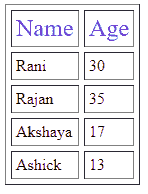

# 单元格填充和单元格间距之间的差异

> 原文:[https://www . geeksforgeeks . org/cell-padding 和-cell-spacing 之间的差异/](https://www.geeksforgeeks.org/difference-between-cellpadding-and-cellspacing/)

*   **细胞膏** ：

    单元格填充指定表格单元格边框与其内容之间的空间(即，它定义单元格边缘与单元格内容之间的空白)。

    **语法:**

    ```html
    <table cellpadding="value" >.....</table>
    where, value determines the padding 
    (space between the border of a table and its content)
    ```

*   **细胞间距:**

    单元格间距指定单元格之间的间距(即定义相邻单元格边缘之间的空白)。

    **语法:**

    ```html
    <table cellspacing="value" >.....</table>
    where, value determines the padding 
    (space between adjacent cells)
    ```

**示例:**

```html
<!DOCTYPE html>
<html lang="en">
<head>
    <meta charset="UTF-8">
    <meta name="viewport" 
          content="width=device-width, 
                   initial-scale=1.0">
    <title>Document</title>
    <style>
        span{
          text-decoration-style: solid;
          width: 25px;
          font-size: x-large;
          color: blueviolet;
        }
      </style>
</head>
<body>
<table border="1" 
       cellpadding="4"
       cellspacing="5">
  <thead>
  <td><span>Name</span></td>
  <td><span>Age</span></td>
  </thead>
  <tbody>
  <tr>
    <td>Rani</td>
    <td>30</td>
  </tr>
   <tr>
    <td>Rajan</td>
    <td>35</td>
  </tr>
  <tr>
    <td>Akshaya</td>
    <td>17</td>
  </tr>
  <tr>
    <td>Ashick</td>
    <td>13</td>
  </tr>
  </tbody>
</table>
</body>
</html>
```

**输出:**


**单元格填充和单元格间距的区别:**

<figure class="table">

| **单元格填充** | **单元格间距** |
| It specifies the spacing between the border of the table cell and its contents. | Specifies the spacing between adjacent cells. |
| Use html tag to create, but the type property is set to cellpadding. | It is also created using HTML tag, but the type property is set to cell spacing. |
| Mainly refers to a single cell. | Cell spacing can be influenced by multiple cells. |
| The default cell fill value is 1. | And the default cell spacing value is 2. |
| Cell filling is widely used and considered as an effective method. | Cell spacing is not as effective as cell filling. |
| Cell filling is an attribute. | Cell spacing is also an attribute. |

</figure>