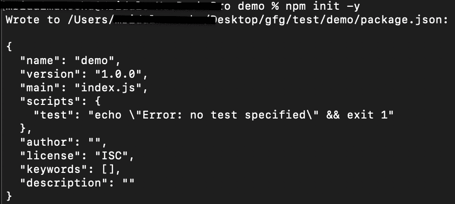
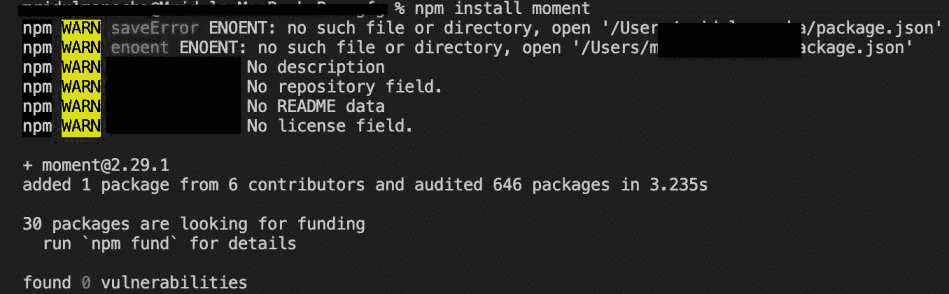
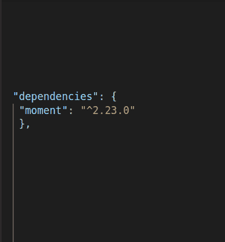

# 依赖、开发依赖和对等依赖之间的区别

> 原文:[https://www . geesforgeks . org/dependencies-dev dependencies-and-peerd dependencies/](https://www.geeksforgeeks.org/difference-between-dependencies-devdependencies-and-peerdependencies/)

**简介:**在每个 web 应用项目中，我们都有一个名为 package.json 的文件，这个文件包含了关于项目的所有相关数据，即元数据。从所有依赖项开始，所有版本号都存在于文件中。这样，在这个文件中可以找到三种类型的依赖关系。它们是依赖项、开发依赖项和对等依赖项。

运行以下命令，从项目的根目录初始化项目:

```
npm init -y
```



**依赖项:**在 package.json 文件中，有一个名为**依赖项**的对象，它由项目中使用的所有包及其版本号组成。因此，无论何时安装项目中需要的任何库，您都可以在 dependencies 对象中找到该库。

**语法:**

```
npm install <package name>
```

**示例:**使用以下命令安装用于格式化项目中时间的时刻模块:

```
npm install moment
```



安装模块后，如果您导航到 package.json 文件，那么您可以在 dependencies 对象中找到它的版本，如下所示:



**开发依赖项:**在 package.json 文件中，有一个名为**开发依赖项**的对象，它由项目在其开发阶段使用的所有包组成，而不是在其版本号为的生产或测试环境中使用的所有包。因此，每当您想要安装仅在开发阶段需要的任何库时，您可以在 dev Dependencies 对象中找到它。

使用以下命令在项目中添加更多开发依赖项:

```
npm install <package name> --save-dev
```

**示例:**安装我们希望仅在开发阶段使用而不是在项目的生产或测试阶段使用的引导模块，使用以下命令:

```
npm install bootstrap --save-dev
```

下载完成后，如果您导航到 package.json 文件，那么您可以在 dev Dependencies 对象中找到引导数据库及其版本，如下所示:


**对等依赖关系:**在 package.json 文件中，有一个名为**对等依赖关系**的对象，它由项目中或下载者确切需要的所有包组成，版本号也应该相同。这就是它们被命名为独立国家的原因。最好的例子是“react ”,这在每个项目中很常见，以类似的方式运行。

**注意:**这些依赖项不会自动安装。只要存在对等依赖关系，npm 就会发出警告消息，这些依赖关系与上面讨论的依赖关系不同。