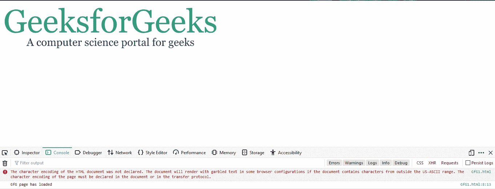
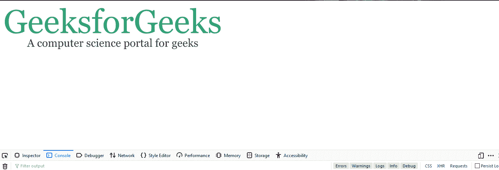

# 加载的内容和加载事件之间的差异

> 原文:[https://www . geeksforgeeks . org/domcontentloaded 和 load-events 之差/](https://www.geeksforgeeks.org/difference-between-domcontentloaded-and-load-events/)

这两个事件 **DOMContentLoaded** 和 **load** 用于检查网页何时已经完全加载。尽管如此，还是有一些因素决定了两者的偏好。让我们看看他们两个，了解他们的工作。

**一旦加载了基本的 HTML 文档并进行了解析，就执行了 DOMContentLoaded** 事件。此事件不会等待加载插件(如样式表、子框架和图像/图片)的完成。

**语法**:

```htmlhtml
document.addEventListener("DOMContentLoaded", function(e) {
  console.log("GfG page has loaded");
});
```

**例 1:**

```htmlhtml
<!DOCTYPE>
<html>

<head>
    <title>
        Output of DOMContentLoaded and Load events
    </title>

    <script type="text/javascript">
        document.addEventListener("DOMContentLoaded", function(e) {
            console.log("GfG page has loaded");
        });
    </script>
</head>

<body>
    
</body>

</html>
```

**输出:**


在这里的输出中，可以看到控制台日志窗口显示了消息，这表示网页 DOM 加载完成。

**使用 DOMContentLoaded 事件的优势:**

*   它有助于改善用户体验，因为它可以更快地显示消息或内容。
*   加载页面花费的时间更少。

**加载**事件执行方式不同。一旦加载了所有组件，即 DOM 层次结构以及网页的相关功能，如 CSS 文件、JavaScript 文件、图像/图片和外部链接，此事件就完成了。所以基本上，load 事件有助于了解页面何时已经完全加载。

**语法**:

```htmlhtml
document.addEventListener("load", function(e) {
  console.log("The page has completely loaded.");
});
```

**例 2:**

```htmlhtml
<!DOCTYPE html>
<html>

<head>
    <title>
        Output of DOMContentLoaded and Load events
    </title>

    <script type="text/javascript">
        document.addEventListener("load", function(e) {
            console.log("GfG page has loaded completely");
        });
    </script>
</head>

<body>
    
</body>

</html>
```

**输出** :


**使用负载事件的优势:**

*   此事件有助于了解网页所有组件的加载时间。