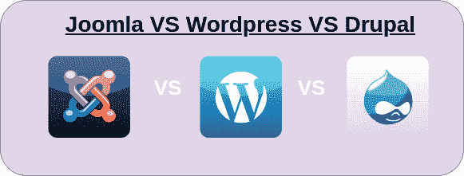

# Drupal、Joomla 和 WordPress 的区别

> 原文:[https://www . geesforgeks . org/difference-Drupal-Joomla-and-WordPress/](https://www.geeksforgeeks.org/difference-between-drupal-joomla-and-wordpress/)

Joomla 对用户非常友好，更像 WordPress，有编程天赋的人可以利用它完成简单的结果。Drupal 是一个开源的 CMF(内容管理框架)并且在 PHP 和编程上被广泛使用。它的适应性更强，并提供了一个真正的应用编程接口框架来制作巨大的结构。我们已经看到 Joomla 和 Drupal 从他们开始放电以来都在发展。众多设计者中的大多数都同意 Drupal 是一个强有力的框架，并暗示了复杂的网络解决方案。喜欢 Drupal 的设计师说，这是任何类型网站有史以来最好的安排，我从 Joomla 的人那里听到了同样的话。Joomla 人认为，由于插件的可访问性，Joomla 是驱动阶段。安全性是 Drupal 突出的观点。每个人都同意这样一个现实，即在 Drupal 平台上制作的网站最轻微地倾向于安全危险，这就是为什么政府网站是由 Drupal 驱动的。尽管 Joomla 网站无可奈何，但它也从未被人听到过。Drupal 和 Joomla，看起来都很容易用不同的格式和可配置的替代来定制。对于那些有足够编程知识的人来说，为各个阶段形成格式是同样费力的工作。

WordPress 和 Joomla 都是由同一种方言组成的物质管理框架，它们都是免费的，都很棒，但肯定会有一个更好更高的，这要由人们来决定。许多人会说 WordPress 是最好的博客，根据他们的默认设置，我会同意这一点，但是 Joomla 错误地认为博客的有效扩展远远优于 WordPress。这些扩展中的一些并不是免费的。当涉及到真正的工作时，你最好留在 Joomla，因为有了 Joomla，你可以不受限制地构建从网络日志、电子商务、下载、社交系统、聚会、聊天、邮件(我不是指电子邮件福利供应商)、测试……和列表交易会等各种各样的网站。

**Drupal:** Drupal 可能是一个免费的、开源的物质管理框架(CMS)，拥有一个扩展的、稳定的社区。全球数百万个人和组织使用 Drupal 来建立和维护他们的网站。Drupal 可能是一个在 GNU 开放许可下发布的开源计算机程序。它有一些独特的优点，如可获取性、适应性、灵活性、安全性和责任感，这些是限制性计算机程序无法比拟的。Drupal 是可以毫无保留地访问的，意味着它可以免费下载，任何人都可以根据自己的需要调整和放大舞台。Drupal 可能是一个内容管理系统。它提供了一个客户端界面，允许客户端有效地制作和分发我们的内容。Drupal 提供了无限的内容种类，包括内容和媒体内容，以及非常可定制的形状。它能有效地恢复、疏导和呈现这种物质。

**德鲁伊的特点:**

*   **精细用户管理:** Drupal CMS 允许其控制器完全控制客户端获取授权和客户端部件定义。
*   **允许多种内容类型:** Drupal 允许完全适应博客、文章、公告等独特的内容组的显示方式以及每种内容组提供的相关有用性。
*   **灵活分类:** Drupal 的科学分类模块对物质分类相关的物质类别提供了无限的定制。Drupal 是最好的内容管理系统，如果你需要复杂的方法来分类你的内容，可以选择它。
*   **响应显示:**如果你的网站更频繁地出现在手机和桌面以外的其他小工具上，内容管理系统利用其响应计划创新，根据浏览器调整内容。
*   **高度调整的搜索引擎优化:** Drupal 突出了典型的方言网址，这些网址自然地发现了外观引擎排名，以及与实体、定制友好的页面元数据的持久连接，并因此创建了 XML 站点地图。

**Joomla:** Joomla 是世界上最著名的免费内容管理框架(CMS)之一，它允许您有效地制作和监督精力充沛或响应迅速的网站。它有一个直观的管理界面来控制这个功能强大的内容管理系统的所有亮点和有用性。Joomla 有成千上万的免费扩展，允许客户扩展他们的有用性，并将其定制为他们的先决条件。Joomla 得到了一个广阔社区的支持，在这个社区里，新手似乎真正依赖于更有经验的成员的帮助。Joomla 是用 PHP 编写的，使用 MySQL 数据库存储信息，而使用面向对象的编程过程。它可以通过网络辅助控制面板通过一键介绍进行设置。互联网上有数百篇文章可以帮助你介绍 Joomla。Joomla 采用模型-视图-控制器(MVC)计划设计。

**Joomla 的特点:**

*   **主要移动内容管理系统:**这可能是让 Joomla 跟上正在接管互联网的移动叛乱的形式。预计，在接下来的一年里，更多的人将通过手机上网，而不是桌面上网。你网站的多样化形式可能不久就会比桌面改编更重要。Joomla 3 正在利用 Bootstrap 毫无疑问地形成来宾和控制器区域是移动友好的。Joomla 将成为默认情况下 100%移动友好的主要物质管理框架。
*   **改进的管理区:**一旦你登录到你的现代 Joomla 位置，你会注意到第一次看到了新的深蓝色图:登录后，你会看到大部分管理屏幕都升级了。仪表板完全由模块组成，因此您可以根据自己的需要进行定制。
    以下是 Joomla 3 仪表盘的六个基本范围:
    1.  菜单栏:从 Joomla 2.5 中可以很大程度上保持不变
    2.  额外连接:这些已经被大幅精简。许多被移动到页脚中的区域#6。
    3.  子菜单:这些给出了当前页面的命令式子菜单链接。
    4.  仪表板模块:这些是模块，可以毫不费力地被取代，这取决于您所在地区的需求。
    5.  快速符号:在 Joomla 2.5 中，这些符号占据了仪表板的整个中央范围。他们目前完美地组织在右手边。
    6.  页脚连接:许多来自区域#2 的连接目前在这里。
*   **移动友好型前端模板:**Joomla 有一个现代的前端布局，叫做 Protostar。这个计划完全符合要求。一个令人愉快的额外接触是所有模块位置都被连贯地标记。在 Joomla 2.5 中，命名传统一团糟，客户们努力找出位置 10、位置 11 等之间的对比。现在你会看到这样的名字:导航[位置-1]顶部中心[位置-3]右侧[位置-7]

**WordPress:** WordPress 是一个基于 PHP 和 MySQL 的免费开源内容管理系统(CMS)。WordPress 是在一个网络服务器上引入的，它或者是在线便利的一部分，或者是一个网络本身。主要案例可能在像 WordPress.com 这样的服务上，而当前案例可能是运行程序包网络日志工具、分发阶段和内容管理系统的计算机。Moment case 可能是附近的一台计算机，被安排作为其声明的网络服务器，方便 WordPress 进行单用户测试或学习。亮点包括插件工程和布局框架。

**WordPress 的特点:**

*   **多页面风格:**如果我们需要包含页面强大，我们能够包含页面，并包括这些页面的时尚。
*   **小部件:**如果我们需要包含社交分享模块，我们也会利用小部件来做同样的事情。
*   **主题定制:**以防我们需要更改粉底颜色或粉底图片，准备不调用就这么做。

| 网站架站软件 | Drupal | WordPress |
| --- | --- | --- |
| Joomla 可能是一个相对容易使用的内容管理系统。 | Drupal 可能是一个更复杂的 CMS，需要一定级别的编码信息。 | WordPress 非常简单&用户友好的内容管理系统。 |
| Joomla 在建立大多数博客和网站时受到青睐。 | 当涉及到构建具有更多后台结论安全性的巨大和高规模网络应用程序时，Drupal 是最佳选择。 | WordPress 最受博主、营销人员和网站构建者的欢迎。 |
| Joomla 的许可证是 GNU 通用开放许可证。 | Drupal 的许可证是 GPLv2/GPLv3。 | 发布 WordPress 软件的许可证是来自自由软件基金会的 GPLv2(或更高版本)。 |
| Joomla 限制了搜索引擎优化能力。 | 与 Joomla 相比，Drupal 具有坚实的 SEP 能力。 | WordPress 比 Drupal 有更多的功能。 |
| 与 Drupal 相比，Joomla 的利用率更高。它占全世界所有网站的 8%。 | 与 joomla 相比，Drupal 的利用率更低。它占全世界所有网站的 5.5%。 | WordPress 占全球所有网站的 23.8%。 |