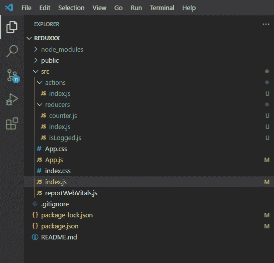

# 通量与 MVC 的差异

> 原文:[https://www . geesforgeks . org/flux-and-MVC 之差/](https://www.geeksforgeeks.org/difference-between-flux-and-mvc/)

**简介:**在本文中，我们将看到 Flux 与 MVC 的区别。

**1。Flux:** Flux 由脸书创建，最初由脸书用于构建客户端 web 应用程序。Flux 应用程序有三个主要部分:调度器、存储和视图(反应组件)。在这里，用外行的话来说，

1.  **商店:**我们可以把商店想象成一个状态管理器，它可以在听动作上改变商店。它通知视图更新。
2.  **视图:**渲染用户界面，处理用户交互。容器视图监听存储更改。
3.  **调度员:**向所有注册店铺广播动作。

**使用助焊剂的优势:**

*   Flux 管理数据资源之间复杂的交互。
*   Flux 具有单向数据流。这意味着更容易管理数据流。

一些流行的 flux 实现是 Redux、Flummox 和 Fluxxor。

**例:**我们用例来理解通量。

#### **创建反应应用程序并安装模块:**

**步骤 1:** 使用以下命令创建一个反应应用程序:

```
npx create-react-app foldername
```

**步骤 2:** 创建项目文件夹(即文件夹名)后，使用以下命令移动到该文件夹:

```
cd foldername
```

**步骤 3:** 创建 ReactJS 应用程序后，使用以下命令安装所需的模块:

```
npm install redux react-redux
```

**第 4 步:**要启动并运行 react 服务器，请使用以下命令

```
npm start
```

**项目结构:**如下图。



**counter.js:** 此文件用于创建递增和递减数字的计数器缩减器。

## java 描述语言

```
const counterReducer=(state=0,action)=>{
    switch(action.type){
        case "INCREMENT":
           return state+1;
        case "DECREMENT":
            return state-1;
        default:
            return state;
    }
}

export default counterReducer;
```