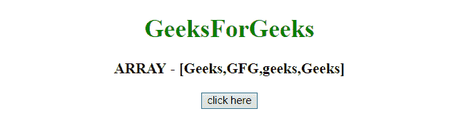
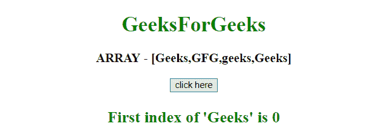
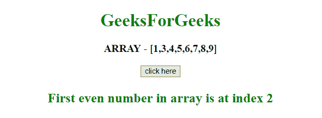

# 数组的 indexOf 和 findIndex 函数的区别

> 原文:[https://www . geesforgeks . org/index of-and-find index-function of-array/](https://www.geeksforgeeks.org/difference-between-indexof-and-findindex-function-of-array/)

任务是区分 JavaScript 的 **indexOf()** 和 **findIndex()** 功能。我们将讨论这两种方法。

*   **indexOf() function:**
    This function is used to find the index of the first occurrence of the element provided for search as the argument to the function.

    **语法:**

    ```
    arr.indexOf(element[, index])

    ```

    **论据:**

    *   **元素:**
        此参数指定要搜索的元素。
    *   **索引:**
        该参数指定从哪个索引开始搜索。
*   **findIndex() function:**
    This function returns index of the first element of the given array which satisfies the testing function.

    **语法:**

    ```
    array.findIndex(fun(curValue, index, arr), thisValue)

    ```

    **论据:**

    *   **fun:** 该参数为数组的每个元素指定要运行的函数。
    *   **曲线值:**此参数指定当前元素的值。
    *   **索引:**此参数指定当前元素的数组索引。
    *   **arr:** 此参数指定当前元素所属的数组对象。
    *   **该值:**该参数指定一个传递给函数的值，用作其“This”值。
        如果为空，将使用值“未定义”。

**例 1:** 在本例中，使用了 **indexOf()函数**。

```
<!DOCTYPE HTML>
<html>

<head>
    <title>
        JavaScript 
      | Difference Between indexOf and findIndex function of array.
    </title>
</head>

<body style="text-align:center;" id="body">
    <h1 style="color:green;">  
            GeeksForGeeks
        </h1>
    <p id="GFG_UP"
       style="font-size: 19px;
              font-weight: bold;">
    </p>
    <button onclick="GFG_Fun()">
        click here
    </button>
    <p id="GFG_DOWN"
       style="color: green; 
              font-size: 24px;
              font-weight: bold;">
    </p>
    <script>
        var el_up = 
            document.getElementById("GFG_UP");
        var el_down = 
            document.getElementById("GFG_DOWN");
        var array = ["Geeks", "GFG", "geeks", "Geeks"];

        el_up.innerHTML = "ARRAY - [" + array + "]";

        function GFG_Fun() {
            el_down.innerHTML = 
              "First index of 'Geeks' is " + array.indexOf('Geeks');
        }
    </script>
</body>

</html>
```

**输出:**

*   **点击按钮前:**
    
*   **点击按钮后:**
    

**例 2:** 在本例中，使用了 **findIndex()函数**。

```
<!DOCTYPE HTML>
<html>

<head>
    <title>
        JavaScript 
      | Difference Between indexOf and findIndex function of array.
    </title>
</head>

<body style="text-align:center;" id="body">
    <h1 style="color:green;">  
            GeeksForGeeks
        </h1>
    <p id="GFG_UP" 
       style="font-size: 19px; 
              font-weight: bold;">
    </p>
    <button onclick="GFG_Fun()">
        click here
    </button>
    <p id="GFG_DOWN"
       style="color: green; 
              font-size: 24px;
              font-weight: bold;">
    </p>
    <script>
        var el_up = 
            document.getElementById("GFG_UP");
        var el_down = 
            document.getElementById("GFG_DOWN");
        var array = [1, 3, 4, 5, 6, 7, 8, 9];

        el_up.innerHTML = "ARRAY - [" + array + "]";

        function getEven(n) {
            if (n % 2 == 0) {
                return 1;
            }
            return 0;
        }

        function GFG_Fun() {
            el_down.innerHTML = 
              "First even number in array is at index "
            + array.findIndex(getEven);
        }
    </script>
</body>

</html>
```

**输出:**

*   **点击按钮前:**
    
*   **点击按钮后:**
    