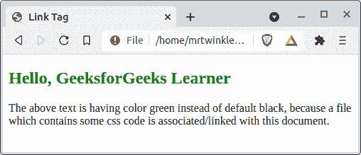
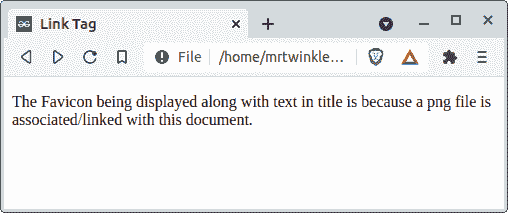
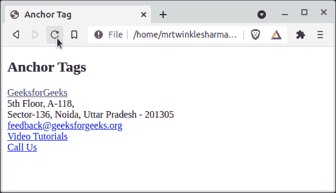

# 链接标签和锚标签的区别

> 原文:[https://www . geesforgeks . org/链接和锚标签之间的区别/](https://www.geeksforgeeks.org/difference-between-link-and-anchor-tags/)

[HTML](https://www.geeksforgeeks.org/html-tutorials/) 语言是 web 开发最基本的组件。如果你是网络开发的初学者，学习 HTML，那么你一定发现了“**链接”**和“**一个“**标签。这两个实体<链接>和< a >，用于某种链接，所以如果你对它们之间的混淆或者想了解它们之间的实际区别，那么你就来对地方了。在本文中，我们将区分它们，然后是实际的定义以及两者的示例。

[**<链接>**](https://www.geeksforgeeks.org/html-link-tag/) **标签:**该标签用于在当前文档和与网页相关联的一些外部资源之间建立连接/关系。该资源可以是一个 CSS 文件、网站中使用的图标、清单等。

它具有某些属性，下面是一些常用属性。

<figure class="table">

| 

Attribute _ Name = " Value "

 | 

示例

 | 

描述

 |
| --- | --- | --- |
| href = " URL " | href = "-什么/externalStyle.css " | It specifies the location of the resource
. |
| media ="media _ query/media _ type " | Media = "sum of screen (minimum width: 700 px)" | On what device will the linked document be displayed
. |
| rel ="relation _ with _ resource " | Rel = Style Sheet
Rel = License
Rel = Icon | It specifies which resource
is associated with this tag. |
| size = " HeightxWidth " | size = " 32×32 " | Mainly used for icon link
resources of specified size. |
| 类型=“MIME _ TYPE” | type = " image/png "
type = " text/html " | This attribute is used to define the
mime-type of the linked content. |

</figure>

**示例 1:** 在我们的文档中创建到某个外部 CSS 样式表的链接。给 h2 标签的 id 只包含一个样式 ***颜色:绿色*** 在那个外部 CSS 文件里面。

## java 描述语言

```html
<!DOCTYPE html>
<html>

<head>
    <title>Link Tag</title>
    <link rel="stylesheet" 
        href="./externalResource.css" />
</head>

<body>
    <h2 id="hello">
        Hello, GeeksforGeeks Learner
    </h2>

<p>
        The above text is having color 
        green instead of default black,
        because a file which contains 
        some css code is associated/linked 
        with this document.
    </p>

</body>

</html>
```

**输出:**



**示例 2:** 为网站添加一些外部收藏夹图标。

## java 描述语言

```html
<!DOCTYPE html>
<html>

<head>
    <title>Link Tag</title>

    // Add png image source here
    <link rel="icon" href="./gfgIcon.png" />
</head>

<body>

<p>
        The Favicon being displayed 
        along with text in title is 
        because a png file is associated
        /linked with this document
    </p>

</body>

</html>
```

**输出:**



[**<一个>**](https://www.geeksforgeeks.org/html-a-tag/) **标签:**这个锚点标签建立了一个到外部或内部 HTML 文档的超链接，一个像电子邮件或电话这样的地址，以及某种外部网址。

*   **一些常用的属性是:-**

<figure class="table">

| 

属性名=“值”

 | 

例子

 | 

描述

 |
| --- | --- | --- |
| href= " url " | href = " https://www . geesforgeks . org "
href = "../FilePath . ext "
href = " # someIncided " | 它指定超链接的
位置。 |
| target="some_browsing_context " | target = " _ blank "
target = " _ self " | 指定
显示链接网址的位置。 |
| download="filename.ext " | 下载="linkedImage.png " | 这是用来
下载超链接
的内容
而不仅仅是访问。 |
| ping= " url " | ping = " https://someurl/post request " | 它将帖子请求发送到
所提供的网址
，主要用于
的追踪。 |

</figure>

**注意:** 链接标签中描述的 **rel** 和**类型**属性也可以与锚点标签一起使用。

**示例 1:** 我们将绘制一个基本克隆的*geeksforgeeks.org*的页脚来说明锚标签的用例，您一定已经看过很多次了，所以对于一个实际示例来说，这可能是一个更好的选择。

**说明:-**

*   第一个锚点标签引用了 GFG 的官方网站，还有另一个属性目标，设置为 value _blank 表示这个超链接将在另一个选项卡中打开。
*   下一个锚标签是传递一个超级链接到 GFG 的邮件。它的语法是**"*****mailto:any _ mail _ id _ will _ 出现在这里*** **"** ，当用户点击这个标签时浏览器会去打开一些默认的应用程序发送邮件。
*   后来有一个链接到 GFG 的 YouTube 频道，注意第一个和这个之间的区别，它没有目标属性，所以默认情况下它会在同一个选项卡中打开。
*   最后，有一个超链接来打电话，它接受一个冒号后带有国家代码的号码，即“T0”电话:any _ phone _ number，类似于邮件超链接，浏览器也将决定使用哪个应用程序来打电话。

## 超文本标记语言

```html
<!DOCTYPE html>
<html>

<body>
    <h2>Anchor Tags</h2>
    <a href="https://www.geeksforgeeks.org"
        target="_blank">
        GeeksforGeeks
    </a><br>

    <div>
        <span>
            5th Floor, A-118,<br>Sector-136, 
            Noida, Uttar Pradesh - 201305
        </span>
    </div>

    <a href="mailto:feedback@geeksforgeeks.org">
        feedback@geeksforgeeks.org
    </a><br>

    <a href="https://www.youtube.com/geeksforgeeksvideos/">
        Video Tutorials
    </a><br>

    <a href="tel:00000000">Call Us</a>
</body>

</html>
```

**输出:-**



**区别** ***<链接>*** **标记** **和** ***<一>*** **标记:**

<figure class="table">T100】

|  | 

<链接>标记

 | T31 | This label is used inside the head. | This label is used inside the car body. |
| --- | --- | --- | --- | --- |
| 2。 | Not displayed on the front end, but for internal use only. | What is written in the anchor tag is displayed at the front end. |
| --- | --- | --- |
| 3。 | It establishes a relationship/connection between two entities. | It establishes a path from the current document to other places. |
| --- | --- | --- |
| 4。 | Because it is not directly visible to users, it cannot be clicked. | Users can click on the content access hyperlink in this tab. |
| --- | --- | --- |
| 5。 | Is an empty element and cannot have nested elements. | It's not an empty element. There can be some nested elements in it. |
| --- | --- | --- |
| 6。 | It has nothing to do with the block or inline attributes of HTML elements. | Is an embedded HTML element. |
| --- | --- | --- |
| 7。 | The basic structure of this tag is that
< links *some _ attributes _ with _ value* /> | 这个标签的基本结构是，
<一*若干 _ 属性 _ 带 _ 值*T4【T97】若干 _ 嵌套 _ 内容<一> |
| --- | --- | --- |

</figure>