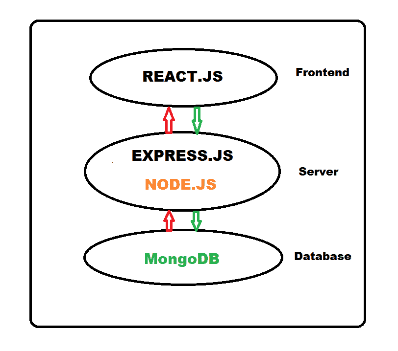

# 均值叠加和 MERN 叠加的差异

> 原文:[https://www . geesforgeks . org/mean-stack 和-mern-stack 之差/](https://www.geeksforgeeks.org/difference-between-mean-stack-and-mern-stack/)

在 web 开发领域，全栈开发发挥着至关重要的作用。全栈开发为前端、后端、测试和移动应用提供了完美的解决方案。在当今世界，对全栈开发人员的需求正在急剧上升。全栈开发人员可以负责项目的整个设计结构。存在不同的全栈开发框架，如 MEAN 栈和 MERN 栈。现在让我们了解两者的变化。

**MEAN stack:** MEAN 是 MongoDB、ExpressJS、AngularJS、Node.js 的缩写，这个框架提供了 web 和移动应用程序的快速轻松开发。均值的主要组成部分如下-

*   **MongoDB:** 用于将后端应用的数据存储为 JSON 文件。
*   **ExpressJS:** 是一个运行在 Node.js 之上的后端应用。
*   **AngularJS:** 是在浏览器中运行代码的前端框架。
*   **NodeJS:** 为后端 web 应用上的 JavaScript 提供运行时系统。

使用 MEAN 堆栈的一个突出优点是整个代码都在 JavaScript 中。所以，初学者很容易探索和学习。此外，它的统一产品可以显著减少开发时间和成本。MEAN 栈包含各种支持库和可重用模块，提供可扩展的最小可行产品。

**MEAN 栈的工作:**MEAN 栈架构是用来在 JavaScript 中构建 web 应用的，并且处理 JSON，非常容易。

**Angular.js 前端:** Angular.js 在 MEAN 栈的顶部。它是一个自封的“JavaScript 框架”。Angular.js 允许您使用元数据扩展您的 HTML 标签，以更强大的方式创建动态的交互式网络体验。

**Express.js 和 Node.js Server Tier:**express . js 是 MEAN 栈的下一步，运行在 node . js 服务器上。Express.js 是 Node.js 的一个快速、极简的 web 框架。Express.js 具有强大的 URL 路由和处理 HTTP 请求和响应的模型。

**MongoDB 数据库层:**如果我们需要存储任何数据，那么我们需要像 MongoDB 这样的数据库。在 Angular.js 前端创建的 JSON 文档被发送到 Express.js 服务器，在那里进行处理并直接存储在 MongoDB 中，以便以后检索。

**MERN 栈:** MERN 是 MongoDB、ExpressJS、ReactJS、Node.js 的缩写，这个框架也提供了使用 java 作为主要组件的 web 和移动应用程序的快速轻松开发。MERN 的主要组成部分如下。

*   **MongoDB:** 是一个面向文档的无 SQL 数据存储，用于存储后端应用。
*   **ExpressJS:** 它是一个建立在 NodeJS 之上的分层框架，负责网站的后端功能和结构。
*   **ReactJS:** 它是一个方便创建单页 web 应用程序的用户界面组件的库。
*   **NodeJS:** 它是一个能够在机器上运行 JavaScript 的运行时环境

**MERN 堆栈工作:**

**React.js 前端:** React.js 在开发栈的顶端。它是用于创建动态客户端应用程序的声明性 JavaScript 框架。React.js 让我们通过简单的组件构建复杂的接口，将它们连接到后端服务器上的数据。

**Express.js 和 Node.js 服务器层:**它在 MERN 栈中的作用与上面提到的 MEAN 栈中的作用相同。

**MongoDB 数据库层:**它在 MERN 堆栈中的作用与上面提到的 MEAN 堆栈中的作用相同。

【MEAN 和 MERN 堆栈之间的差异:

| S.NO | 平均堆栈 | 意思是堆叠 |
| --- | --- | --- |
| one | 它的技术堆栈由 MongoDB、Angular、Express 和 Node 组成。 | 它的技术堆栈由 MongoDB、React、Express 和 Node 组成。 |
| Two | 这是一个 javascript 框架。 | 它是开源的 JS 库。 |
| three | 它使用 Typescript 语言。 | 它使用 JavaScript，JSX。 |
| four | 它提供了更好的生产力。 | 它的生产率很低。 |
| five | 它的学习曲线很陡。 | 它提供了更好的文档。 |
| six | 它有助于管理和呈现代码。 | 它有助于平滑渲染。 |
| seven | 它的数据流是双向的。 | 它的数据流是单向的。 |
| eight | 它不支持移动应用。 | 它支持移动应用。 |