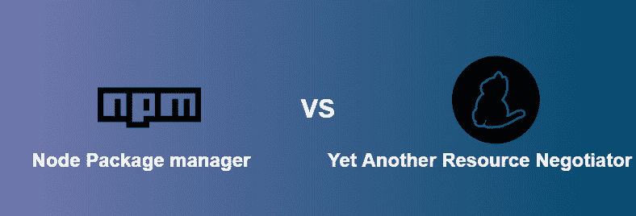
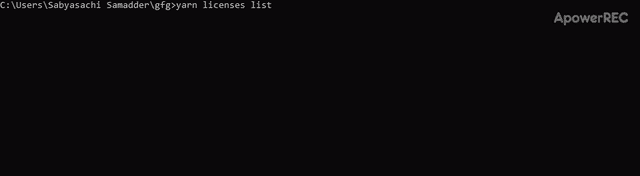

# NPM 与纱线的区别

> 原文:[https://www . geeksforgeeks . org/NPM 与纱线的区别/](https://www.geeksforgeeks.org/difference-between-npm-and-yarn/)


**【NPM】**和**纱**是帮助管理项目依赖关系的包管理器。听起来，依赖是项目所依赖的东西，是使项目正常工作所需的一段代码。我们需要它们，因为管理项目的依赖关系是一项困难的任务，并且它很快变得乏味，并且当项目增长时会失控。通过管理依赖关系，我们意味着包含、不包含和更新它们。

**[npm:](https://www.geeksforgeeks.org/node-js-npm-node-package-manager/)** 它是一个针对 JavaScript 编程语言的包管理器。它是 JavaScript 运行时环境 Node.js 的默认包管理器，由一个命令行客户端(也称为 npm)和一个名为 npm 注册表的公共和付费私有包的在线数据库组成。

**纱:**它代表**又一个资源谈判者**，它是一个包装经理，就像 npm 一样。它是由脸书开发的，现在是开源的。开发纱线(当时)的目的是解决 npm 的性能和安全问题。

**NPM 和纱线的区别解释如下:**

**安装程序**

*   **npm:** npm 随 Node 自动安装。
*   **纱线:**安装纱线必须安装 npm。

    ```
    npm install yarn --global
    ```

**锁定文件**

*   **npm:** NPM 生成一个‘package-lock . JSON’文件。由于决定论和简单性之间的权衡，package-lock.json 文件稍微复杂一点。由于这种复杂性，包锁将为不同的 npm 版本生成相同的 node_modules 文件夹。在包锁文件中，每个依赖项都有一个与之关联的确切版本号。
*   **纱线:**纱线生成一个“纱线锁定”文件。纱线锁文件有助于轻松合并。由于锁定文件的设计，合并也是可预测的。

**输出日志**

*   **安装:**npm 创建 NPM 命令的海量输出日志。它本质上是 npm 正在做什么的堆栈跟踪的转储。
    T3】
*   **添加:**纱线输出圆木干净，视觉上可区分，简洁。为了便于理解，它们也以树形形式排列。
    T3】

**安装全局依赖关系**

*   **npm:** 要安装全局包，npm 的命令模板是:

    ```
    npm install -g package_name@version_number
    ```

*   **纱线:**要安装全局包，纱线的命令模板为:

    ```
    yarn global add package_name@version_number
    ```

**“为什么”命令:**

*   **npm:** npm 还没有内置“为什么”功能。
*   **纱线:**纱线带有一个“为什么”命令，告诉为什么项目中存在依赖关系。例如，它是依赖项、本机模块或项目依赖项。

**许可证检查器**

*   **npm:** 由于安装的依赖关系，npm 没有一个许可证检查器可以方便地描述项目绑定的所有许可证。
*   **yarn:** Yarn has a neat license checker. To see them, run

    ```
    yarn licenses list
    ```

    

**取包**

*   **npm:** 在每个“npm 安装”命令期间，npm 都会从 npm 注册表中获取依赖项。
*   **纱线:**纱线在本地存储依赖关系，并在“纱线添加”命令期间从磁盘获取(假设依赖关系(具有特定版本)在本地存在)。

**NPM 后纱线中的命令发生变化**

| 命令 | 国家预防机制 | 故事 |
| 安装依赖项 | npm 安装 | 故事 |
| 安装软件包 | npm 安装包名
npm 安装包名@版本号 | 纱线添加包 _ 名称
纱线添加包 _ 名称@版本 _ 编号 |
| 卸载软件包 | npm 卸载包名称 | 纱线移除包 _ 名称 |
| 安装开发包 | npm 安装包名称–保存-开发 | 纱线添加包 _ 名称–开发 |
| 更新开发包 | npm 更新包名
npm 更新包名@版本号 | 纱线升级包 _ 名称
纱线升级包 _ 名称@版本 _ 编号 |
| 查看包 | npm 视图包名称 | 纱线信息包 _ 名称 |
| 全局安装包 | npm 安装包名称 | 纱线全局添加包 _ 名称 |

**对 npm 和纱线的命令相同:**

| 国家预防机制 | 故事 |
| npm 初始化 | 纱线初始化 |
| npm 运行[脚本] | 纱线运行[脚本] |
| npm 列表 | 纱线清单 |
| npm 测试 | 纱线测试 |
| npm 连结 | 纱线链节 |
| npm 登录或注销 | 纱线登录或注销 |
| npm 发布 | 纱线出版 |