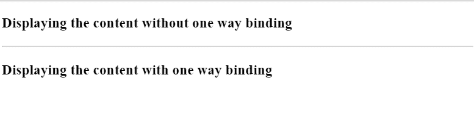
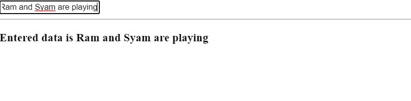

# 单向绑定和双向绑定的区别

> 原文:[https://www . geesforgeks . org/单向绑定和双向绑定的区别/](https://www.geeksforgeeks.org/difference-between-one-way-binding-and-two-way-binding/)

在本文中，我们将学习 Angular 中[数据绑定](https://www.geeksforgeeks.org/angularjs-data-binding/)的概念。我们也将探索它的类型&考察单向绑定和双向绑定在角度上的区别。

数据绑定是自动同步模型和视图组件之间数据的一种方式。 AngularJS 实现了数据绑定，在您的应用程序中始终将模型视为唯一的真实来源&，视图是模型的投影。与 React 不同，angular 支持双向绑定。这样，我们可以使代码更加松散地耦合。数据绑定可以分为两种类型，即。，单向绑定&双向绑定。

**单向绑定:**

*   在单向绑定中，数据流是单向的。
*   这意味着代码流是从 typescript 文件到 Html 文件。
*   为了实现单向绑定，我们在 Angular 中使用了属性绑定概念。
*   在属性绑定中，我们用方括号([ ])将变量封装在 Html 中。
*   我们将通过一个例子来理解这个概念，以便使它更容易理解。

## app.component.ts

```html
import { Component } from "@angular/core";

@Component({
  selector: "my-app",
  templateUrl: "./app.component.html",
  styleUrls: ["./app.component.css"],
})
export class AppComponent {
  title = "Displaying the content with one way binding";
}
```

## app.component.html

```html
<h3>Displaying the content without one way binding</h3>

<hr />

<h3 [textContent]="title"></h3>
```

## app.module.ts

```html
import { NgModule } from "@angular/core";
import { BrowserModule } from "@angular/platform-browser";

import { AppComponent } from "./app.component";

@NgModule({
  imports: [BrowserModule],
  declarations: [AppComponent],
  bootstrap: [AppComponent],
})
export class AppModule {}
```

**输出:**



**双向绑定:**

*   在双向绑定中，数据流是双向的。
*   这意味着代码流是从 ts 文件到 Html 文件以及从 Html 文件到 ts 文件。
*   为了实现双向绑定，我们将在 box 语法中使用 ngModel 或 banana。
*   为了确保应用程序不会崩溃，我们需要从“@angular/forms”导入“FormsModule”。
*   对视图的任何更改都会传播到组件类。此外，组件类中属性的任何更改都会反映在视图中。
*   若要绑定两个属性以便双向绑定工作，请声明 ngModel 指令并将其设置为等于属性的名称。
*   我们将通过一个例子来理解这个概念，以便使它更容易理解。

## app.component.ts

```html
import { Component } from "@angular/core";

@Component({
  selector: "my-app",
  templateUrl: "./app.component.html",
})
export class AppComponent {
  data = "Ram and Syam";
}
```

## app.component.html

```html
<input [(ngModel)]="data"  type="text">

<hr>

<h3> Entered data is  {{data}}</h3>
```

## app.module.ts

```html
import { NgModule } from "@angular/core";
import { BrowserModule } from "@angular/platform-browser";
import { FormsModule } from "@angular/forms";

import { AppComponent } from "./app.component";

@NgModule({
  imports: [BrowserModule, FormsModule],
  declarations: [AppComponent],
  bootstrap: [AppComponent],
})
export class AppModule {}
```

**输出:**



#### 单向和双向绑定的区别

<figure class="table">

| 

**单向绑定**

 | 

**双向绑定**

 |
| --- | --- |
| 在单向绑定中，流是单向的。 | 在双向绑定中，流是双向的。 |
| 这意味着代码流是从 ts 文件到 Html 文件。 | 这意味着代码流是从 ts 文件到 Html 文件以及从 Html 文件到 ts 文件。 |
| 为了实现单向绑定，我们在 Angular 中使用了属性绑定的概念。 | 为了实现双向绑定，我们将在 box 语法中使用 ngModel 或 banana。 |
| 在属性绑定中，我们用方括号([ ])将变量封装在 html 中。 | 为了确保应用程序不会崩溃，我们需要从“@angular/forms”导入“FormsModule”。使用**n model**，我们将一个变量从 Html 绑定到 ts 文件，从 ts 文件绑定到 Html 文件。 |

</figure>