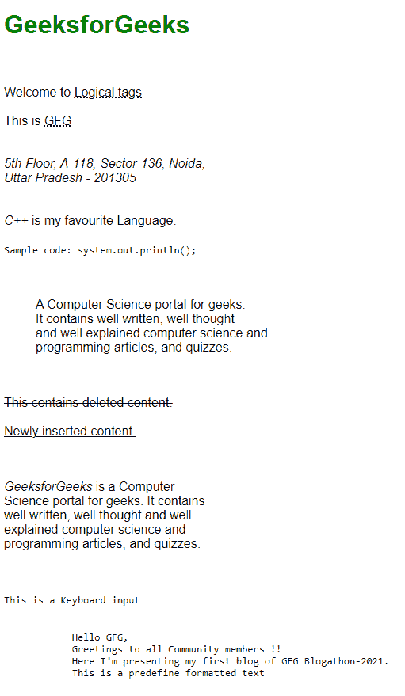

# 物理标签和逻辑标签的区别

> 原文:[https://www . geesforgeks . org/物理标签和逻辑标签的区别/](https://www.geeksforgeeks.org/difference-between-physical-and-logical-tags/)

在本文中，我们将了解 HTML 中的物理标签和逻辑标签及其实现。我们还将探讨它们之间的区别。让我们从物理标签开始讨论。

**物理标签:**物理标签用于指示如何使用 HTML 标签格式化或指示特定字符。任何物理样式标签都可以包含文本中允许的任何项目，包括常规文本、图像、换行符等。物理标签只能用于特定元素的样式目的。虽然每个物理标签都有定义的样式，但是您可以通过为每个标签定义自己的外观来覆盖该样式。所有物理标签都需要结束标签。请参考[什么是 HTML 中的物理标签？](https://www.geeksforgeeks.org/what-are-physical-tags-in-html/)文章获取更多详情。

**语法:**

```html
<tagname>Content</tagname>
```

**特征:**

*   他们非常直白。
*   他们习惯于突出重要的句子。
*   物理文本样式表示部分的特定外观类型，例如粗体、斜体等。
*   所有浏览器都以相同的方式呈现物理样式。

以下是一些有用的物理标签列表:

*   **[<>](https://www.geeksforgeeks.org/html-sup-tag/)**上标通常用于显示基线以上的元素
*   **[<子>](https://www.geeksforgeeks.org/html-sub-tag/)** 这个下标是用于交替基线的。
*   **[< i >](https://www.geeksforgeeks.org/html-i-tag/)** 斜体标签用于定义具有特殊含义的文本。
*   **[<大>](https://www.geeksforgeeks.org/html-big-tag/)** 大标签增加字体大小 1(注意:HTML 5 中不能使用大标签)
*   **[<小>](https://www.geeksforgeeks.org/html-small-tag/)** 一个小标签定义了小文本，写版权时使用。
*   **[< b >](https://www.geeksforgeeks.org/html-b-tag/)** 加粗增加了文本的重要性，因为加粗标签将文本隐蔽成加粗的大小。
*   **[< u >](https://www.geeksforgeeks.org/html-u-tag/)** 它是用来给文字加下划线的。
*   **[<【TT】>](https://www.geeksforgeeks.org/html-tt-tag/)**电传文本给出了默认字体系列，即等宽字体。
*   **[<击>](https://www.geeksforgeeks.org/html-strike-tag/)** 这是一个编辑标记，告诉读者忽略文本段落。

**示例:**

## 超文本标记语言

```html
<!DOCTYPE html>
<html>

<head>
    <title>Physical Tags</title>
    <style>
        .container {
            font-family: sans-serif;
            white-space: pre-line;
        }

        h1 {
            color: green;
        }
    </style>
</head>

<body>
    <div class="container">
        <h1>GeeksforGeeks</h1>
        Welcome to the official channel of GeeksforGeeks!
        <b>
            Learn Data Structures Online At Your 
            Own Pace With The Best Of Faculty
            In The Industry.
        </b>

        <big>
            A Computer Science portal for geeks. 
            It contains well written, well thought 
            and well explained computer science 
            and programming articles.
        </big>

        <i>
            The Best Data Structures Course 
            Available Online From Skilled And
            Experienced Faculty.
        </i>

        <small>
            Python is a widely used, high-level 
            programming language.
        </small>

        5<sup>2</sup> SO<sub>2</sub>

        <tt>
            We provide a variety of services for 
            you to learn, thrive and also have
            fun!
        </tt>

        <u>
            Free Tutorials, Millions of Articles, 
            Live, Online and Classroom Courses, 
            Frequent Coding Competitions, Webinars
            by Industry Experts, Internship 
            opportunities and Job Opportunities. 
            Knowledge is power!
        </u>
    </div>
</body>

</html>
```

**输出:**


**逻辑标签:**逻辑标签用来告诉浏览器标签里面写的是什么样的文字。逻辑标签也称为结构标签，因为它们指定文档的结构。逻辑标签用于向视力受损的人表明文本中有更重要的东西，或者强调文本，即逻辑标签可以用于样式目的，也可以赋予文本内容特殊的重要性。请参考[什么是 HTML 中的逻辑标签？](https://www.geeksforgeeks.org/what-are-logical-tags-in-html/)文章获取更多详情。

**语法:**

```html
<tagname>Content</tagname>   
```

逻辑标签有用的一些情况:

*   在我们的网站上写代码。
*   强调一些文字。
*   在网页上显示缩写。
*   在我们的网页上展示一些名言。
*   用变量来写一些数学公式。

以下是一些有用的逻辑标签列表:

*   **[<缩写>](https://www.geeksforgeeks.org/html-abbr-tag/)** 定义了文字的缩写。
*   **[<首字母缩略词>](https://www.geeksforgeeks.org/html-acronym-tag/)** 定义首字母缩略词。
*   **[<地址>](https://www.geeksforgeeks.org/html-address-tag/)** 一个人或一个组织的联系方式。
*   **[<引用>](https://www.geeksforgeeks.org/html-cite-tag/)** 定义引用。它以斜体格式显示文本。
*   **[<代码>](https://www.geeksforgeeks.org/html-code-tag/)** 定义了那段电脑代码。
*   **[<>](https://www.geeksforgeeks.org/html-blockquote-tag/)**定义了一个长引号。
*   **[<>](https://www.geeksforgeeks.org/html-del-tag/)**定义删除的文本，用于标记文档中已删除的部分文本。
*   **[< dfn >](https://www.geeksforgeeks.org/html-dfn-tag/)** 定义了定义元素，用于在 HTML 中表示定义实例。
*   **[< ins >](https://www.geeksforgeeks.org/html-ins-tag/)** 定义插入文字。
*   **[< kbd >](https://www.geeksforgeeks.org/html-kbd-tag/)** 定义键盘输入文字。
*   **[<>](https://www.geeksforgeeks.org/html-pre-tag/)**定义了预格式化文本块，它保留了网页浏览器忽略的文本空格、换行符、制表符和其他格式化字符。
*   **[< q >](https://www.geeksforgeeks.org/html-q-tag/)** 定义了短引号。
*   **[<采样>](https://www.geeksforgeeks.org/html-samp-tag/)** 定义从计算机程序输出的样本文本。
*   **[<强>](https://www.geeksforgeeks.org/html-strong-tag/)** 定义强文本即显示文本的重要性。
*   **[<var>](https://www.geeksforgeeks.org/html-var-tag/)** Defines the variable in a mathematical equation or in the computer program.

    **示例:**

    ## 超文本标记语言

    ```html
    <!DOCTYPE html>
    <html>

    <head>
        <title>Logical Tag</title>

        <style>
            .container {
                font-family: sans-serif;
                white-space: pre-line;
            }

            h1 {
                color: green;
            }
        </style>
    </head>

    <body>
        <div class="container">
            <h1>GeeksForGeeks</h1>

            Welcome to <abbr title="tags"> Logical tags</abbr>

            This is <acronym title="GeeksforGeeks">GFG</acronym>

            <address>
                5th Floor, A-118, Sector-136, Noida, 
                Uttar Pradesh - 201305
            </address>

            <cite> C++ </cite> is my favourite Language.

            <code> Sample code: system.out.println(); </code>

            <blockquote cite="https://www.geeksforgeeks.org/">
                A Computer Science portal for geeks. 
                It contains well written, well thought 
                and well explained computer science and 
                programming articles, and quizzes.
            </blockquote>

            <del> This contains deleted content.</del>

            <ins> Newly inserted content.</ins>

            <p>
                <dfn> GeeksforGeeks </dfn> is a Computer 
                Science portal for geeks. It contains 
                well written, well thought and well 
                explained computer science and 
                programming articles, and quizzes.
            </p>

            <kbd>This is a Keyboard input </kbd>

            <pre>
                Hello GFG,
                Greetings to all Community members !!
                Here I'm presenting my first blog of GFG Blogathon-2021.
                This is a predefine formatted text 
            </pre>
        </div>
    </body>

    </html>
    ```

    **输出:**

    

    **逻辑&物理标签的区别:**

    <figure class="table">

    | s。没有。 | 

    #### **Logical label**

     | 

    #### **Physical label**

     |
    | --- | --- | --- |
    | 1。 | 逻辑标签描述了标签内包含的文本的行为、内容性质。它们代表了页面上文本的功能。

     | 物理标签用于决定文本的外观，不提供任何关于文本的信息。 |
    | 2。 | 它承载着一定的义务。 | 它极其直白。 |
    | 3。 | 用来提视障文字。 | 用来表示需要形成的具体字符。 |
    | 4。 | 在这里，页面更容易访问。 | 页面可访问性比较低。 |
    | 5。 | 它支持最新的技术。 | 这个概念是依赖于弱工具的。 |
    | 6。 | 逻辑标签通过赋予文本特殊的重要性来提供信息。例如，< em >标签用于通过以斜体格式表示文本来强调文本。 | 物理标签仅用于内容样式。例如，< i >用于以斜体格式显示文本。 |

    </figure>