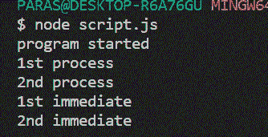

# process . next tick()和 setImmediate()方法的区别

> 原文:[https://www . geeksforgeeks . org/process-next tick-and-set immediate-methods/](https://www.geeksforgeeks.org/difference-between-process-nexttick-and-setimmediate-methods/)

要理解 process.nextTick()和 setImmediate()方法的区别，首先需要了解 Node.js **事件循环**的工作原理。

**什么是 Node.js 事件循环？**
由于 JavaScript 是单线程的，即一次只执行一个进程，所以是 Event Loop 允许 Node.js 执行非阻塞 I/O 操作。

**事件循环的工作？**
在一个 JavaScript 程序的开始，一个事件循环被初始化。有几个操作在事件循环中执行。下面是它们在事件循环的单次迭代中执行的顺序。这些操作在队列中处理。

> 计时器–>等待回调–>空闲、准备–>连接(轮询、数据等)–>检查–>关闭回调

**理解过程. nextTick()方法:**每当一个新的操作队列被初始化时，我们可以把它看作一个新的 **tick** 。process.nextTick()方法将回调函数添加到下一个事件队列的开头。需要注意的是，在程序进程开始时，在事件循环被处理之前，第一次调用 nextTick()方法。

**语法:**

```html
process.nextTick(callback);
```

**理解 setimmdiate()方法:**每当我们调用 setImmediate()方法时，它的回调函数都被放在下一个事件队列的**检查**阶段。这里需要注意一点细节，setImmediate()方法在**轮询**阶段调用，它的回调函数在**检查**阶段调用。

**语法:**

```html
setImmediate(callback);
```

**示例:**

```html
setImmediate(function A() {
    console.log("1st immediate");
});

setImmediate(function B() {
    console.log("2nd immediate");
});

process.nextTick(function C() {
    console.log("1st process");
});

process.nextTick(function D() {
    console.log("2nd process");
});

// First event queue ends here
console.log("program started");
```

对于上述程序，事件队列以下列方式初始化:

1.  在**第一个**事件队列中，只打印“程序启动”。
2.  然后**秒**事件队列启动，函数 C 即 process.nextTick()方法的回调放在事件队列的开始。c 被执行，队列结束。
3.  Then previous event queue ends and **third** event queue is initialized with callback D. Then callback function A of setImmdeiate() method is placed in the followed by B.
    Now, the third event queue looks like this,

    ```html
    D A B
    ```

    现在，函数 D、A、B 按照它们在队列中出现的顺序执行。

    **输出:**
    