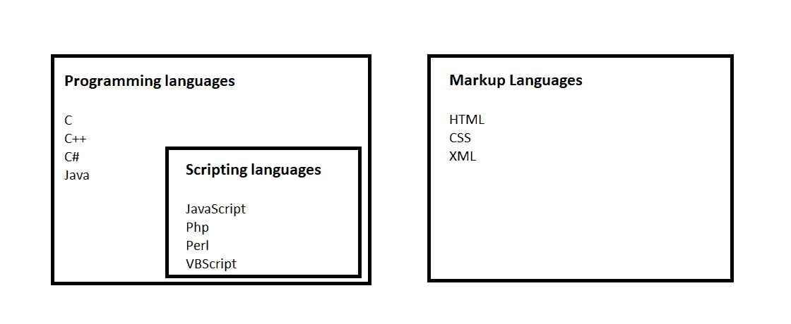

# 编程、脚本和标记语言之间的区别

> 原文:[https://www . geesforgeks . org/编程-脚本和标记语言之间的区别/](https://www.geeksforgeeks.org/difference-between-programming-scripting-and-markup-languages/)

说到制作网站或应用程序，编码基本上涉及三种语言，即编程语言、脚本语言和标记语言。
有很多人认为编码只是开发或制作一个网站，但他们需要了解每一种语言都属于某一特定类别，我们需要知道这种语言属于哪一类别。我们将详细讨论网站或应用程序的这三个主要类别或支柱之间的区别，即编程语言、脚本语言和标记语言。

**编程语言:**简单来说，编程语言是一组指令或代码，告诉计算机它需要做什么。因此，基本上，我们向计算机提供一个逻辑或指令来执行一些任务，以从中获得期望的输出。当我们需要写一张光盘或刻录一张光盘时，或者当我们需要在笔式驱动器中粘贴一些东西时，所有这些指令都是通过一些软件给出的，这些软件涉及一些指令或一组代码，并且这些软件与硬件通信。编程语言是需要转换为机器级语言的高级语言，因为计算机只能理解机器级语言或二进制语言(0 和 1)。因此，我们以人类可读的形式编写指令，然后点击编译按钮，将其转换为计算机可以理解的机器级语言，然后计算机执行任务。这种转换是由编译器完成的，它一次扫描完整的代码，如果发现任何错误，它会立即抛出所有错误。例如 [Java](https://www.geeksforgeeks.org/java/) 、 [C](https://www.geeksforgeeks.org/c-programming-language/) 、 [C++](https://www.geeksforgeeks.org/c-plus-plus/) 、 [C#](https://www.geeksforgeeks.org/csharp-programming-language/) 。编程语言最广泛地用于制作软件或驱动程序。

**脚本语言:**顾名思义，就是给脚本执行某个特定的任务。脚本语言基本上是编程语言的一个子类，用来给另一个程序提供指导或者我们可以说是控制另一个程序，所以它也涉及到指令。它基本上将一种语言连接到另一种语言，并且不能独立工作。 [Javascript](https://www.geeksforgeeks.org/javascript-tutorial/) 、 [PHP](https://www.geeksforgeeks.org/php/) 、 [Perl](https://www.geeksforgeeks.org/perl-tutorial/) 、 [Python](https://www.geeksforgeeks.org/python-programming-language/) 、VBScript 这些都是脚本语言的例子。脚本语言需要解释(逐行扫描代码，不像编译器那样一气呵成)而不是编译。脚本语言中没有 ***编译器*** 的作用域。脚本语言最广泛地用于创建网站。

**标记语言:**标记语言与编程语言和脚本语言完全不同。标记语言为数据准备结构，或者为页面的外观或设计做准备。这些都是 ***表象*** 语言，它不包括任何类型的逻辑或算法，例如，HTML。 [HTML](https://www.geeksforgeeks.org/html-tutorials/) 不是对着电脑问任何一种问题，也不是在比较东西，也不是在问任何逻辑问题。它只是用来表示网页浏览器中的一个视图。它告诉浏览器如何为特定的页面、布局、标题、标题、表格等构建数据，或者以特定的方式设计页面的样式。所以基本上它包括格式化数据或者控制数据的呈现。标记语言的例子有 HTML、 [CSS](https://www.geeksforgeeks.org/css-tutorials/) 或 XML。这些语言被广泛用于设计网站。

从上面的定义中，我们可以从下面的图片中总结出编程语言、脚本语言和标记语言。

**结论:**所以可以说*所有的脚本语言都是编程语言但是所有的编程语言都不是脚本语言*。c 不能称为脚本语言，它只是一种编程语言，但我们可以称之为 JavaScript 或 Php 编程或脚本语言。此外，没有必要编译脚本语言，它只需要解释。脚本语言通常比编程语言慢，因为编译的程序首先被转换成机器代码。另一方面，标记语言只是用来定义不需要任何逻辑或算法的数据结构。