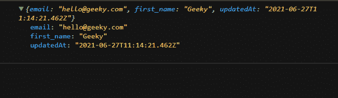
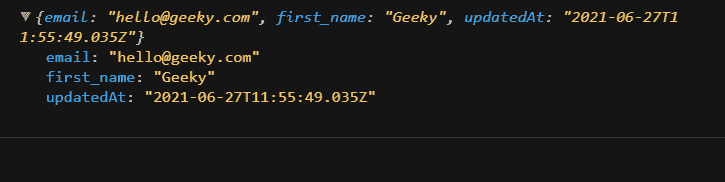

# PUT 和 PATCH 请求之间的差异

> 原文:[https://www . geesforgeks . org/put-and-patch-request 之差/](https://www.geeksforgeeks.org/difference-between-put-and-patch-request/)

在本文中，我们将讨论 **PUT** 和 **PATCH** HTTP 请求之间的区别。PUT 和 PATCH 请求都是 HTTP 动词，都与更新某个位置的资源有关。

**PUT HTTP Request:** PUT 是一种修改资源的方法，其中客户端发送更新整个资源的数据。PUT 类似于 POST，因为它可以创建资源，但是当有一个定义的 URL 时，PUT 会替换整个资源(如果存在的话)，或者创建新的资源(如果不存在的话)。

例如，当您想要更新候选人姓名和电子邮件时，您必须发送候选人的所有参数，包括那些不在请求正文中更新的参数，否则，它将简单地用姓名和电子邮件替换整个资源。

```
{
  id: 8,
  email: "lindsay.ferguson@reqres.in",

  // field to be updated
  first_name: "Lindsay",

  // field to be updated
  last_name: "Ferguson",
  avatar: "https://reqres.in/img/faces/8-image.jpg"
}
```

让我们举一个例子，通过只发送我们想要更新的字段来理解 PUT 请求。

**示例:**以下代码演示了 **PUT** 请求方法

## java 描述语言

```
let PutRequest = () => {
  // Sending PUT request with fetch API in javascript
  fetch("https://reqres.in/api/users/2", {
    headers: {
      Accept: "application/json",
      "Content-Type": "application/json"
    },
    method: "PUT",

    // Sending only the fields that to be updated
    body: JSON.stringify({      
      email: "hello@geeky.com",
      first_name: "Geeky"
    })
  })
    .then(function (response) {

      // Console.log(response);
      return response.json();
    })
    .then(function (data) {
      console.log(data);
    });
};

PutRequest();
```

**输出:**



put 请求的示例

在上面的例子中，我们向服务器发出了一个 PUT 请求，并在主体上附加了一个有效负载。如果我们想要更新名称和电子邮件，通过 PUT 请求，我们必须向服务器发送所有其他字段，如 id、avatarlast_name，否则，它会用传递的有效负载替换数据，如我们在上面的示例中所见。

**PATCH HTTP 请求:**与 PUT 请求不同，PATCH 会进行部分更新，例如需要客户端更新的字段，只更新该字段，不修改其他字段。

所以在前面的例子中，我们只需发送请求正文中的姓名和电子邮件字段。

```
{
"first_name":"Geeky",    // field that to be updated
"email":"hello@geeky.com",     // field that to be updated
}
```

**示例**:以下代码演示了**补丁**请求方法

## java 描述语言

```
let PatchRequest = () => {
  // sending PUT request with fetch API in javascript
  fetch("https://reqres.in/api/users/2", {
    headers: {
      Accept: "application/json",
      "Content-Type": "application/json"
    },
    method: "PATCH",    

    // Fields that to be updated are passed
    body: JSON.stringify({
      email: "hello@geeky.com",
      first_name: "Geeky"
    })
  })
    .then(function (response) {

      // console.log(response);
      return response.json();
    })
    .then(function (data) {
      console.log(data);
    });
};

PatchRequest();
```

**输出:**



补丁请求

在上面的例子中，我们已经向服务器发出了一个 **PATCH** 请求，在主体上附加了一个有效载荷。如果我们想用 PATCH 请求更新电子邮件和名字，那么我们只需要发送需要更新的字段，例如名字和电子邮件。

**PUT 和 PATCH 请求的区别:**

<figure class="table">

| 【PUT】 | 修补 |
| --- | --- |
| PUT is a method of modifying resources, in which the client sends data to update the whole resource. | PATCH is a method of modifying resources, in which the client sends some data to be updated without modifying the whole data. |
| In the PUT request, the included entity is considered as a modified version of the resource stored on the source server, and the client is requesting to replace the stored version with a PATCH. | However, the contained entity contains a set of instructions that describe how the resources currently residing on the source server should be modified to generate a new version. |
| HTTP PUT is said to be idempotent, so if a request is sent and retried several times, it should be equivalent to the modification of a single request. | HTTP PATCH is basically not idempotent. Therefore, if you retry the request n times, you will create n resources with n different URIs on the server. |
| It has high bandwidth. | Because only the data that needs to be modified when it is sent as payload in the request body, it has low bandwidth. |

</figure>