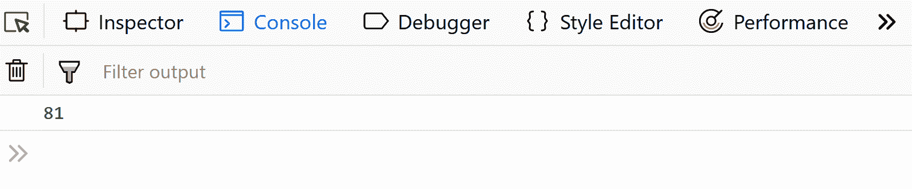
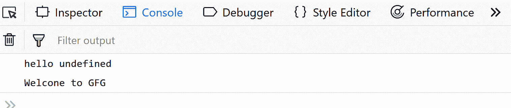
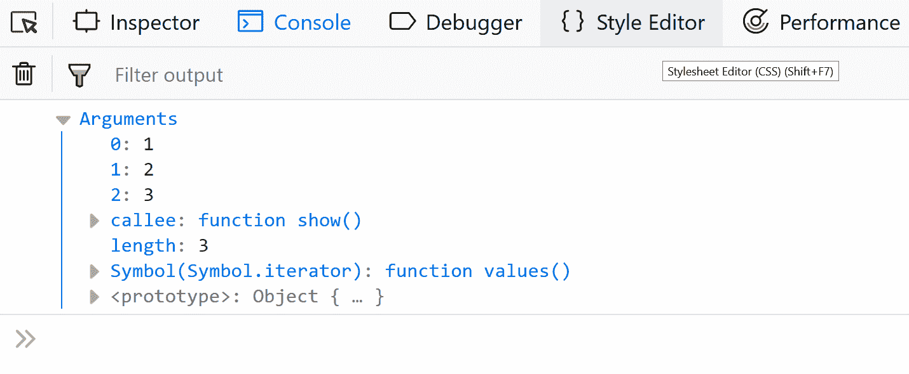
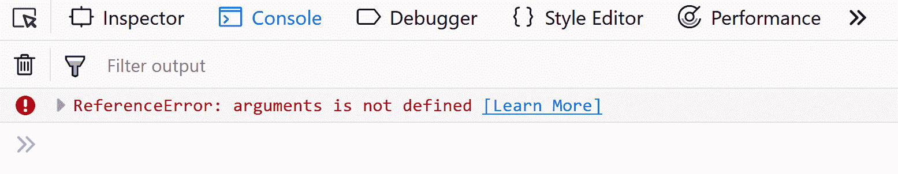
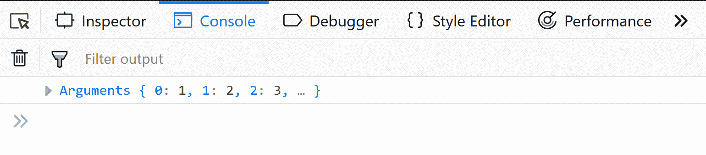
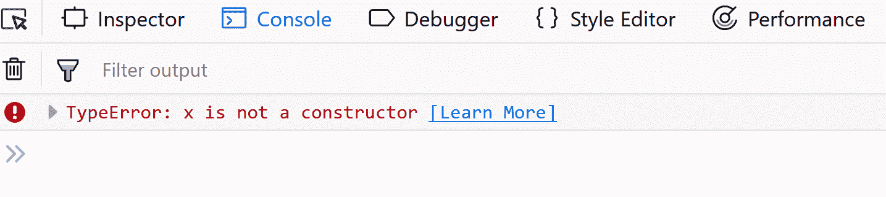

# 常规函数和箭头函数的区别

> 原文:[https://www . geesforgeks . org/常规函数和箭头函数的区别/](https://www.geeksforgeeks.org/difference-between-regular-functions-and-arrow-functions/)

本文讨论了正则函数和箭头函数之间的主要区别。

箭头函数 ES6 中引入的新功能——支持用 JavaScript 编写简洁的函数。虽然常规函数和箭头函数的工作方式相似，但它们之间有一些有趣的区别，如下所述。

句法

**常规**函数的语法:-

```html
let x = function function_name(parameters){
   // body of the function
};
```

**常规**功能示例:-

```html
let square = function(x){
  return (x*x);
};
console.log(square(9));
```

**输出:**


**箭头**的语法功能:-

```html
let x = (parameters) => {
    // body of the function
};
```

**箭头**功能示例:-

```html
var square = (x) => {
    return (x*x);
};
console.log(square(9));
```

**输出:**


使用此关键字

与**常规功能**不同，箭头功能没有自己的`this`。
例如:-

```html
let user = {
    name: "GFG",
    gfg1:() => {
        console.log("hello " + this.name); // no 'this' binding here
    },
    gfg2(){       
        console.log("Welcome to " + this.name); // 'this' binding works here
    }  
 };
user.gfg1();
user.gfg2();
```

**输出:**


`arguments`对象的可用性

Arguments 对象在箭头函数中不可用，但在常规函数中可用。

使用**常规** ():-

```html
let user = {      
    show(){
        console.log(arguments);
    }
};
user.show(1, 2, 3);
```

**输出:**


使用**箭头** ():-

```html
let user = {     
        show_ar : () => {
        console.log(...arguments);
    }
};
user.show_ar(1, 2, 3);
```

**输出:**


使用`new`关键字

使用函数声明或表达式创建的正则函数是“可构造的”和“可调用的”。因为正则函数是可构造的，所以可以使用“new”关键字来调用它们。但是，箭头函数只能“调用”，不能构造。因此，在尝试使用新关键字构造不可构造的箭头函数时，我们会得到一个运行时错误。

使用**常规**功能的示例:-

```html
let x = function(){
    console.log(arguments);
};
new x =(1,2,3);
```

**输出:**

示例使用**箭头功能** :-

```html
let x = ()=> {
    console.log(arguments);
};
new x(1,2,3);
```

**输出:**

关于箭头功能的更多信息，请参考本[链接](https://www.geeksforgeeks.org/arrow-functions-in-javascript/)。