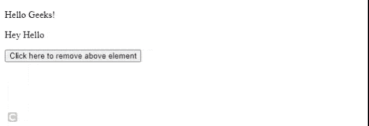
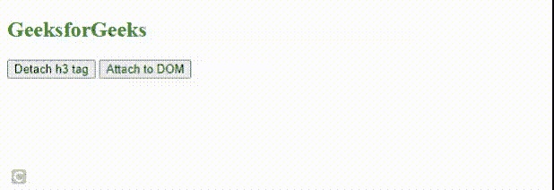

# 移除()和分离()方法的区别

> 原文:[https://www . geesforgeks . org/remove-and-detach-methods/](https://www.geeksforgeeks.org/difference-between-remove-and-detach-methods/)

在看 jQuery 这两种方法的区别之前，让我们先了解一下方法。

[**移除()**](https://www.geeksforgeeks.org/jquery-remove/) **:** 这个**移除()**方法从 DOM 中移除匹配的元素。当我们对任何元素应用 **remove()** 方法时，该元素内的所有内容和元素本身都将从 DOM 中移除。所有嵌套元素、事件处理程序或该元素中存在的任何类型的数据都将被移除。

**语法:**

```
$('selector').remove();
```

**示例:**

## 超文本标记语言

```
<!DOCTYPE html>

<head>
    <!-- jQuery library -->
    <script src=
    "https://code.jquery.com/jquery-git.js">
    </script>
</head>

<body>
    <div class="test">
        <p>Hello Geeks!</p>

        <p>Hey Hello</p>

    </div>

    <button>Click here to remove above element</button>
    <script>
        // Removing class test from DOM
        $("button").click(function () {
            $(".test").remove();
        })        
    </script>
</body>

</html>
```

**输出:**



移除方法

[**拆离():**](https://www.geeksforgeeks.org/jquery-detach-with-examples/)****拆离()**的方法和上面**拆离()**的方法差不多。唯一的区别是 **detach()** 方法保留了与被移除元素相关的所有数据。我们所有的数据都是安全的，所以我们可以随时将它们重新插入 DOM。**

**当我们想要移除任何元素，但又不想完全移除它，以便以后可以重新插入移除的元素时，基本上使用这种方法。**

****语法:****

```
$(selector).detach()
```

****示例:**我们将首先从 DOM 中移除一个元素，然后尝试将移除的元素重新插入到 DOM 中。**

## **超文本标记语言**

```
<!DOCTYPE html>

<head>
    <!-- jQuery library -->
    <script src=
"https://code.jquery.com/jquery-git.js">
   </script>
</head>

<body>
    <h2 style="color:green">GeeksforGeeks</h2>

    <button id="detach">Detach h3 tag</button>
    <button id="attach">Attach to DOM</button>
    <script>
        // A variable to store the data 
        // of removed element
        let rem; 

        // Removing h3 tag first
        // on clicking detach button
        $("#detach").click(function () {
            rem = $("h2").detach();
        })

        // Reinserting h2 tag 
        // on clicking attach button
        $("#attach").click(function(){
            rem.appendTo("body");
        })

    </script>
</body>

</html>
```

****输出:****

**

分离并连接** 

****之间的区别。移除()和。detach():****

<figure class="table">

| 移除() | 分离() |
| --- | --- |
| It removes the matching element from the DOM. | It also removes matching elements from the DOM. |
| 它不保留被移除元素的数据。同样，所有子元素、事件处理程序以及元素中存在的任何类型的数据都将被移除。 | 它保存了分离元素的数据。分离元件内部的所有东西都保持安全。 |
| The removed element cannot be reinserted into the DOM. | We can easily reinsert elements into DOM at any time. |

</figure>