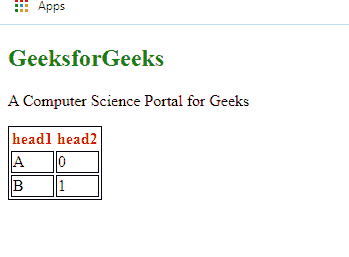

# 语义和非语义元素的区别

> 原文:[https://www . geesforgeks . org/语义和非语义元素的区别/](https://www.geeksforgeeks.org/difference-between-semantic-and-non-semantic-elements/)

**[语义 HTML 元素:](https://www.geeksforgeeks.org/html5-semantics/)**
这些元素简单的意思就是，有意义的元素。原因是，代码中的定义告诉浏览器和开发人员他们应该做什么。用更简单的话来说，这些元素描述了它们应该包含的内容类型。

以下是一些语义元素的列表:

*   文章
*   在旁边
*   细节
*   figcaption(快照标题)
*   数字
*   页脚
*   形式
*   页眉
*   主要的
*   标记
*   航行
*   桌子
*   部分

**示例:**下面的程序包含了一些语义元素，可以更好地解释上下文:

```html
<!DOCTYPE html>
<html>
<head>
    <title>my web page</title>
    <style type="text/css">
        h1{
            color: green;
            font-weight: bold;
        }
        table, tr, td{
            border: 1px solid black;
        }
        th{
            font-weight: bold;
            color: red;
        }
    </style>
</head>
<body>
     <article> 
         <h1>GeeksforGeeks</h1> 
         <p>A Computer Science Portal for Geeks</p> 
      </article> 
      <table>
          <tr>
              <th>head1</th>
              <th>head2</th>
          </tr>
          <tr>
              <td>A</td>
              <td>0</td>
          </tr>
          <tr>
              <td>B</td>
              <td>1</td>
          </tr>
      </table>
</body>
</html>
```

**输出:**


**非语义要素:**与语义要素不同，它们没有任何意义。他们不告诉任何关于他们包含的内容。它们可以与不同的属性一起使用来标记一个组的公共语义。

以下是一些非语义元素的列表:

*   差异
*   跨度

**示例:**
下面的代码描述了非语义元素的工作原理:

```html
<!DOCTYPE html>
<html>
<head>
    <title>my web page</title>
    <style type="text/css">
     span{
         color: green;
         font-size: 40px ;
         font-weight: bold;  
            }
    </style>
</head>
<body>
    <div>
        <span>GeeksForGeeks</span> <br>
        A computer science portal for geeks
    </div>
</body>
</html>
```

**输出:**


**语义要素与非语义要素的区别:**

| 语义元素 | 非语义元素 |
| 它们有意义 | 它们没有意义 |
| 它们描述了其中的内容应该如何表现 | 它们可以包含任何东西 |
| 它们的结构有特定的属性 | “class”属性可用于处理它们的结构 |