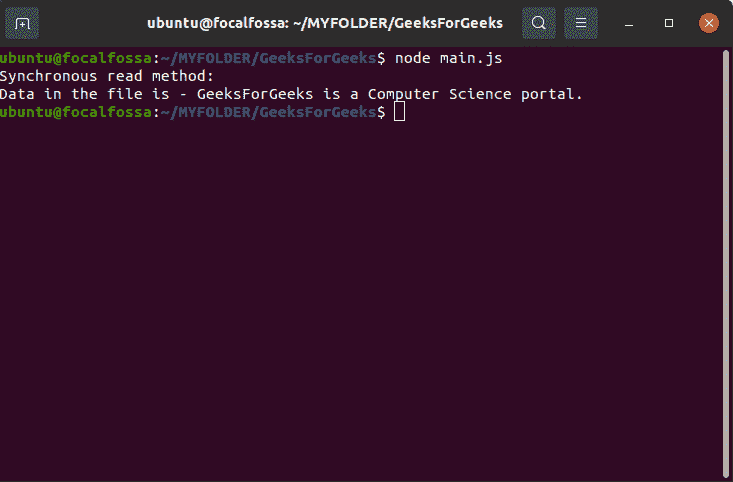
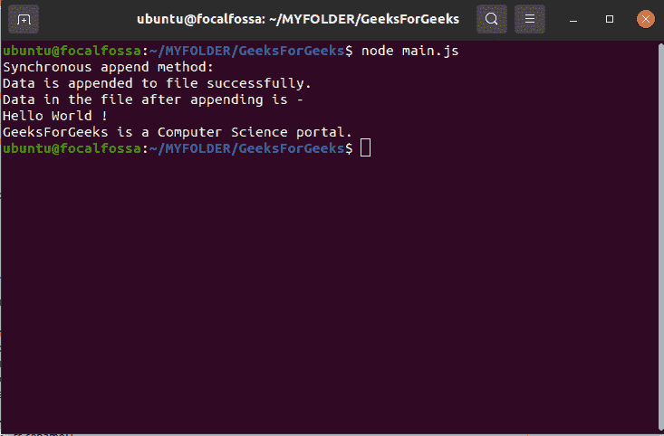
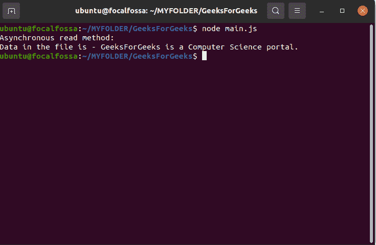
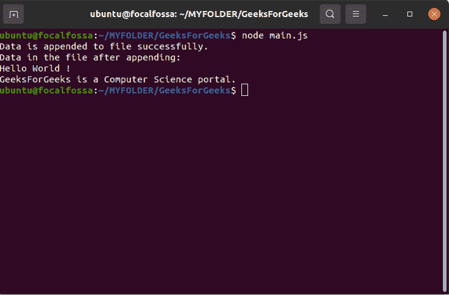

# fs 模块同步和异步方式的区别

> 原文:[https://www . geesforgeks . org/同步和异步方法的区别-fs-module/](https://www.geeksforgeeks.org/difference-between-synchronous-and-asynchronous-method-of-fs-module/)

NodeJS 为我们提供了一个内置的 [**fs(文件系统)模块**](https://www.geeksforgeeks.org/tag/node-js-fs-module/) ，用于各种文件处理操作，如读取文件、写入文件、删除文件等。可以使用以下语句安装 fs 模块:

**语法:**

```html
npm install fs --save
```

**注意:**上面命令中的 npm 代表节点包管理器，所有依赖项都可以从这里安装到 NodeJS 中。

要使用 fs 模块，请在代码中添加以下语句:

```html
const fs = require('fs');
```

fs 模块对文件处理有不同的操作，如读取文件、写入文件、追加文件、关闭文件、删除文件等。根据用户的需求，所有的操作既可以同步执行，也可以异步执行。

**1。同步方法:**同步函数阻止程序的执行，直到执行文件操作。这些函数也称为阻塞函数。同步方法将文件描述符作为最后一个参数。文件描述符是对打开文件的引用。它是使用 fs 模块的 fs.open()方法打开文件后返回的文件的数字或引用 id。所有异步方法都可以通过在函数名后添加“同步”来同步执行。NodeJS 中 fs 模块的一些同步方法有:

*   [fs.readFileSync()](https://www.geeksforgeeks.org/node-js-fs-readfilesync-method/)
*   [fs.renameSync()](https://www.geeksforgeeks.org/node-js-fs-renamesync-method/)
*   [fs.writeSync()](https://www.geeksforgeeks.org/node-js-fs-writefilesync-method/)
*   [fs.writeFileSync()](https://www.geeksforgeeks.org/node-js-fs-writefilesync-method/)
*   [fs.fsyncSync()](https://www.geeksforgeeks.org/nodejs-fs-fsyncsync-method/)
*   [fs.appendFileSync()](https://www.geeksforgeeks.org/node-js-fs-appendfilesync-function/)
*   [fs .状态同步()](https://www.geeksforgeeks.org/node-js-fs-statsync-method/)
*   fs . readdirsync()
*   [fs . existesync()](https://www.geeksforgeeks.org/node-js-fs-existssync-method/)

**例 1:同步读取方法**

**第一步:**我们创建一个名为 **main.js** 的 JavaScript 文件和一个名为 **sample.txt** 的文本文件，其语句如下:

```html
GeeksForGeeks is a Computer Science portal.
```

**第二步:**在 **main.js** 文件中添加以下代码并执行:

## main.js

```html
var fs = require("fs");

// Synchronous read
console.log("Synchronous read method:");
var data = fs.readFileSync('sample.txt');
console.log("Data in the file is - " + data.toString());
```

**输出:**



同步读取方法的输出

**例 2:同步追加法**

**第一步:**我们创建一个名为 **main.js** 的 JavaScript 文件和一个名为 **sample.txt** 的文本文件，其语句如下:

```html
Hello World !
```

**第二步:**在 **main.js** 文件中添加以下代码并执行:

## main.js

```html
var fs = require("fs");

// Synchronous read
console.log("Synchronous append method:");

var data = "\nGeeksForGeeks is a Computer Science portal.";

// Append data to file
fs.appendFileSync('sample.txt', data, 'utf8');
console.log("Data is appended to file successfully.")

data = fs.readFileSync('sample.txt');
console.log("Data in the file after appending is - \n" + data.toString());
```

**输出:**



同步追加方法的输出

**2。异步方法:**

异步函数不会阻止程序的执行，并且每个命令都在前一个命令之后执行，即使前一个命令没有计算结果。前一个命令在后台运行，并在完成处理后加载结果。因此，这些函数被称为非阻塞函数。他们把回调函数作为最后一个参数。异步函数通常比同步函数更受欢迎，因为它们不会阻止程序的执行，而同步函数会阻止程序的执行，直到它完成处理。NodeJS 中 fs 模块的一些异步方法有:

*   [fs.readFile()](https://www.geeksforgeeks.org/node-js-fs-readfile-method/)
*   [fs.rename()](https://www.geeksforgeeks.org/node-js-fs-rename-method/)
*   [fs.write()](https://www.geeksforgeeks.org/node-js-fs-write-method/)
*   [fs.writeFile()](https://www.geeksforgeeks.org/node-js-fs-writefile-method/)
*   [fs.fsync()](https://www.geeksforgeeks.org/node-js-fs-fsync-method/)
*   fs . append file()
*   [fs . state()](https://www.geeksforgeeks.org/node-js-fs-stat-method/)
*   [fs.readdir（）](https://www.geeksforgeeks.org/node-js-fs-readdir-method/)
*   [fs.exists()](https://www.geeksforgeeks.org/node-js-fs-exists-method/)

消耗处理时间的繁重操作，例如从数据库中查询大量数据，应该异步完成，因为其他操作仍然可以执行，从而减少程序的执行时间。

**例 1:异步读取方法**

**第一步:**我们创建一个名为 **main.js** 的 JavaScript 文件和一个名为 **sample.txt** 的文本文件，其语句如下:

```html
GeeksForGeeks is a Computer Science portal.
```

**第二步:**在 **main.js** 文件中添加以下代码并执行:

## main.js

```html
var fs = require("fs");

// Asynchronous read
console.log("Asynchronous read method:");
fs.readFile('sample.txt', function (err, data) {
   if (err) {
      return console.error(err);
   }
   console.log("Data in the file is - " + data.toString());
});
```

**输出:**



异步读取方法的输出

**例 2:异步追加方法**

**第一步:**我们创建一个名为 **main.js** 的 JavaScript 文件和一个名为 **sample.txt** 的文本文件，其语句如下:

```html
Hello World !
```

**第二步:**在 **main.js** 文件中添加以下代码并执行:

## main.js

```html
var fs = require("fs");

const data = "\nGeeksForGeeks is a Computer Science portal.";

// Asynchronously appending data to file
fs.appendFile('sample.txt', data, 'utf8',

    // Callback function
    function(err) { 
        if (err) throw err;

        //  If no error
        console.log("Data is appended to file successfully.")
});

fs.readFile('sample.txt', function (err, data) {
    if (err) {
       return console.error(err);
    }
    console.log("Data in the file after appending: \n"
        + data.toString());
 });
```

**输出:**



异步追加方法的输出

**异步和同步方法的区别:**

<figure class="table">

| **先生。否〔t1〕** | **同步方法** | **异步方法** |
| 1。 | Synchronization function is called blocking function. | Asynchronous functions are called non-blocking functions. |
| 2。 | It will prevent the program from executing until the file operation is finished. | Do not block the execution of the program. |
| 3。 | These functions take the file descriptor as the last parameter. | These functions take a callback function as the last parameter. |
| 4。 | 示例:fs.readFileSync()、fs.appendFileSync()、fs.writeFileSync()等。 | 示例:fs.readFile()、fs.appendFile()、fs.writeFile()、fs.stat()等。 |

</figure>