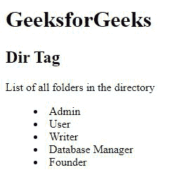
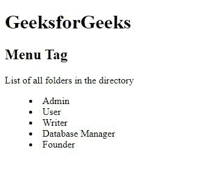

# 目录、菜单列表和无序列表的区别

> 原文:[https://www . geesforgeks . org/目录菜单列表和无序列表的区别/](https://www.geeksforgeeks.org/difference-between-the-directory-menu-lists-and-the-unordered-list/)

在创建[无序列表](https://www.geeksforgeeks.org/html-ul-tag/)时，我们可以使用两种不同类型的标签。这些用于生成目录列表和菜单列表。

**目录列表:**目录列表是使用 HTML [<目录>](https://www.geeksforgeeks.org/html-dir-tag/) 标签创建的。该标签用作目录中文件/文件夹列表的容器。随着 HTML 5 的引入，< dir >标签已经被弃用，不再被支持。

**语法:**

```htmlhtml
<dir> lists.... </dir>
```

**示例:**这个示例说明了 HTML 中的< dir >标签。

## 超文本标记语言

```htmlhtml
<!DOCTYPE html>
<html>

<body>
    <h1>GeeksforGeeks</h1>
    <h2>Dir Tag</h2>
    <p>List of all computer science subjects:</p>

    <!-- dir tag starts here-->
    <dir>
        <li>Admin</li>
        <li>User</li>
        <li>Writer</li>
        <li>Database Manager</li>
        <li>Founder</li>
    </dir>
    <!-- dir tag ends here-->

</body>

</html>
```

**输出:**



**菜单列表:**菜单列表的工作方式与目录列表相同。<菜单>标签用于创建菜单列表。它充当菜单项的容器，并以列表的形式显示它们。参考链接了解<导航>和<菜单>T3 的[区别，以便更好的理解。](https://www.geeksforgeeks.org/difference-between-nav-and-menu-tag-in-html5/)

**语法:**

```htmlhtml
<menu> lists... </menu>
```

**示例:**这个示例用 HTML 说明了<菜单>标签

## 超文本标记语言

```htmlhtml
<!DOCTYPE html>
<html>

<body>
    <h1>GeeksforGeeks</h1>
    <h2>Menu Tag</h2>
    <p>List of all folders in the directory</p>

    <!-- menu tag starts here-->
    <menu>
        <li>Admin</li>
        <li>User</li>
        <li>Writer</li>
        <li>Database Manager</li>
        <li>Founder</li>
    </menu>
    <!-- menu tag ends here-->
</body>

</html>
```

**输出:**



**无序列表:** [无序列表](https://www.geeksforgeeks.org/how-to-create-an-unordered-list-in-html/)也用于创建物品列表。顾名思义，项目没有特定的顺序，即它们是无序的。

**语法:**

```htmlhtml
<ul> lists.... </ul>
```

**示例:**

## 超文本标记语言

```htmlhtml
<!DOCTYPE html>
<html>

<body>
    <h1>GeeksforGeeks</h1>
    <h2>Menu Tag</h2>
    <p>unordered list for professions</p>

    <ul>
        <li>Teacher</li>
        <li>Admin</li>
        <li>User</li>
        <li>Writer</li>
        <li>Manager</li>
        <li>Founder</li>
        <li>Salesperson</li>
    </ul>
</body>

</html>
```

**目录列表、菜单列表、无序列表的区别:**

<figure class="table">

| **Directory list** | **menu list** | **unordered list** |
| In HTML5, the latest version of HTML | Has been deprecated in, supported by HTML 5. | Active support from HTML 5. |
| They do not support any attributes for the style of bullets. | They do not support any attributes of bullet shape. | Bullets in unordered lists can use the attribute of *list style type* |
| Style settings, the properties of these lists are not supported by any browser. | The properties of these lists are not supported by any browser. | The attribute of unordered list is supported by all well-known browsers in the market. |
| They are generally not very popular in search engine results. | They are generally not very popular in search engine results. | They are very helpful in SEO (Search Engine Optimization), because they generate less noise in search and return better results. |

</figure>