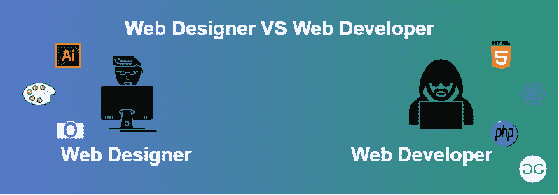

# 网页设计师和网页开发者的区别

> 原文:[https://www . geesforgeks . org/网页设计师和网页开发者的区别/](https://www.geeksforgeeks.org/difference-between-web-designer-and-web-developer/)

**网页设计师:**网页设计师是让网站看起来好看的人。他们主要是指网站的精彩部分及其可用性。网页设计师的主要职责是使用不同的软件，如 Photoshop、Corel Draw 等，专注于网站的风格和整体感觉，使网站更具吸引力。

根据他们的角色有不同类型的网页设计师:

*   [**用户体验(UX)设计师:**](https://www.geeksforgeeks.org/user-experience-or-ux-design/) UX 被称为用户体验。基本上，用户在使用软件或汽车或任何其他设计的小工具后的感受和他/她的需求得到满足。简单来说就是“用户能够以有效的方式使用产品，也就是开发人员想要使用他的工件的方式。”
*   [**用户界面(UI)设计者:**](https://www.geeksforgeeks.org/user-interface-ui/) 用户界面(UI)设计是指创建图形、插图，并使用摄影艺术作品和版式来增强数字产品在其各种设备视图中的显示和布局。界面元素由输入控件(按钮、下拉菜单、数据字段)、导航组件(搜索字段、滑块、图标、标签)、信息组件(进度条、通知、消息框)组成。
*   **视觉设计师:**视觉设计师的角色是为了让完成的产品看起来有吸引力。他们是用户界面和图形设计师的混合体。不要混淆平面设计师和视觉设计师。

**Web Developer:** Web 开发人员一般被称为程序员。他们采用网页设计师创造的设计，并将其转换成一个功能齐全的网站。他们使用不同的软件和工具，如 Javascript、jQuery、Node.js、PHP、ASP.NET Python 等。他们的主要目标是建立一个运行平稳、功能良好的网站。Web 开发人员负责与 UX 设计师、UI 设计师和视觉设计师协作，根据设计师提供的设计创建网页。

根据他们的角色，web 开发人员也可以分为三种类型:

*   [**前端开发者:**](https://www.geeksforgeeks.org/frontend-vs-backend/) 用户直接交互的网站部分称为前端。它也被称为应用程序的“客户端”。它包括用户直接体验到的一切:文本颜色和样式、图像、图形和表格、按钮、颜色和导航菜单。HTML、CSS 和 Javascript 是用于前端开发的语言。当网站、网络应用程序或移动应用程序打开时，浏览器屏幕上看到的所有内容的结构、设计、行为和内容都由前端开发人员实现。响应能力和性能是前端的两个主要目标。开发人员必须确保网站具有响应性，即无论屏幕大小如何，网站的任何部分都不应出现异常。
*   [**后端开发者:**](https://www.geeksforgeeks.org/frontend-vs-backend/) 后端是网站的服务器端。它存储和整理数据，并确保网站客户端的一切正常运行。它是网站中你看不到也无法与之互动的部分。它是软件中不与用户直接接触的部分。后端设计人员开发的部分和特性由用户通过前端应用程序间接访问。像编写应用编程接口、创建库以及在没有用户界面甚至没有科学编程系统的情况下使用系统组件等活动也包含在后端中。
*   [**全栈开发者:**](https://www.geeksforgeeks.org/what-is-full-stack-development/) 全栈 web 开发者有能力设计完整的 web 应用和网站。他们从事 web 应用程序或网站的前端、后端、数据库和调试工作。

**网页设计师与网页开发者的区别**

<figure class="table">

| Web Designer | Web page developer |
| --- | --- |
| Web designers are very creative in nature. | Web developers are essentially more technical. |
| Web designers are aesthetic elements. | Web development refers to the establishment of user-friendly websites according to customer specifications. |
| They turn ideas into visually attractive designs. | They turn the design into a fully functional website. |
| Web page design refers to the external look and feel of the website. | Web development refers to the influence of the functions of a website on its working methods. |
| 网页设计工具包括 Adobe Photoshop、Illustrator、DreamWeaver、素描等。 | 绿绿绿绿绿绿绿绿绿绿绿绿绿绿绿绿绿绿绿绿绿绿绿绿绿绿绿绿绿绿绿绿绿绿绿绿绿绿绿绿绿绿绿绿绿绿绿绿绿绿绿绿绿绿绿绿绿绿绿绿绿绿绿绿绿绿绿绿绿 html PHP JavaScript CSS python ruby jquery-什么。 |

</figure>