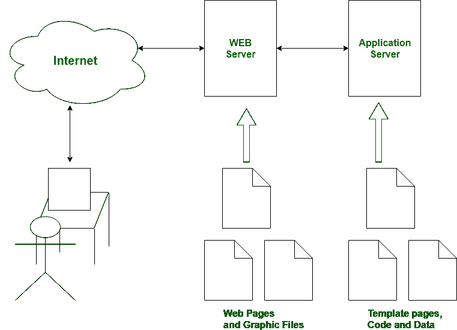

# 网络服务器和应用服务器的区别

> 原文:[https://www . geesforgeks . org/web 服务器和应用服务器的区别/](https://www.geeksforgeeks.org/difference-between-web-server-and-application-server/)

服务器是一个中央储存库，程序员在网络中保存和访问信息和计算机程序。**网络服务器**和**应用服务器**是用于交付站点的服务器，因此后者处理用户和组织后端业务应用之间执行的应用操作。

**Web 服务器:**是接受数据请求，发送指定文档的计算机程序。网络服务器可以是保存在线内容的计算机。本质上，互联网服务器是用来托管网站的，但是同时存在不同的网络服务器，如娱乐、存储、文件传输协议、电子邮件等。

**网络服务器示例:**

*   Apache Tomcat
*   树脂

**应用服务器:**包含 Web 容器和 EJB 容器。应用程序服务器为企业应用程序组织运行环境。应用服务器可能是一个合理的服务器，意味着如何放置操作系统，为用户、IT 服务和组织托管应用和服务。在这种情况下，使用了与协议和 RPC/RMI 协议类似的用户界面。

**应用服务器示例:**

*   中间件
*   JBoss
*   万维网环球服务系统

**web 服务器和应用服务器的区别:**

| S.NO | 网络服务器 | 应用服务器 |
| 1. | Web 服务器仅包含 web 容器。 | 而应用服务器包括网络容器和 EJB 容器。 |
| 2. | Web 服务器对静态内容有用或适用。 | 而应用服务器适合动态内容。 |
| 3. | Web 服务器消耗或利用的资源较少。 | 而应用服务器利用更多资源。 |
| 4. | 网络服务器为网络应用程序安排运行环境。 | 而应用服务器则为企业应用安排运行环境。 |
| 5. | 在 web 服务器中，不支持多线程。 | 在应用服务器中，支持多线程。 |
| 6. | Web 服务器的容量低于应用服务器。 | 而应用服务器的容量高于 web 服务器。 |
| 7. | 在网络服务器中，使用了超文本标记语言和超文本传输协议。 | 在这种情况下，使用图形用户界面以及 HTTP 和 RPC/RMI 协议。 |