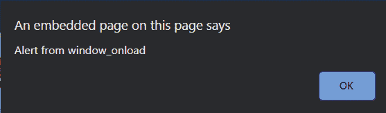

# 车窗加载和车身加载的区别

> 原文:[https://www . geesforgeks . org/window-on load 和-body-onload 之差/](https://www.geeksforgeeks.org/difference-between-window-onload-and-body-onload/)

**车窗加载**和**车身加载**之间略有不同，但在探讨它们之间的差异之前，我们首先需要了解这些加载是什么。之后，我们将知道它们在不同场景中的用法，我们会注意到它们之间的细微差别。

**onloads:**onloads 事件在对象完全加载时触发，onload 事件有两种类型一种是 windows onload，一种是 body onload。

1.  **窗口加载:**该窗口的加载事件在开始时触发。
2.  **body onload:** 这个 Body onload 事件一旦下载完所有内容就会触发，如果我们想要找到一个元素并更新样式或者内容，那么，Body onload 就是正确的使用选择。

**注意:**如果更新的风格和内容没有打扰到你，那么你使用的是哪个 onload 并不重要。

以下示例说明了 windows onload 和 body onload 之间的区别:

## 超文本标记语言

```
<!DOCTYPE html>
<html>
   <head>
   </head>
   <body onload="bodyLoad()">
      <div id="B1">
         <h1 style="color: green;">GeeksforGeeks</h1>

<p>A Computer Science Portal for Geeks</p>

      </div>
      <script>

        // Body onload
         function bodyLoad() {
             alert("Alert from body_onload");
             alert("content from d1: "
                   + document.getElementById("d1").innerText);
         }

         // Window onload 
         function winLoad() {
             alert("Alert from window_onload");
             if (document.getElementById("B1") != null) {
                 alert("Content from body: "
                       + document.getElementById("B1").innerText);
             }
             else {
                 alert("Failed to find B1");
             }
         }
         window.onload = winLoad();
      </script>
   </body>
</html>
```

**输出:**

*   **车窗加载:**



*   **车身负荷:**

