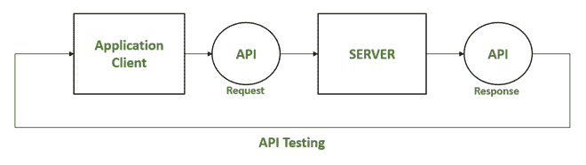
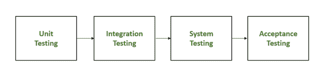

# API 测试和单元测试的区别

> 原文:[https://www . geesforgeks . org/API 测试和单元测试之间的差异/](https://www.geeksforgeeks.org/differences-between-api-testing-and-unit-testing/)

**API 测试:**应用编程接口(API)是一种编程接口。API 可以被认为是两个软件系统之间的桥梁，允许它们进行通信。应用编程接口测试需要独立评估应用编程接口，并将其作为集成测试的一部分，以查看它们是否满足功能、可靠性、性能和安全性要求。

*   API 测试仅在构建完成时运行。
*   作为最终用户将与之交互的用户界面，应用编程接口测试必须代表整个系统。
*   API 测试是一种黑盒测试，只关注测试最终输出下的系统。

**原料药检测方法:**

*   安全测试
*   自动化测试
*   发现测试
*   可用性测试

**原料药检测中使用的工具:**

*   放心
*   咳咳咳咳咳咳咳咳咳咳咳咳咳咳咳咳咳咳咳咳咳咳咳咳咳咳咳咳咳咳咳咳咳咳咳咳咳咳咳咳咳咳咳咳咳咳咳咳咳咳咳咳咳咳咳咳
*   Ping API
*   邮递员
*   加泰罗尼亚工作室
*   soapui

**单元测试:**其目标是在每个单独的模块可用时对其进行测试，并验证模块是否执行强制功能。单元测试可以手动或自动进行。

*   确保代码正确。
*   帮助开发人员理解代码库，并允许他们快速进行更改。
*   通过在开发周期的早期修复 bug 来省钱。
*   单元测试有两种类型:
    *   手动测试
    *   自动化测试

**单元测试中使用的工具:**

*   努尼特
*   女子名
*   菲普奈
*   Jtest
*   Junit

**API Testing 与单元测试的区别:**

<figure class="table">

| **API Testing** | **单元测试** |
| Access to end users | The main functions of the system are used to test whether each unit performs as expected. |
| Implemented by QA team. | It was done by the developer. |
| The functionality has been tested from beginning to end. | Functional test. |
| Most of the time, it is a black box test. | This is a white box test. |
| Only API functions are tested. | UI testing is also part of the process. |
| All functional problems have been thoroughly checked. | Only the most basic functions are tested. |
| Wider range | Limited scope. |
| Run after completion of construction. | Usually before check-in. |

</figure>