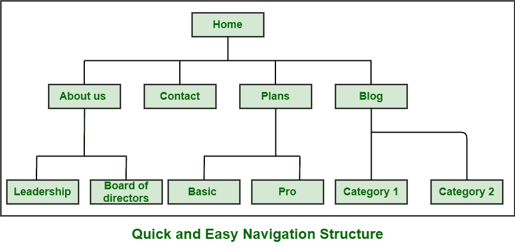
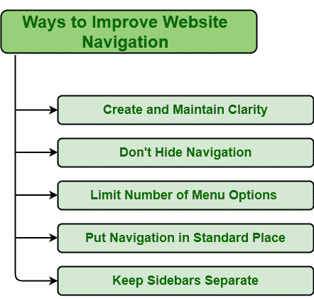

# 改善网站导航的不同方式

> 原文:[https://www . geeksforgeeks . org/differential-way-to-improve-web-navigation/](https://www.geeksforgeeks.org/different-ways-to-improve-website-navigation/)

在数字世界中，每个人都知道网站对业务增长有多重要。这是在网上推销自己业务的最佳方式。如果你没有任何网站，那么即使你无法接触到更多的受众或用户，你也有可能失去良好的商业机会。因此，网站作为一个企业建立信誉真的很重要。拥有一个好的、设计良好的、有效的、信息丰富的、更新的网站，只会促进业务的增长，也会强化你的品牌。网站导航也是好网站设计的一部分。网站导航基本上是主菜单，也可能包括子菜单、页脚、页眉、链接等。，在网站内。它是用户或访问者可以在网站上立即找到他们想要的东西的方式。这是一套更清晰的方向，有助于人们轻松到达目的地。

**改善网站导航的方法:**拥有良好的导航真的很重要，因为这是最好的方法，可以帮助接触到更多的客户或受众，并允许他们在更长的时间内搜索网站，从而提高业务的增长，并使业务领先于其他竞争对手。因此，拥有良好的网站导航，即清晰有效的网站导航，帮助访问者找到他们想要的任何东西。但是设计糟糕的网站导航会让你失去更多的访问者和销售。它直接影响网站的可用性。如果网站导航好，那么对用户和 SEO(搜索引擎优化)性能最好。下面给出了一些创建或改进好的网站导航的方法:

1.  **创建并保持清晰:**网站导航是访问者或用户在网站中导航的一种方式。如果它很复杂和困难，那么它让用户可以理解。你可能也会失去你的访客。让它变得清晰并保持清晰，因为清晰简单的网站导航是业务成功和客户或访问者幸福的关键。尽可能使用更清晰的设计和文字。定期更新和维护网站以确保网站满负荷运行非常重要。它有助于提高安全性，增加受众或用户或访问者等。
2.  **不要隐藏导航:**网站导航让用户很容易找到自己想看的内容或信息。因此，显示导航栏很重要。这是展示对用户或访问者很重要的东西的最好方式。隐藏导航使用户更难找到他们想要的东西，用户可能会感到沮丧，同时也增加了用户完成任务的时间。儿子，不要隐藏导航栏，而是向用户展示重要的东西。导航让用户可以轻松搜索，让他们对自己在哪里以及能从网站上获得什么充满信心。
3.  **限制菜单选项数量:**给用户提供太多选项不是好事。这给了他们更多的选择和更多的选择，但有时也让他们很难做出选择的决定。这确实让浏览所有可用选项变得更加困难。有更多的选择，用户需要更多的时间来做出决定。因此，在导航栏中选择较少但重要的选项是很重要的。更少的菜单项使用户可以清楚地看到，浏览可用的选项，并加快用户的阅读速度。
4.  **把导航放在一个标准的地方:**网站导航的设计非常重要，对用户体验的影响更大。将导航条放在人们不希望它出现的地方会造成不必要的混乱，并使用户很难在网站中移动。因此，将导航条放在标准位置很重要，因为这让用户更容易使用它。标准位置包括页脚、页眉、侧边栏等。
5.  **将侧栏分开:**侧栏一般在网站设计中起着重要的作用。它包括可能不适合页面的信息。它应该看起来是独立的，与页面的其他内容不同。好的侧边栏一般能改善用户体验，包含用户最喜欢看的内容。所以，它应该看起来不同于其他内容页面。侧边栏可以是任何网站上有价值的房地产，根据网站的目标，帮助一个人达到和完成网站的目标。