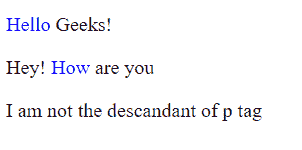
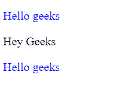
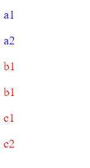

# 区分 find()和 child()方法

> 原文:[https://www . geesforgeks . org/difference-find-and-children-methods/](https://www.geeksforgeeks.org/differentiate-between-find-and-children-methods/)

之前看 [**的区别找到()**](https://www.geeksforgeeks.org/jquery-find-with-examples/) 和 [**的孩子()**](https://www.geeksforgeeks.org/jquery-children-with-examples/) 的方法。让我们简单了解一下这些是什么，它们是做什么的。

**find():** 此方法用于获取当前匹配元素集中每个元素的所有过滤后代。

**语法:**

```
$(selector).find('filter-expression')
```

**参数:**用于筛选后代搜索的选择器表达式、元素或 jQuery 对象。

**返回值:**返回调用 **find()** 方法的元素的所有匹配后代。这个方法遍历 DOM 直到最后一个后代。这意味着它会遍历 DOM 的所有层次，比如孩子、孙子、曾孙等等。

**例 1:** 在输出中我们可以清楚的看到所有的“ [span](https://www.geeksforgeeks.org/span-tag-html/) 标签颜色都变了，谁是 [p](https://www.geeksforgeeks.org/html-paragraph/) 标签的后代。

## 超文本标记语言

```
<!DOCTYPE html>

<head>
    <!-- jQuery library -->
    <script src=
        "https://code.jquery.com/jquery-git.js">
    </script>
</head>

<body>    
    <p><span>Hello </span>Geeks!</p>

    <div>
        <p>Hey! <span>How </span>are you</p>
    </div>

    <script>
        $('p').find('span').css('color','blue')
    </script>
</body>
</html>
```

**输出:**



**children():****[**children()**](https://www.geeksforgeeks.org/jquery-children-with-examples/)方法也用于获取匹配元素集中每个元素的所有后代。我们也可以过滤结果。**

****语法:****

```
$(selector).children(filter-expression)
```

****参数:**(可选)如果我们不提供任何过滤表达式，它将返回所选元素的所有直接子元素。若要筛选结果，请传递参数。**

****返回值:**只返回所选元素的直接子元素。**

****例 2:** 我们可以看到 *p* 标签的颜色发生了变化，谁是‘a’班的直系子女。如果我们没有为 **children()** 方法提供任何过滤器表达式，那么所有的 *p* 标记都将是蓝色的，因为类“b”也是类“a”的直接子级**

## **超文本标记语言**

```
<!DOCTYPE html>

<head>
    <!-- jQuery library -->
    <script src="https://code.jquery.com/jquery-git.js"></script>
</head>

<body>
    <div class="a">
        <p>Hello geeks</p>

        <div class="b">
            <p>Hey Geeks</p>
        </div>
        <p>Hello geeks</p>

    </div>
    <script>
        $('.a').children('p').css('color','blue')
    </script>
</body>

</html>
```

****输出:****

****

****差异 **find()** 和 **children()** 方法:**两者的工作方法几乎相同。它们之间只有一个主要区别，让我们看看是什么。**

**举个例子吧。**

## **超文本标记语言**

```
<!DOCTYPE html>

<head>
    <!-- jQuery library -->
    <script src=
"http://ajax.googleapis.com/ajax/libs/jquery/1.4.2/jquery.min.js" 
            type="text/javascript">
    </script>
</head>

<body>
    <div class=a>
        <p id="a1"> a1 </p>
        <p id="a1"> a2 </p>

        <div class=b>
            <p id="a2"> b1 </p>
            <p id="a2"> b1 </p>

            <div class=c>
                <p id="a3"> c1 </p>
                <p id="a3"> c2 </p>
            </div>
        </div>
    </div>

    <script>
        $(".a").find("p").css('color','red')
        $(".a").children("p").css('color','blue')
    </script>
</body>

</html>
```

****输出:****

****

**我们选了 3 个类 a、b 和 c，每个类都包含两个“p”标签。**

**让我们看看当我们在这个结构上调用 **find()** 和 **children()** 方法时会发生什么。**

**在类“a”上调用 **find()** 方法时，它会一直向下到最后一个后代，并到处搜索 *p* 标记。它检查它的孩子，然后检查孩子的孩子，以此类推。**

**在类“a”上调用 **children()** 方法时，它将只检查它的直接子类，即只检查一个级别。**

<figure class="table">

| 查找() | 儿童() |
| --- | --- |
| This method is used to search down multiple levels in DOM tree. | This method is used to search down a single level in the DOM tree. |
| It is slower than children's () method. | It is faster than the find () method. |

</figure>