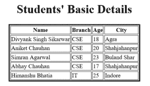

# 使用 XSLT 显示 XML

> 原文:[https://www.geeksforgeeks.org/displaying-xml-using-xslt/](https://www.geeksforgeeks.org/displaying-xml-using-xslt/)

**XSLT** 代表 **E** 扩展 **S** 样式表 **L** 语言 **T** 转换。

*   XSLT 用于将 XML 文档从一种形式转换成另一种形式。
*   XSLT 使用 Xpath 来执行节点的匹配，以执行这些转换。
*   将 XSLT 应用于 XML 文档的结果可能是另一个 XML 文档、HTML、文本或从技术角度来看的任何其他文档。
*   XSL 代码写在扩展为*的 XML 文档中。xsl)* 。
*   换句话说，XSLT 文档是一种不同的 XML 文档。

**XML 名称空间:** XML 名称空间是唯一的名称。

*   XML 命名空间是一种将元素或属性分配给组的机制。
*   XML 命名空间用于避免 XML 文档中的名称冲突。
*   W3C 推荐使用 XML 命名空间。

**XML 名称空间声明:**
使用保留属性声明，如属性为 *xmlns* 或可以以 *xmlns:* 开头

*   **Syntax:**

    ```html
     <element xmlns:name = "URL">
    ```

    在哪里

    *   命名空间以 *xmlns 开头。*
    *   单词*名称*是命名空间前缀。
    *   *URL* 是命名空间标识符。
*   **Example:**
    Consider the following xml document named Table.xml :-

    ```html
    <?xml version="1.0" encoding="UTF-8"?>
    <?xml-stylesheet type="text/css" href="rule.css"?>
     <tables>
      <table>
       <tr>
        <td>Apple</td>
        <td>Banana</td>
       </tr>
      </table>
      <table>
       <height>100</height>
       <width>150</width>
      </table>
     </tables>
    ```

    在上面的代码中，会出现名称冲突，两者都包含相同的 *table* 元素，但是 table 元素的内容不同。为了处理这种情况，使用了 XML 名称空间的概念。

*   **示例:**
    考虑相同的 XML 文档来解决名称冲突:

    ```html
    <?xml version="1.0" encoding="UTF-8"?>
    <?xml-stylesheet type="text/css" href="rule.css"?>
     <tables>
      <m:table xmlns:m=""http://www.google.co.in">
       <m:tr>
        <m:td>Apple</m:td>
        <m:td>Banana</m:td>
       </m:tr>
      </m:table>
      <n:table xmlns:m=""http://www.yahoo.co.in">
       <n:height>100</n:height>
       <n:width>150</n:width>
      </n:table>
     </tables>
    ```

**Xpath:**

*   Xpath 是 XSLT 标准的重要组成部分。
*   Xpath 用于遍历 XML 文档的元素和属性。
*   Xpath 使用不同类型的表达式从 XML 文档中检索相关信息。
*   Xpath 包含一个标准函数库。
    例:
    *   书店/书[1] = >获取书店元素的第一个子元素的详细信息。
    *   书店/书[last()] = >获取书店元素的最后一个子元素的详细信息。

**模板:**

*   XSL 样式表包含一组或多组称为模板的规则。
*   模板包含匹配特定元素时应用的规则。
*   XSLT 文档包含以下内容:
    *   样式表的根元素。
    *   扩展名的文件。xsl。
    *   XSLT 的语法，即什么是允许的，什么是不允许的。
    *   网址为*http://www.w3.org/1999/XSL/Transform*的标准命名空间。

**示例:**
在本例中，创建包含五名学生信息的 XML 文件，并使用 XSLT 显示该 XML 文件。

*   **XML file:**
    Creating Students.xml as:

    ```html
    <?xml version="1.0" encoding="UTF-8"?>
    <?xml-stylesheet type="text/xsl "href="Rule.xsl" ?>
     <student>
      <s>
       <name> Divyank Singh Sikarwar </name>
       <branch> CSE</branch>
       <age>18</age>
       <city> Agra </city>
      </s>
      <s>
       <name> Aniket Chauhan </name>
       <branch> CSE</branch>
       <age> 20</age>
       <city> Shahjahanpur </city>
      </s>
      <s> 
       <name> Simran Agarwal</name>
       <branch> CSE</branch>
       <age> 23</age>
       <city> Buland Shar</city>
      </s>
      <s> 
       <name> Abhay Chauhan</name>
       <branch> CSE</branch>
       <age> 17</age>
       <city> Shahjahanpur</city>
      </s>
      <s> 
       <name> Himanshu Bhatia</name>
       <branch> IT</branch>
       <age> 25</age>
       <city> Indore</city>
      </s>
     </student>
    ```

    在上面的例子中，创建了 Students.xml，并将其与包含相应 xsl 样式表规则的 Rule.xsl 相链接。

*   **XSLT Code:**

    将规则. xsl 创建为:

    ```html
    <?xml version="1.0" encoding="UTF-8"?>
    <xsl:stylesheet version="1.0" 
      xmlns:xsl="http://www.w3.org/1999/XSL/Transform">
    <xsl:template match="/">
     <html>
     <body>
      <h1 align="center">Students' Basic Details</h1>
       <table border="3" align="center" >
       <tr>
        <th>Name</th>
        <th>Branch</th>
        <th>Age</th>
        <th>City</th>
       </tr>
        <xsl:for-each select="student/s">
       <tr>
        <td><xsl:value-of select="name"/></td>
        <td><xsl:value-of select="branch"/></td>
        <td><xsl:value-of select="age"/></td>
        <td><xsl:value-of select="city"/></td>
       </tr>
        </xsl:for-each>
        </table>
    </body>
    </html>
    </xsl:template>
    </xsl:stylesheet>
    ```

*   **Output :**

    