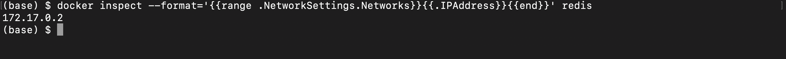
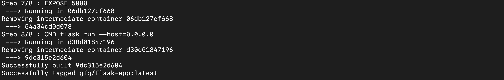
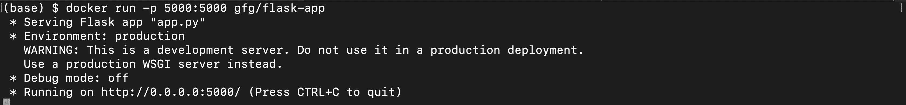
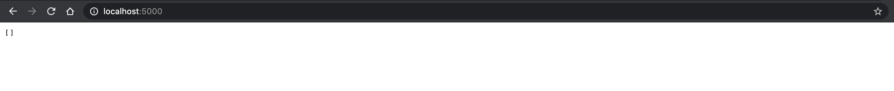
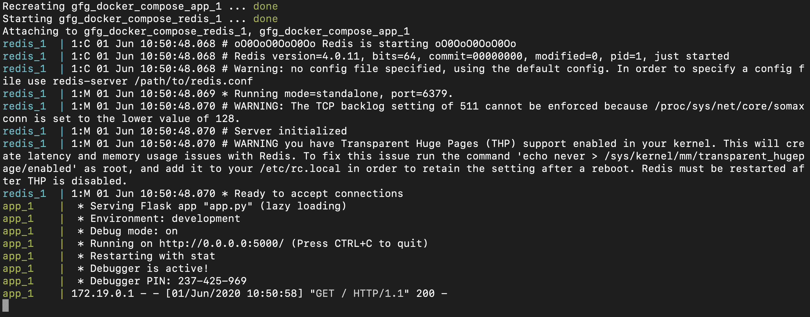
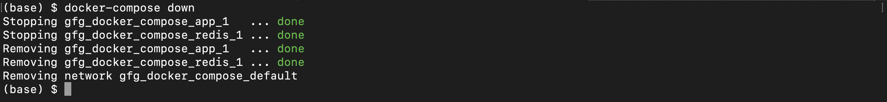

# Docker 编写工具运行多容器应用程序

> 原文:[https://www . geesforgeks . org/docker-compose-tool-to-run-multi-container-applications/](https://www.geeksforgeeks.org/docker-compose-tool-to-run-multi-container-applications/)

本文的目标是展示如何使用单个命令运行多容器应用程序。Compose 是一个定义和运行多容器 Docker 应用程序的工具。通过编写，您可以使用配置文件(YAML 文件)来配置您的 docker 容器。然后，使用一个命令，从您的配置中创建并启动所有服务(容器)。我举个例子解释一下。

本文期待您熟悉 [docker](https://www.geeksforgeeks.org/containerization-using-docker/) ，并对有一定的[使用经验。](https://www.geeksforgeeks.org/dockerize-your-flask-app/)

假设我们有一个简单的应用程序，它有两个组件，flask app 和 redis 数据库。我将通过运行完整的应用程序，使用和不使用 docker-compose 工具，这将使您主要使用这个 compose 工具。

### 创建项目

创建目录*保存我们的项目*

```html
$ mkdir gfg_docker_compose
```

移到那个目录

```html
$ cd gfg_docker_compose
```

创建*需求文件*

```html
gfg_docker_compose/ $ touch requirements.txt
```

复制到*需求. txt*

## 计算机编程语言

```html
flask
redis
```

创建文件 *app.py* 将有我们的烧瓶应用程序的代码

```html
gfg_docker_compose/ $ touch app.py
```

将以下代码复制到 *app.py*

## 蟒蛇 3

```html
from flask import Flask, request, jsonify
from redis import Redis

# initializing a new flask app
app = Flask(__name__)

# initializing a new redis database
# Hostname will be same as the redis service name
# in the docker compose configuration
redis = Redis(host ="localhost", db = 0, socket_timeout = 5,
              charset ="utf-8", decode_responses = True)

# Our app has a single route allowing two methods POST and GET.

@app.route('/', methods =['POST', 'GET'])
def animals():

    if request.method == 'POST':
        # Take the name of the animal
        name = request.json['name']
        # push the name to the end of animals list in the redis db
        redis.rpush('animals', {'name': name})
        # return a success
        return jsonify({'status': 'success'})

    if request.method == 'GET':
        # return complete list of names from animals
        return jsonify(redis.lrange('animals', 0, -1))
```

#### 解释:

我们只是简单地接受了两种方法`/'路由的 GET 和 POST 请求。当用这个名字完成一个开机自检请求时，这个名字会被添加到动物列表的末尾。对于 GET 请求，我们将从动物列表中返回名称列表。

创建*文件*

```html
gfg_docker_compose/ $ touch dockerfile
```

将以下代码复制到*文件*

## 蟒蛇 3

```html
# pulling the base image
FROM python:3.7.0-alpine3.8

# Creating a folder and moving into it
WORKDIR /usr/src/app

# Copying the dependency list
COPY requirements.txt ./

# Installing the python dependencies
RUN pip install --no-cache-dir -r requirements.txt

# Copying the flask code into the container
COPY . .

ENV FLASK_APP=app.py

EXPOSE 5000

# Starting the server
CMD flask run --host=0.0.0.0
```

#### 解释:

我们将从基础映像 *python:3.7.0-alpine3.8 开始。*我们将复制 *requirements.txt* 文件并安装我们所有的 flask 应用程序依赖项。然后我们将 *app.py* 文件复制到容器中，最后运行烧瓶应用程序。

现在我们准备好了 docker 应用程序。

### 没有 docker-compose 工具

在没有编写工具的情况下启动和使用这个应用程序对于多容器应用程序来说是很整洁的，因为您需要记住完整的配置，并在运行应用程序时使用。让我们看看在没有合成工具的情况下它是如何正常工作的

现在您将有一个项目树，如下所示

```html
gfg_docker_compose
--- app.py
--- requirements.txt
--- Dockerfile
```

现在将运行并启动我们的 redis 服务器容器

```html
gfg_docker_compose/ $  docker run --name=redis redis:4.0.11-alpine
```


redis 服务器已启动

因此，使用该命令，我们将拉 *redis:4.0.11-alpine* 图像并运行一个 redis 容器。现在我们的 redis 已经开始了，所以你应该取它的容器 IP 地址

```html
gfg_docker_compose/ $ docker inspect --format='{{range .NetworkSettings.Networks}}{{.IPAddress}}{{end}}' redis
```



提取 redis 容器 IP 地址

这给了你一个 IP 地址，你需要把它放到 *app.py.* 的主机参数中

现在这条线看起来像是在 *app.py* 中

```html
redis = Redis(host="IPAddress", db=0, socket_timeout=5,
              charset="utf-8", decode_responses=True)
```

其中 IPAddress 是您从 redis 容器中获得的 IP 地址。

构建烧瓶应用程序

```html
gfg_docker_compose/ $  docker build -t gfg/flask-app .
```



我们的 gfg/flask-app 映像已成功构建

等待一段时间，应用程序映像将被构建

现在我们也将启动我们的烧瓶应用程序容器。

打开一个新的终端选项卡，并运行以下命令

```html
gfg_docker_compose/ $  docker run -p 5000:5000 gfg/flask-app
```



我们的烧瓶应用程序已经启动

因此，使用该命令，我们将拉出我们之前构建的 *gfg/flask-app* ，并运行我们的 flask app 容器。此外， *-p* 用于将端口 5000 从集装箱映射到主机。

最后，当你在浏览器上转到 flask 应用程序时，你应该会看到类似这样的内容。



我们的应用程序正在运行

### 使用 docker-compose 工具

使用 docker-compose 工具，多容器 docker 应用程序的设置过程将变得相当容易。简单地说，我们将在一个名为 docker-compose.yml 的 YAML 文件中编写完整的容器配置，然后使用简单的命令启动和停止应用程序。通过简单地共享 docker-compose 文件和项目，这种方法还将帮助我们轻松地将 docker 应用程序共享给其他开发人员。

创建*坞站-复合. yml* 文件

```html
gfg_docker_compose/ $  touch docker-compose.yml
```

现在项目树看起来像

```html
gfg_docker_compose
--- app.py
--- requirements.txt
--- Dockerfile
--- docker-compose.yml
```

现在将下面的 YAML 代码复制到文件中。

## 计算机编程语言

```html
version: '3'

services:
  app:
    build: .
    image: gfg/flask-app
    environment:
      - FLASK_ENV=development
    ports:
      - 5000:5000

  redis:
    image: redis:4.0.11-alpine
```

#### 解释:

*   *版本:*说明要使用的 docker-compose 版本，这里我们使用的是版本 3
*   *服务:*保存我们所有的应用服务(容器)配置。
*   *app:* 我们已经将我们的 flask app 命名为 app service，您可以随意给它起任何其他的名字。
*   *构建:*docker file 的相对路径
*   *图像:*最终码头工人应用图像的名称
*   *环境:*环境变量列表
*   *端口:*要从容器映射到主机的端口列表
*   *重定向:T1】我们重定向服务的名称*
*   *图像:*图像的名称。

**注意:**服务名称*应用程序*和 *redis* 也是我们运行的服务(容器)的主机名，因为 docker-compose 会自动创建一个网络并将我们的容器添加到该网络中，这样每个容器都可以通过它们的服务名称将其他容器识别为该网络中的主机名。所以这就是我们将 app.py 文件中的主机参数保留给 redis 本身的原因。

启动应用程序

```html
gfg_docker_compose/ $  docker-compose up --build
```



一个成功的 docker-compose 输出如下所示

*–build*用于明确提及在启动应用程序之前构建图像。

您可以看到应用程序的工作原理如下


我们的 docker 应用程序正在工作

停止整个应用程序

```html
gfg_docker_compose/ $  docker-compose down
```



一个成功的码头工人写下来是这样的

使用 docker-compose 工具，我们可以使多容器 docker 应用程序的设置过程比通常的方式更快更容易。