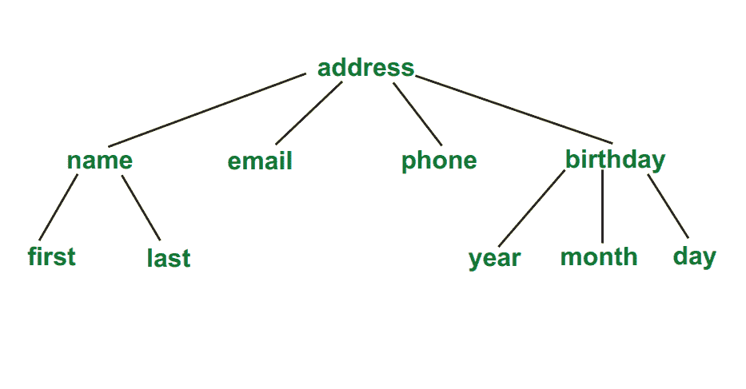
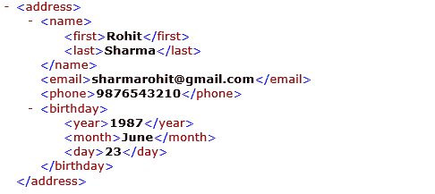

# 文件类型定义–DTD

> 原文:[https://www.geeksforgeeks.org/document-type-definition-dtd/](https://www.geeksforgeeks.org/document-type-definition-dtd/)

A 文档类型定义 **(DTD)** 描述文档的树形结构及其数据的一些情况。它是一组标记声明，实际上为 SGML 家族定义了一种文档类型，像 GML、SGML、HTML、XML。

DTD 可以在 XML 文档中声明为内联或外部推荐。DTD 决定了一个节点应该出现多少次，以及它们的子节点是如何排序的。

有两种数据类型，PCDATA 和 CDATA

*   PCDATA 是经过解析的字符数据。
*   CDATA 是字符数据，通常不会被解析。

**语法:**

```html
<!DOCTYPE element DTD identifier
[
   first declaration
   second declaration
   .
   .
   nth declaration
]>

```

**示例:**



上述树的 DTD 为:

**带有内部 DTD 的 XML 文档:**

## 可扩展标记语言

```html
<?xml version="1.0"?>
<!DOCTYPE address [
<!ELEMENT address (name, email, phone, birthday)>
<!ELEMENT name (first, last)>
<!ELEMENT first (#PCDATA)>
<!ELEMENT last (#PCDATA)>
<!ELEMENT email (#PCDATA)>
<!ELEMENT phone (#PCDATA)>
<!ELEMENT birthday (year, month, day)>
<!ELEMENT year (#PCDATA)>
<!ELEMENT month (#PCDATA)>
<!ELEMENT day (#PCDATA)>
]>

<address>
    <name>
        <first>Rohit</first>
        <last>Sharma</last>
    </name>
    <email>sharmarohit@gmail.com</email>
    <phone>9876543210</phone>
    <birthday>
        <year>1987</year>
        <month>June</month>
        <day>23</day>
    </birthday>
</address>
```

**上面的 DTD 是这样解释的:**

*   ！DOCTYPE 地址定义了这个文档的根元素是地址。
*   ！ELEMENT address 定义了 address 元素必须包含四个元素:“姓名、电子邮件、电话、生日”。
*   ！ELEMENT name 定义了 name 元素必须包含两个元素:“第一个，最后一个”。
    *   ！元素首先将第一个元素定义为“#PCDATA”类型。
    *   ！ELEMENT last 将最后一个元素定义为“#PCDATA”类型。
*   ！元素电子邮件将电子邮件元素定义为“#PCDATA”类型。
*   ！元素电话将电话元素定义为“#PCDATA”类型。
*   ！ELEMENT 生日定义生日元素必须包含三个元素“年、月、日”。
    *   ！元素年份将年份元素定义为“#PCDATA”类型。
    *   ！元素月份将月份元素定义为“#PCDATA”类型。
    *   ！元素日将日元素定义为“#PCDATA”类型。

**带有外部 DTD 的 XML 文档:**

## 可扩展标记语言

```html
<?xml version="1.0"?>
<!DOCTYPE address SYSTEM "address.dtd">
<address>
    <name>
        <first>Rohit</first>
        <last>Sharma</last>
    </name>
    <email>sharmarohit@gmail.com</email>
    <phone>9876543210</phone>
    <birthday>
        <year>1987</year>
        <month>June</month>
        <day>23</day>
    </birthday>
</address>
```

**address.dtd:**

**输出:**

