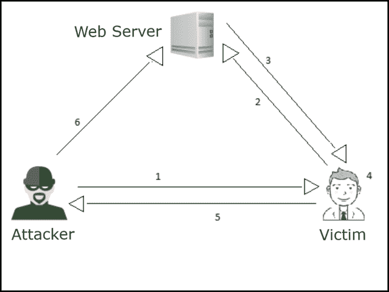

# 基于 DOM 的跨站点脚本深度攻击

> 原文:[https://www . geesforgeks . org/基于 DOM-跨站点-脚本-深度攻击/](https://www.geeksforgeeks.org/dom-based-cross-site-scripting-attack-in-depth/)

在本文中，我们将深入了解跨站点脚本的一种类型，即基于 DOM 的 XSS。下面我们一个一个来讨论。

[**DOM**](https://www.geeksforgeeks.org/dom-document-object-model/)**-基于** [**跨站点脚本**](https://www.geeksforgeeks.org/what-is-cross-site-scripting-xss/) **:**

*   DOM XSS 代表基于文档对象模型的跨站点脚本。基于 DOM 的漏洞发生在客户端执行的内容处理阶段，通常发生在客户端 JavaScript 中。
*   基于 DOM 的 XSS 的工作方式类似于反射的 XSS 一号——攻击者操纵客户端的浏览器环境(文档对象模型)并将有效负载放入页面内容。主要区别在于，由于恶意负载存储在浏览器环境中，因此可能不会在服务器端发送。这样，所有与流量分析相关的保护机制都将失败。
*   在反射和存储的跨站点脚本攻击中，您可以在响应页面中看到漏洞恶意脚本，但是在基于 DOM 的跨站点脚本中，攻击的 HTML 源代码和响应将是相同的，即在来自网络服务器的响应中找不到恶意脚本。
*   在基于 DOM 的 XSS 攻击中，恶意字符串不会被受害者的浏览器解析，直到网站的合法 JavaScript 被执行。要执行基于 DOM 的 XSS 攻击，您需要将数据放入源中，以便将其传播到接收器，并导致任意 JavaScript 代码的执行。

**基于 DOM 的 XSS 攻击的分解:**
以下是基于 DOM 的 XSS 攻击的分解如下。

1.  攻击者发现了基于 DOM 的 XSS 漏洞
2.  黑客或攻击者制作恶意脚本，并将网址发送给目标(电子邮件、社交媒体等)
3.  受害者点击网址
4.  受害者浏览器向易受攻击的站点发送请求(注意:请求不包含 XSS 恶意脚本)
5.  web 服务器用网页进行响应(注意:该响应不包含 XSS 恶意脚本)
6.  受害者的网页浏览器呈现页面，带有黑客或攻击者 XSS 的恶意脚本

**撞击:**

1.  窃取另一个客户的 cookies 或会话。
2.  修改另一个客户端的 cookies 或会话。
3.  窃取其他客户提交的表单信息或一些敏感凭据。
4.  通过拦截请求(在请求到达服务器之前)，修改另一个客户端提交的表单数据或信息。

**注意–**
代表用户向您的应用程序提交一份修改服务器上的密码或敏感数据或其他应用程序数据的表格。

**寻找基于 DOM 的跨站点脚本:**

1.  大多数 DOM XSS 漏洞可以使用 Burp 套件的工具扫描程序或 GitHub 上可用的一些其他脚本快速有效地找到。
2.  要手动测试基于 DOM 的跨站点脚本，通常需要使用带有开发工具的网络浏览器，如 Chrome 或 Firefox。
3.  您需要依次检查每个可用的源或输入字段，并分别测试每个字段。

**通过图表理解基于 DOM 的攻击:**



多姆·XSS 台阶

**图表描述–**
从上图中，“将图表箭头编号(步骤 1 至步骤 6)视为步骤”如下。

*   **步骤-1:** 攻击者伪造网址并将其发送给受害者。
*   **步骤 2:** 受害者点击它，请求到达服务器。
*   **步骤 3:** 服务器响应包含硬编码的 JavaScript。
*   **步骤-4:** 攻击者的 URL 被硬编码的 JavaScript 处理，触发他的负载。
*   **步骤-5:** 受害者的浏览器将 cookies 发送给攻击者。
*   **第 6 步:**攻击者劫持用户的会话。

**示例:**
基于 DOM 的 XSS 攻击示例如下。

```html
<HTML>
<TITLE>Hello!</TITLE>
<SCRIPT>
var pos=document.URL.indexOf("name=")+5;
document.write(document.URL.substring(pos,document.URL.length));
</SCRIPT>
<BR>
Welcome To Our Website
…
</HTML>
```

**解释–**
通常，该 HTML 页面用于欢迎用户，例如–

```html
http://www.victim.site/hello.html?name=Gaurav
```

然而，像下面这样的请求将导致如下的 XSS 条件。

```html
http://www.victim.site/hello.html?name=alert(document.domain)
```

#### **基于 DOM 的 XSS 补救措施:**

*   使用纯粹的服务器端检测(即 HTTP 请求)很难检测到 DOM XSS，这就是为什么像 Acunetix 这样的提供商利用 DeepScan 来做这件事。
*   这些恶意脚本或有效载荷由于位于一个 HTML 片段后面(所有东西都在#符号后面)，所以永远不会被发送到 web 服务器。
*   因此，根本问题在于源页面上的代码(即 JavaScript)。这意味着您应该始终净化或过滤用户输入，而不管它是否是客户端输入
*   要修复基于 DOM 的 XSS，数据不能从任何不可信的来源动态写入 HTML 文档。如果功能需要，安全控制必须到位。
*   它可能涉及 JavaScript 转义、HTML 编码和 URL 编码的组合。
*   像 AngularJS 和 React 这样的框架使用模板，使得构建特定的 HTML 成为显式的(也是罕见的)操作。这将推动您的开发团队走向最佳实践，并使不安全的操作更容易被发现。

**注意–**
应避免以下来源属性，如 URL、文档 URI、位置、href、搜索、哈希。