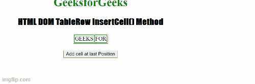

# DOM TableRow insertCell()方法

> 原文:[https://www . geesforgeks . org/DOM-tablerow-insert cell-method/](https://www.geeksforgeeks.org/dom-tablerow-insertcell-method/)

**简介:**HTML DOM 中的 **TableRow insertCell()方法**用于在当前行的任意特定位置添加单个单元格。它是 TableRow 对象的预定义方法。

**语法:**

```htmlhtml
tablerowObject.insertCell(index)
```

**参数值:**

*   ***索引:*** 它包含一个从 0 开始的数字，表示当前行中要插入的单元格的位置。也可以使用-1 的值；瓦特小时

**注:**

*   该参数将在火狐和 Opera 浏览器中强制定义。另一方面，它在 safari、chrome 和 IE 浏览器中是可选的。
*   如果这个参数是不包含任何值的，那么 insertCell()会在 IE 中的最后一个位置以及 Chrome 和 Safari 中的第一个位置添加新的单元格。

**示例 1:** 在本例中，我们将使用 DOM TableRow insertCell()方法在第一个位置插入单元格。

## 超文本标记语言

```htmlhtml
<!DOCTYPE html>
<html>

<head>
    <title>
        HTML DOM TableRow insertCell() Method
    </title>

    <style>
        table,
        td {
            border: 1px solid green;
        }

        h1 {
            color: green;
        }

        h2 {
            font-family: Impact;
        }

        body {
            text-align: center;
        }
    </style>
</head>

<body>
    <h1>GeeksforGeeks</h1>
    <h2>
        HTML DOM TableRow insertCell() Method
    </h2>

    <table align="center">
        <tr id="gfg">
            <td>GEEKS</td>
            <td>FOR</td>
        </tr>
    </table>
    <br>

    <button onclick="row()">
        Add cell at last Position
    </button>

    <script>
        function row() {
            var MyCell =
                document.getElementById("gfg");
            var AddCell = MyCell.insertCell(-1);
            AddCell.innerHTML = "GEEKS";
        }
    </script>
</body>

</html>
```

**输出:**


**示例 2:** 在本例中，我们将使用 DOM TableRow insertCell()方法在最后一个位置插入单元格。

## 超文本标记语言

```htmlhtml
<!DOCTYPE html>
<html>

<head>
    <title>
        HTML DOM TableRow insertCell() Method
    </title>

    <style>
        table,
        td {
            border: 1px solid green;
        }

        h1 {
            color: green;
        }

        h2 {
            font-family: Impact;
        }

        body {
            text-align: center;
        }
    </style>
</head>

<body>
    <h1>GeeksforGeeks</h1>
    <h2>
        HTML DOM TableRow insertCell() Method
    </h2>

    <table align="center">
        <tr id="gfg">
            <td>GEEKS</td>
            <td>FOR</td>
        </tr>
    </table>
    <br>

    <button onclick="row()">
        Add cell at last Position
    </button>

    <script>
        function row() {
            var MyCell =
                document.getElementById("gfg");
            var AddCell = MyCell.insertCell(-1);
            AddCell.innerHTML = "GEEKS";
        }
    </script>
</body>

</html>
```

**输出:**

