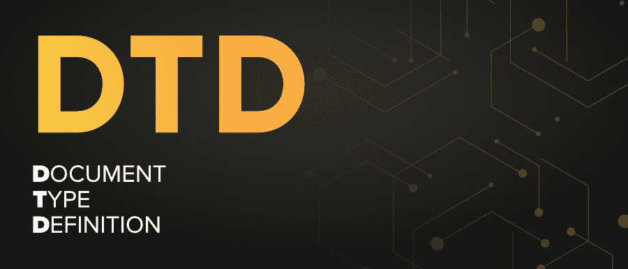

# DTD 完整形式

> 原文:[https://www.geeksforgeeks.org/dtd-full-form/](https://www.geeksforgeeks.org/dtd-full-form/)

**DTD** 代表**文件类型定义**。它是一个定义 XML 文档结构的文档。它用于精确描述 XML 语言的属性。它可以分为两种类型，即内部 DTD 和外部 DTD。它可以在文档内部或文档外部指定。DTD 主要检查 XML 文档的语法和有效性。它检查一个 XML 文档是否具有有效的结构。

#### 特征

*   它定义了 XML 文档中的强制和可选元素。
*   它验证了 XML 文档的结构。
*   它检查 XML 文档的语法。
*   它描述了元素出现的顺序。

#### 优势

*   我们可以通过 DTD 为 XML 文件定义自己的格式。
*   它有助于验证 XML 文件。
*   它为我们提供了适当的文件。
*   它使我们能够有效地描述一个 XML 文档。

#### 不足之处

*   如果数字电视很大，就很难阅读和维护。
*   它不是面向对象的。
*   文档支持有限。
*   DTD 不支持命名空间。