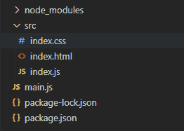
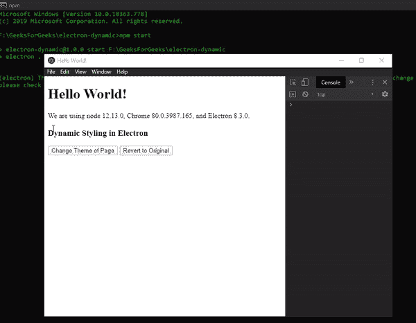
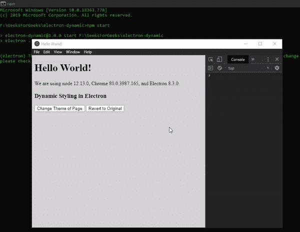

# 电子表格中的动态样式

> 原文:[https://www . geesforgeks . org/dynamic-styling-in-electronijs/](https://www.geeksforgeeks.org/dynamic-styling-in-electronjs/)

**[electronijs](https://www.geeksforgeeks.org/introduction-to-electronjs/)**是一个开源框架，用于使用能够在 Windows、macOS 和 Linux 操作系统上运行的 HTML、CSS 和 JavaScript 等网络技术构建跨平台的本机桌面应用程序。它将铬引擎和**T5 节点 T7】结合成一个单一的运行时。**

为了使桌面应用程序对用户更具吸引力和吸引力，除了预定义的 **CSS** 之外，开发人员还希望提供一种功能，其中用户可以控制应用程序的外观和感觉，并在执行过程中动态改变应用程序的样式。例如，更改应用程序的主题，动态地向元素添加动画等。电子提供了一种方法，通过这种方法，我们可以使用内置的**浏览器窗口**对象和**网络内容**属性的实例方法和事件，成功地将动态样式添加到页面内容中。本教程将演示如何在电子版中为页面内容添加动态样式。

我们假设您熟悉上述链接中介绍的先决条件。电子要工作， **[节点](https://www.geeksforgeeks.org/introduction-to-nodejs/)** 和 **[npm](https://www.geeksforgeeks.org/node-js-npm-node-package-manager/)** 需要预装在系统中。

*   **项目结构:**
    

**示例:**我们将按照给定的步骤开始构建基本的电子应用程序。

*   **Step 1:** Navigate to an Empty Directory to setup the project, and run the following command,

    ```html
    npm init
    ```

    生成**包. json** 文件。安装 **[电子](https://www.geeksforgeeks.org/introduction-to-electronjs/)** 如果没有安装，使用 npm。

    ```html
    npm install electron --save
    ```

    该命令还将创建**包-lock.json** 文件，并安装所需的**节点 _ 模块**依赖项。一旦电子安装成功，打开**包. json** 文件，并在**脚本**键下执行必要的更改。
    **package.json:**

    ```html
    {
      "name": "electron-dynamic",
      "version": "1.0.0",
      "description": "Dynamic Styling in Electron",
      "main": "main.js",
      "scripts": {
        "start": "electron ."
      },
      "keywords": [
        "electron"
      ],
      "author": "Radhesh Khanna",
      "license": "ISC",
      "dependencies": {
        "electron": "^8.3.0"
      }
    }

    ```

*   **Step 2:** Create a **main.js** file according to the project structure. This file is the **Main Process** and acts as an entry point into the application. Copy the Boilerplate code for the **main.js** file as given in the following [link](https://www.electronjs.org/docs/tutorial/first-app#electron-development-in-a-nutshell). We have modified the code to suit our project needs.

    **main.js:**

    ```html
    const { app, BrowserWindow } = require('electron')

    function createWindow () {

      // Create the browser window.
      const win = new BrowserWindow({
        width: 800,
        height: 600,
        webPreferences: {
          nodeIntegration: true
        }
      })

      // Load the index.html of the app.
      win.loadFile('src/index.html')

      // Open the DevTools.
      win.webContents.openDevTools()
    }

    // This method will be called when Electron has finished
    // initialization and is ready to create browser windows.
    // Some APIs can only be used after this event occurs.
    // This method is equivalent to 'app.on('ready', function())'
    app.whenReady().then(createWindow)

    // Quit when all windows are closed.
    app.on('window-all-closed', () => {
      // On macOS it is common for applications and their menu bar
      // to stay active until the user quits explicitly with Cmd + Q
      if (process.platform !== 'darwin') {
        app.quit()
      }
    })

    app.on('activate', () => {
        // On macOS it's common to re-create a window in the 
        // app when the dock icon is clicked and there are no 
        // other windows open.
      if (BrowserWindow.getAllWindows().length === 0) {
        createWindow()
      }
    })

    // In this file, you can include the rest of your 
    // app's specific main process code. You can also 
    // put them in separate files and require them here.
    ```

*   **Step 3:** Create the **index.html** file, the **index.js** file and the **index.css** file within the **src** directory. We will also copy the boilerplate code for the *index.html* file from the above-mentioned link. We have modified the code to suit our project needs.

    **index.html:**

    ```html
    <!DOCTYPE html>
    <!DOCTYPE html>
    <html>
      <head>
        <meta charset="UTF-8">
        <title>Hello World!</title>
        <!-- https://electronjs.org/docs/tutorial
                               /security#csp-meta-tag -->
        <meta http-equiv="Content-Security-Policy" 
              content="script-src 'self' 'unsafe-inline';" />
        <link rel="stylesheet" type="text/css" href="index.css">
      </head>
      <body>
        <h1>Hello World!</h1>
        We are using node
        <script>
            document.write(process.versions.node)
        </script>, Chrome
        <script>
            document.write(process.versions.chrome)
        </script>, and Electron
        <script>
            document.write(process.versions.electron)
        </script>.

        <!-- Adding Individual Renderer Process JS File -->
        <script src="index.js"></script>
      </body>
    </html>
    ```

*   **Output:** At this point, our basic Electron Application is set up. To launch the Electron Application, run the Command:

    ```html
    npm start
    ```

    

**电子动态样式:****浏览器窗口**实例和**网站内容**属性是**主进程**的一部分。要在**渲染器流程**中导入和使用`BrowserWindow`，我们将使用电子**远程**模块。 **webContents.insertCSS(css，options)** 实例方法将 **CSS** 动态注入到当前的**浏览器窗口**页面内容中，并为插入的样式表返回一个唯一的键。此方法返回一个**承诺**，并解析为一个**字符串**，该字符串代表插入到**浏览器窗口**页面内容中的 CSS 的唯一**键**。相同的唯一键可以在以后使用**方法从页面内容中移除 CSS。它接受以下参数。**

*   **CSS: String** 该值不应为空。css 字符串由您想要应用于**浏览器窗口**页面内容的 CSS 组成。css 字符串遵循所有与 **CSS3** 相同的规则，除了它在一个字符串中声明。
*   **选项:对象(可选)**它接受以下参数:
    *   **CSSOrigin: String(可选)**值可以是**用户**或**作者**。将该值设置为**用户**可以使开发人员防止外部网站覆盖开发人员设置的 CSS。默认值为**作者**。

**webcontents . removeinsertedcss(Key)**实例方法基于表示样式表的唯一键从当前页面内容中移除插入的 CSS，该样式表是由 **webContents.insertCSS()** 方法返回的。它返回一个**无效** **承诺**并且当移除 CSS 成功时它解决。

要在**渲染器进程**中获取当前**浏览器窗口**实例，我们可以使用**浏览器窗口**对象提供的一些**静态**方法。

*   **browserwindow . getall windows():**这个方法返回一个活动/打开的`BrowserWindow`实例数组。在这个应用程序中，我们只有一个活动的**浏览器窗口**实例，它可以直接从数组中引用，如代码所示。
*   **浏览器窗口. getFocusedWindow():** 此方法返回应用程序中聚焦的**浏览器窗口**实例。如果没有找到当前`BrowserWindow`实例，则返回**空值**。在这个应用程序中，我们只有一个活动的**浏览器窗口**实例，可以使用这个方法直接引用它，如代码所示。

**index.html:** 在该文件中添加以下代码片段。

```html
<h3>Dynamic Styling in Electron</h3>
    <button id="style">Change Theme of Page</button>
    <button id="clear">Revert to Original</button>
```

**注意:**此时， **index.css** 文件为空。
**index.js** :在该文件中添加以下片段。

```html
const electron = require('electron');
// Importing BrowserWindow from Main Process
const BrowserWindow = electron.remote.BrowserWindow;

var style = document.getElementById('style');
let win = BrowserWindow.getFocusedWindow();
// let win = BrowserWindow.getAllWindows()[0];
var cssKey = undefined;

var css = "body { background-color: #000000; color: white; }"

style.addEventListener('click', () => {
    win.webContents.insertCSS(css, {
        cssOrigin: 'author'
    }).then(result => {
        console.log('CSS Added Successfully')
        console.log('Unique Key Returned ', result)
        cssKey = result;
    }).catch(error => {
        console.log(error);
    });
});

var clear = document.getElementById('clear');
clear.addEventListener('click', () => {
    if (cssKey) {
        win.webContents.removeInsertedCSS(cssKey)
            .then(console.log('CSS Removed Successfully')).catch(error => {
                console.log(error);
            });
    }
});
```

**输出:**


**注意:**如果我们已经指定了一个外部样式表，比如 **index.css** 文件或者在 HTML 文档中使用了内嵌样式，那么 **webContents.insertcss()** 实例方法将在已经存在的样式之外添加 CSS。对于当前的**浏览器窗口**内容，它将无法覆盖或更改外部样式表或内联样式(如果有)中定义的 CSS。

**index.css:** 在该文件中添加以下代码片段。

```html
html, body {
    background-color: lightgray;
}
```

**背景色**属性在 **index.css** 文件中定义，我们也在 **webContents.insertCSS()** 方法的 **index.js** 文件中用不同的值动态设置。因此，按照行为，不应该改变**浏览器窗口**页面的背景颜色。如果我们除了这个代码片段之外运行上面的代码，我们应该会看到下面的**输出:**

**输出:**
