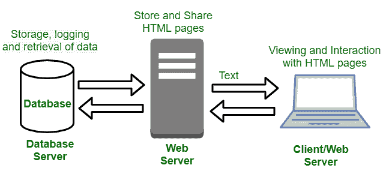

# 动态网站

> 原文:[https://www.geeksforgeeks.org/dynamic-websites/](https://www.geeksforgeeks.org/dynamic-websites/)

动态网站是那些随着对网络服务器的每一个请求而改变内容或布局的网站。这些网站能够从同一个源代码文件中为不同的访问者生成不同的内容。动态网页有两种，即客户端脚本和服务器端脚本。客户端网页根据您在网页上的活动而变化。在服务器端，每当加载网页时，网页都会发生变化。

**示例:**登录&注册页面、申请&提交表单、查询、购物车页面。

动态网站的典型架构

有不同的语言用来创建动态网页，如 PHP、ASP、。NET 和 JSP。每当动态页面加载到浏览器中时，它都会请求数据库根据用户的输入给出信息。在从数据库接收信息时，在应用样式代码之后，结果网页被应用到用户。

**动态网页特点:**

*   这些网站非常灵活。
*   在这些网站中，内容可以在用户的计算机上快速更改，而无需向网络浏览器请求新的页面。
*   在这些网站中，所有者能够简单地更新网站并向网站添加新内容。
*   这些网站的特点是内容管理系统、电子商务系统和内联网或外联网设施。
*   大多数动态网页内容是使用服务器脚本语言在网上组装的。

**动态网页优势:**

*   它提供了更多功能性网站。
*   很容易更新。
*   它有助于搜索引擎，因为新内容会把人们带回网站。
*   这些是互动网站，因为这些可以定制。
*   这些网站可以作为一个系统工作，允许员工或用户进行协作。

**动态网页的缺点:**

*   这些类型的网站很复杂。
*   开发这些更昂贵。
*   托管这些网站的成本也更高。
*   它需要一个快速、高端的网络服务器。