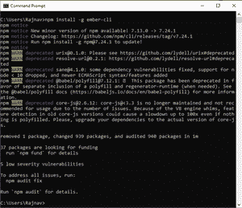
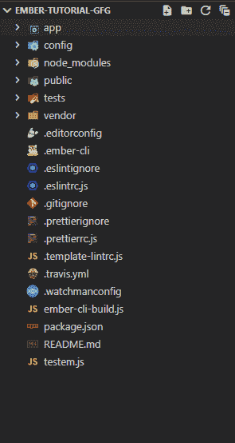
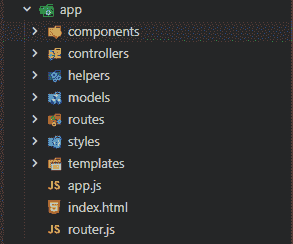
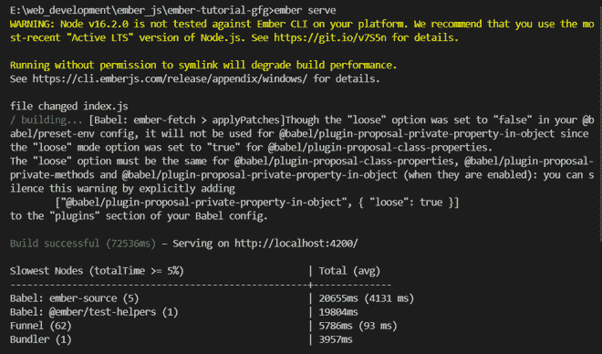

# 成员创建应用程序

> 原文:[https://www.geeksforgeeks.org/emberjs-create-application/](https://www.geeksforgeeks.org/emberjs-create-application/)

**EmberJS** 是一个开源的 javascript 框架。这是一个非常高效的框架，用于毫无困难地构建非常高效的网络应用程序。它遵循 MVC 架构。EmberJS 应用程序已经为专业级别的应用程序做好了准备，它们附带了许多内置工具来简化任务。一些工具包括:

*   构建管道
*   按指定路线发送
*   数据层
*   测试单元

**特征:**

*   MVC 模式
*   客户端渲染
*   高性能
*   模板机制
*   网址支持

**安装 Ember CLI:** 首先，我们需要使用 npm，Node.js 包管理器安装 Ember。因此，在终端中运行以下命令。

```
npm install -g ember-cli
```

这将在我们的系统上全局安装 Ember.js 命令行界面。因此，从现在开始，无论在我们的系统中，我们都可以创建烬应用程序。请注意，npm 包管理器附带了 Node.js。您必须在您的系统中安装 Node.js 才能运行 ember 应用程序。



**创建新应用程序:** Ember.js 使用以下命令创建新应用程序。有些导航到你想要的目录，在那里烬会自动创建一个文件夹，所有文件安装。

```
ember new ember-tutorial-gfg
```

这将创建一个名为**成员-教程-gfg** 的新文件夹。在文件夹中打开代码编辑器，开始编辑创建的项目。

> 注意:安装可能需要几分钟，具体取决于您的机器。

**项目结构:**项目结构应类似如下。



**了解项目结构:**

*   **app:** 这个包含应用 UI 和模型相关文件。
*   **配置:**包含烬应用配置文件。
*   **node_modules:** 包含项目所需的节点模块。
*   **public:** 该文件夹包含托管目的所需的文件。
*   **测试:**这个文件夹包含单元测试的文件。
*   **供应商:**第三方插件或依赖项应该放在这个文件夹中。
*   **app 文件夹:**在这个文件夹中，我们主要关注的是开发我们的第一个 app。您的应用程序文件夹应该如下所示:



您可以检查组件、控制器、助手、模型、路线是否只包含*。gitkeep* 文件。样式文件夹有一个 *app.css* 文件，模板文件夹有一个 *application.hbs* 文件。这是 Ember 应用程序的经典结构，我们将只继续这个结构。

**运行应用程序:**在终端/命令提示符下输入以下命令运行应用程序:

```
ember serve
```

这将在 [http://localhost:4200](http://localhost:4200) 上默认构建应用并服务网站。您也可以在 Ember.js 的文档或自述文件中找到更多详细信息。项目文件夹中的 MD 文件。

项目构建完成后，您会发现类似的输出，如下所示。任何更改都将自动更新，非常类似于 React.js 项目。



现在打开任意浏览器，导航至***http://localhost:4200/***查看结果。你会发现下面的网页。


**示例:**创建一个基本的 EmberJS 应用程序。

**文件名:application.hbs**

## 超文本标记语言

```
{{page-title 'EmberTutorialGfg'}}
<h1 id='body-title'>Welcome to GeeksforGeeks Ember Tutorial</h1>
<h4 id='body-subtitle'>Creating first website using Ember.js</h4>
{{outlet}}
```