# 人体检验员插件

> 原文:[https://www . geesforgeks . org/ember js-ember-inspector-plugin/](https://www.geeksforgeeks.org/emberjs-ember-inspector-plugin/)

**Ember.js** 是一个 web 框架，它让开发和原型制作变得更加容易和快速。它是一个开源的 JavaScript 框架，以 MVC 架构开发项目。Ember.js 应用程序是为专业级别的项目准备的，因为它们是结构化的项目。

**余烬检查器:**余烬检查器是一个浏览器插件或插件，旨在使网络应用程序开发的过程更加流畅。它旨在理解和调试烬应用程序。

*   **查看组件树:**我们可以看到应用当前页面的组件树，看看是否有渲染问题。
*   **路线检查:**现代应用中的导航是必要的选择。但是为了搜索引擎优化和其他问题，路线需要看起来很好，并且在刷新时呈现相同的页面。使用检查器，我们可以看到每条路线，如果有问题，可以调试它们。
*   **数据检查:T** 我们想要获取的数据应该被正确地获取和处理，否则我们会出错。此外，我们可以看到不同的传入数据模型、记录，以及它们是如何被提供给应用程序的不同页面的。
*   **性能:T** 性能选项卡显示每个页面的加载速度以及影响它的不同方面。
*   **实时调试元素和承诺:**我们可能不会一直在应用程序中更改数据，所以检查器给了我们更改应用程序的一些值或元素并查看其结果的机会。这些结果不会存储在应用程序中，因此我们更安全。我们可以**调试****异步承诺**在检查器内部的 javascript 中使用。

**安装:**该插件可用于以下浏览器:

*   **谷歌铬**
*   **Firefox**

转到浏览器的扩展页面，搜索烬检查器。然后安装插件。

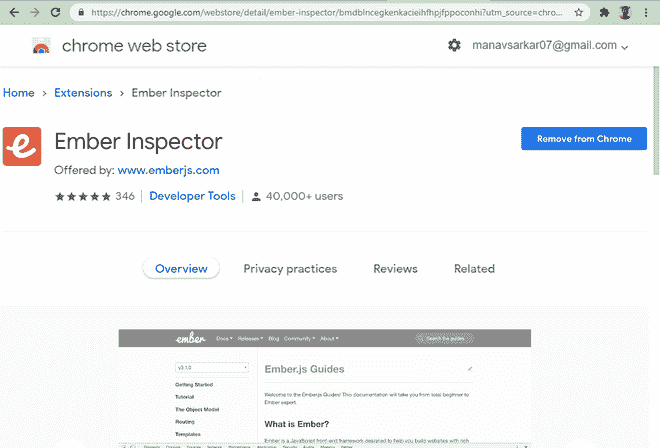

**创建项目:**

**步骤 1:** 让我们创建一个包含一些元素的项目。稍后，我们将使用烬检查器检查这些元素。在**终端/命令提示符下输入以下命令。**

```html
ember new ember_cli_tutorial
```

这将创建一个新的 Ember.js 项目。**项目结构**如下。

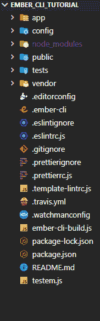

**步骤 2:** 现在**使用以下命令构建并运行**项目。

```html
ember serve
```

项目建成成功后，**导航**至 **http://localhost:4200。**

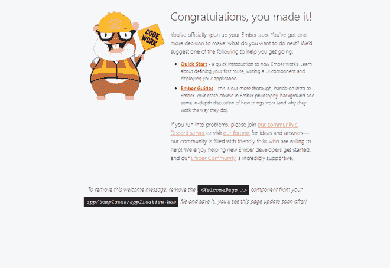

**第三步:**创建路线，我们可以有两条不同的路线，一条是【T2 之家】，另一条是【关于】。让我们使用 Ember 命令创建两条路线。

*   **家庭:**

    ```html
    ember generate route home
    ```

*   **关于:**

    ```html
    ember generate route about
    ```

我们需要将主页重定向为默认路由。我们需要修改 router.js 文件，并将路径更改为应用程序的根目录(“/”)。按如下方式修改 router.js 文件。

## router.js

```html
import EmberRouter from '@ember/routing/router';
import config from 'ember-cli-tutorial/config/environment';

export default class Router extends EmberRouter {
  location = config.locationType;
  rootURL = config.rootURL;
}

Router.map(function () {
  this.route('home', { path: '/' });
  this.route('about');
});
```

我们将显示名为**项目**的**组件**中的项目。要**创建新的**组件**，请使用以下命令。**

```html
ember generate component item
```

生成组件后，按如下方式修改组件文件。

## 项目. hbs

```html
<div class='item'>
  <h4>
    {{@title}}
  </h4>
  <a href="{{@link}}" target="_blank">Click Here</a>
</div>
```

**第四步:**创建一些数据，我们会以列表的形式显示一些数据。我们将以列表的形式在主页上显示数据。因此，我们将返回包含项目列表的模型数据。

## home.js

```html
import Route from '@ember/routing/route';

export default class HomeRoute extends Route {
  async model() {
    return {
      items: [
        {
          name: 'Data Structures',
          link: '
https://www.geeksforgeeks.org/data-structures/',
        },
        {
          name: 'Algorithms',
          link: '
https://www.geeksforgeeks.org/fundamentals-of-algorithms/',
        },
        {
          name: 'Competitive Programming',
          link: '
https://www.geeksforgeeks.org/competitive-programming-a-complete-guide/',
        },
      ],
    };
  }
}
```

**步骤 5:** 创建主页。我们的应用程序页面只包含默认的欢迎文本。只需删除欢迎元素并保留其他内容。我们将获取上述模型提供的数据，然后在主页上以列表项的形式显示它们。更新 home.hbs 文件以显示项目列表。我们还使用这里提供的 CSS 来进行样式设计。

## home.hbs

```html
{{page-title "Home"}}

<h1 id='title'>
  GeeksforGeeks Ember Inspector
</h1>
<div class="navbar">
  <LinkTo @route="home" class="nav">Home</LinkTo>
  <LinkTo @route="about" class="nav">About</LinkTo>
</div>
<div id='items'>
  {{#each @model.items as |item|}}
  <Item @title={{item.name}} @link={{item.link}}></Item>
  {{/each}}
</div>
```

## app.css 文件

```html
body {
  margin: 2rem;
  background-color: rgb(22, 187, 64);
}
#title {
  text-align: center;
  color: aliceblue;
}
#items {
  margin: auto;
  width: 80%;
  height: 70vh;
  bottom: 5rem;
  background-color: white;
  border-radius: 10px;
  overflow-x: hidden;
  overflow-y: auto;
}
.item {
  margin: 2rem;
  padding: 5px 20px;
  background-color: rgb(131, 243, 164);
  border-radius: 10px;
}
.navbar {
  display: inline;
  margin: 5rem;
}
.navbar .nav {
  text-decoration: none;
  font-size: 32px;
  font-weight: 600;
  background-color: rgb(57, 248, 57);
  transition-duration: 0.5s;
  border-radius: 10px;
  color: black;
}
.navbar .nav:hover {
  background-color: rgb(34, 158, 34);
}
```

**第 6 步:**创建“关于”页面。最后**T3【关于】页面我们包含了一些细节。这里我们将放置一些文本和标题。**

## 关于. hbs

```html
{{page-title "About"}}
<h1 id="title">GeeksforGeeks Ember js Tutorial</h1>
<div class="navbar">
  <LinkTo @route="home" class="nav">Home</LinkTo>
  <LinkTo @route="about" class="nav">About</LinkTo>
</div>
<p id="items">GeeksforGeeks is a programming tutorial website
  with lots of wonderful content at no cost.
</p>
```

**输出:**保存所有文件后，保存并运行项目。应用程序应该如下所示。

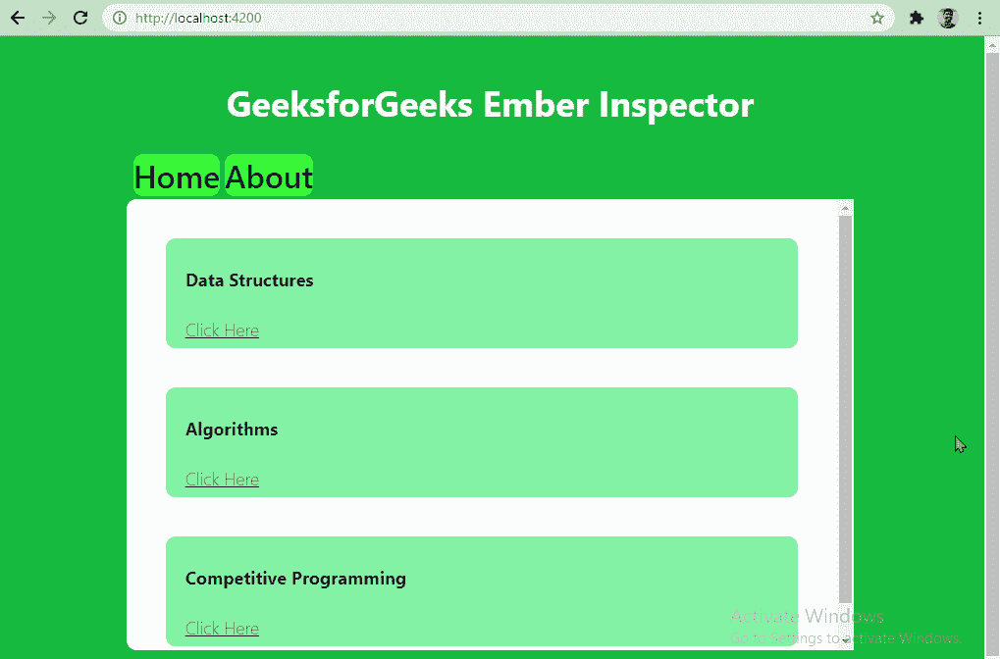

烬检查员。我们的项目完成了，现在探索烬检查员。

**烬对象检查器:****对象检查器允许我们在应用程序中与不同的对象进行交互。**

**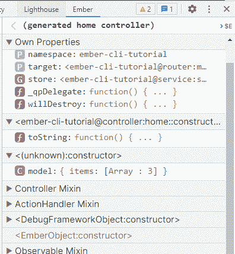**

**这里可以看到**组件树**。**

**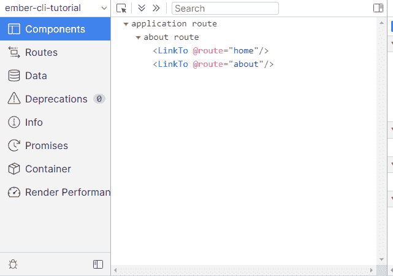**

**我们可以通过导航到所需的路线来探索和悬停在不同路线的不同组件上，如下所示。**

**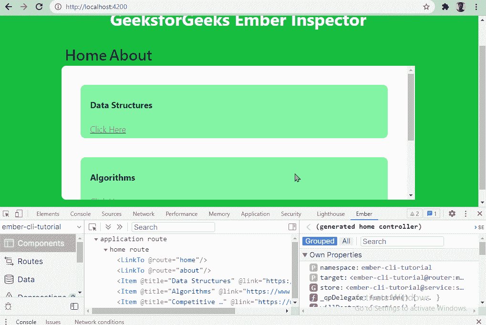**

****路线检查员:**我们有两条不同的路线:-回家和大约。因此，我们可以在“路线”选项卡下探索不同的路线。高亮颜色也会随着我们改变路线而改变。**

**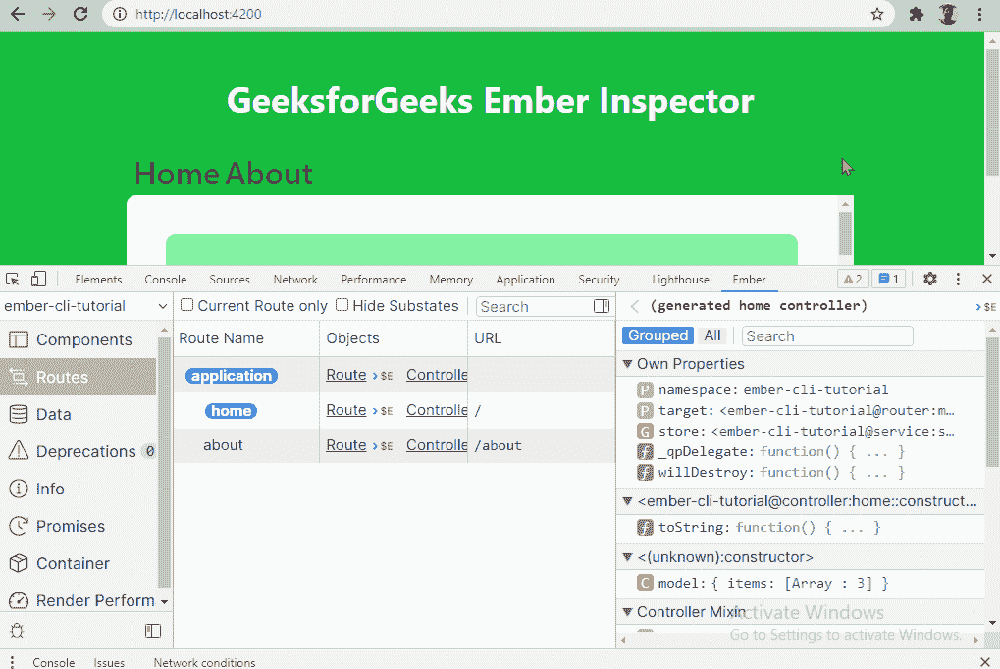**

****Info 标签:**Info 标签显示我们应用的信息，比如 Ember.js、Ember CLI 等版本，App Configuration 是与项目名称、根 URL、版本等相关的配置。**

*   ****图书馆:**
    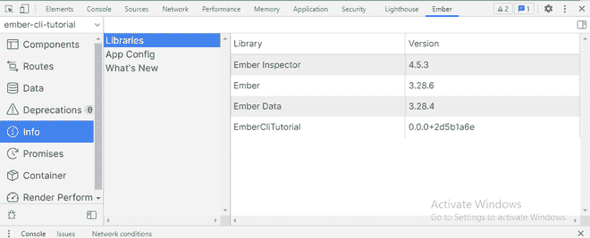**
*   ****应用配置:** 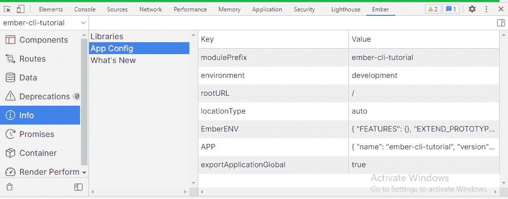**

****渲染性能:**在该选项卡下可以看到性能度量。此选项卡显示导航时间等详细信息。单击右上角的刷新会从选项卡中删除数据。**

*   ****衡量绩效:** 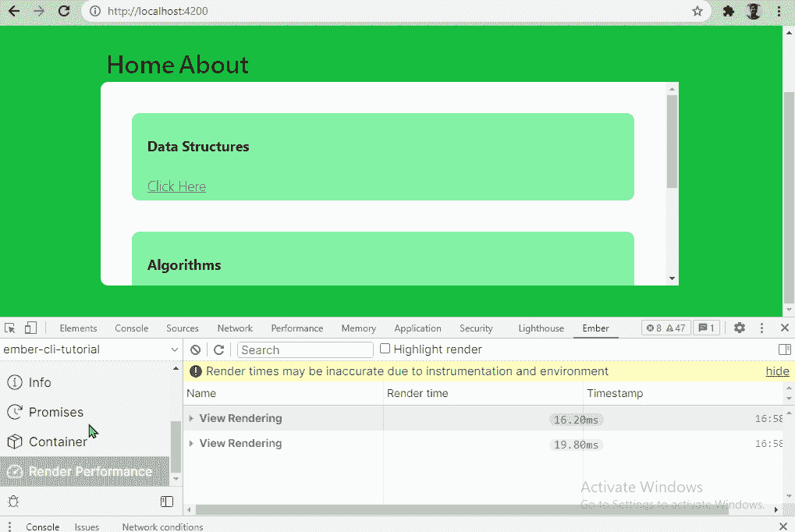**
*   ****刷新按钮:** 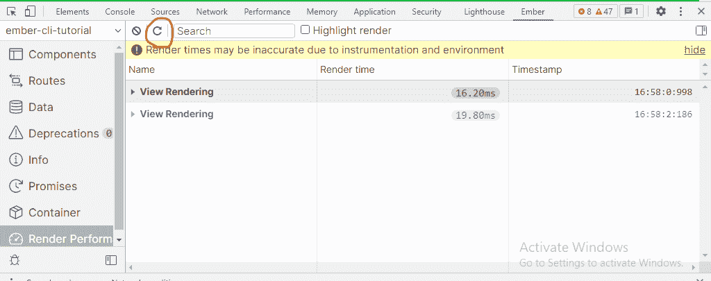**