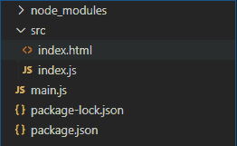
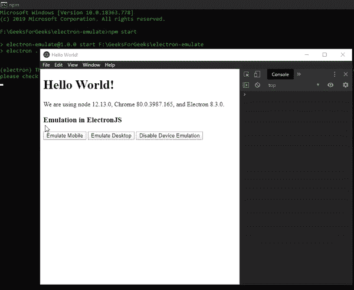

# 电子 JS 仿真

> 原文:[https://www.geeksforgeeks.org/emulation-in-electronjs/](https://www.geeksforgeeks.org/emulation-in-electronjs/)

[**electronijs**](https://www.geeksforgeeks.org/introduction-to-electronjs/)是一个开源框架，用于使用能够在**Windows****macOS**和 **Linux** 操作系统上运行的 HTML、CSS 和 JavaScript 等 web 技术构建跨平台原生桌面应用。它将 Chromium 引擎和 [**NodeJS**](https://www.geeksforgeeks.org/introduction-to-nodejs/) 结合成一个单一的运行时。

在传统的网络应用程序中，我们有**切换视图**功能，在该功能中，我们可以选择是查看网站的桌面版本还是移动版本。这取决于我们当前查看网站的设备。这也是**仿真**的一部分。仿真是指软件仿真(或模仿)另一个程序或呈现不同于原始/预期程序的特性的能力。这样做是为了增强用户体验或为开发人员提供在不同平台/特性上测试应用程序的能力。电子为我们提供了一种方法，通过这种方法，我们可以使用内置的**浏览器窗口**对象和**网络内容**属性的实例方法和事件来模拟桌面或移动设备。本教程将演示如何模拟电子设备。

我们假设您熟悉上述链接中介绍的先决条件。电子要工作， [**节点**](https://www.geeksforgeeks.org/introduction-to-nodejs/) 和 [**npm**](https://www.geeksforgeeks.org/node-js-npm-node-package-manager/) 需要预装在系统中。

*   **项目结构:**



**示例:**按照 [**中给出的步骤，设置基本的电子应用程序。复制文章中提供的 **main.js** 文件和**index.html**文件的样板代码。还要对**包. json** 文件进行必要的更改，以启动电子应用程序。我们将继续使用相同的代码库构建我们的应用程序。设置电子应用程序所需的基本步骤保持不变。**](https://www.geeksforgeeks.org/dynamic-styling-in-electronjs/)

**package.json:**

```htmlhtml
{
  "name": "electron-emulate",
  "version": "1.0.0",
  "description": "Device Emulation in Electron",
  "main": "main.js",
  "scripts": {
    "start": "electron ."
  },
  "keywords": [
    "electron"
  ],
  "author": "Radhesh khanna",
  "license": "ISC",
  "dependencies": {
    "electron": "^8.3.0"
  }
}

```

**输出:**此时，我们的基本电子应用程序设置完毕。启动应用程序后，我们应该会看到以下结果。

[](https://media.geeksforgeeks.org/wp-content/uploads/20200512225834/Output-1105.png)

**电子设备仿真:****浏览器窗口**实例和**网站内容**属性是**主进程**的一部分。要在**渲染器进程**中导入和使用浏览器窗口，我们将使用电子**远程**模块。

*   **index.html**:在该文件中添加以下片段。这些按钮还没有任何相关的功能。要进行更改，请在 **index.js** 文件中添加以下内容。

## 超文本标记语言

```htmlhtml
<h3>
  Emulation in ElectronJS
</h3>
<button id="emulate">
  Emulate Mobile
</button>
<button id="desktop">
  Emulate Desktop
</button>
<button id="disable">
  Disable Device Emulation
</button>
```

*   **index.js:** 在该文件中添加以下代码片段。

## java 描述语言

```htmlhtml
const electron = require("electron");

// Importing BrowserWindow from Main 
// Process with Electron remote
const BrowserWindow = electron.remote.BrowserWindow;
let win = BrowserWindow.getFocusedWindow();
// let win = BrowserWindow.getAllWindows()[0];

var emulate = document.getElementById("emulate");
emulate.addEventListener("click", () => {
    win.webContents.enableDeviceEmulation({
        screenPosition: "mobile",

        // Defined as Size of Galaxy S5 in 
        // Chromium Browser
        screenSize: {
            width: 360,
            height: 640,
        },
        viewPosition: {
            x: 0,
            y: 0,
        },
        // Defined as Size of Galaxy S5 in
        // Chromium Browser
        viewSize: {
            width: 360,
            height: 640,
        },
        deviceScaleFactor: 0,
        scale: 1,
    });
});

var desktop = document.getElementById("desktop");
desktop.addEventListener("click", () => {
    win.webContents.enableDeviceEmulation({
        screenPosition: "desktop",

        // Same as BrowserWindow Instance 
        // in Main Process
        screenSize: {
            width: 800,
            height: 600,
        },
        viewPosition: {
            x: 0,
            y: 0,
        },
        // Same as BrowserWindow Instance 
        // in Main Process
        viewSize: {
            width: 800,
            height: 600,
        },
        deviceScaleFactor: 0,
        scale: 1,
    });
});

var disable = document.getElementById("disable");
disable.addEventListener("click", () => {
    win.webContents.disableDeviceEmulation();
});
```

下面给出了代码中使用的[](https://www.electronjs.org/docs/api/web-contents)**属性的所有实例方法的详细说明。**

*   ****webcontents . enable Device 仿真(参数)**这个实例方法只是根据提供给它的参数来启用设备仿真。此方法没有返回类型。它接受以下对象。

    *   **参数:对象**取以下参数，
        *   **屏幕位置:字符串**该属性指定仿真。它表示应该为应用程序模拟的屏幕视图。它可以容纳**桌面**或**移动**数值。**桌面**值代表桌面屏幕类型，**移动**值代表移动屏幕类型。默认值为**桌面**。在我们的代码中，我们已经基于**参数**对象中提供的其他属性在两个值之间切换。
        *   **屏幕尺寸:对象(可选)**使用**尺寸**对象设置仿真屏幕尺寸。当**屏幕位置**属性设置为**移动**时，该参数很重要。它接受以下参数。
            *   **宽度:整数**屏幕尺寸的宽度。
            *   **高度:整数**屏幕尺寸的高度。
        *   **视图尺寸:对象(可选)**使用**尺寸**对象设置仿真视图尺寸。当**屏幕位置**属性设置为**移动**时，该参数很重要。它接受以下参数。默认为一个**空**对象。空对象表示**无覆盖**。
            *   **宽度:整数**视图尺寸的宽度。
            *   **高度:整数**视图尺寸的高度。
        *   **视图位置:对象**该参数用于使用**点**对象在屏幕上定位视图框。当**屏幕位置**属性设置为**移动**时，该参数很重要。它接受以下参数。
            *   **x:整数**位置的 X 坐标。
            *   **y:整数**位置的 Y 坐标。
        *   **设备比例因子:整数**该参数设置设备比例因子。默认值为 **0** 。
        *   **缩放:浮动**该参数定义了仿真视图的缩放比例，由可用空间内的**屏幕位置**属性定义。该值覆盖适合视图模式。默认值为 **1** 。** 
*   ****webcontents . disabledeviceemulation()**此实例方法只是禁用由**webcontents . enabledeviceemulation()**方法启用的设备仿真。此方法不接受任何参数，也没有返回类型。**

**要在**渲染器进程**中获取当前**浏览器窗口**实例，我们可以使用**浏览器窗口**对象提供的一些**静态**方法。**

*   ****BrowserWindow . getallwindow():**此方法返回一个活动/打开的 BrowserWindow 实例数组。在这个应用程序中，我们只有一个活动的**浏览器窗口**实例，它可以直接从数组中引用，如代码所示。**
*   ****浏览器窗口. getFocusedWindow():** 此方法返回在应用程序中聚焦的**浏览器窗口**实例。如果没有找到当前浏览器窗口实例，则返回**空值**。在这个应用程序中，我们只有一个活动的**浏览器窗口**实例，可以使用这个方法直接引用它，如代码所示。** 

****输出:****

**[](https://media.geeksforgeeks.org/wp-content/uploads/20200606212155/Output-1-GIF5.gif)**