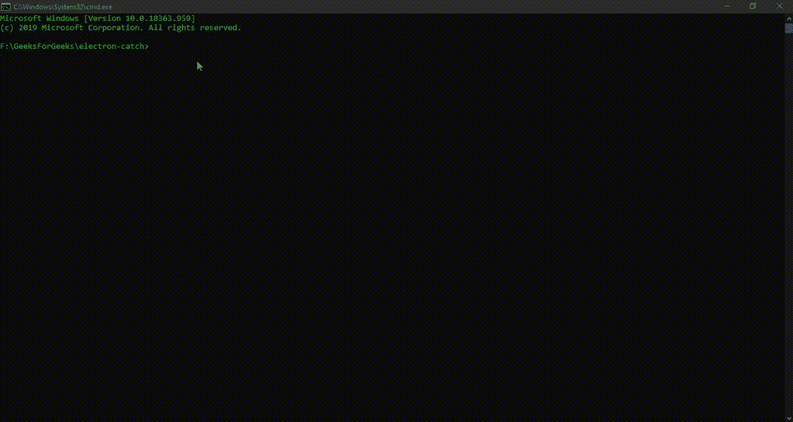

# 电子表格中的错误处理

> 原文:[https://www.geeksforgeeks.org/error-handling-in-electronjs/](https://www.geeksforgeeks.org/error-handling-in-electronjs/)

[**electronijs**](https://www.geeksforgeeks.org/introduction-to-electronjs/)是一个开源框架，用于使用能够在 Windows、macOS 和 Linux 操作系统上运行的 HTML、CSS 和 JavaScript 等网络技术构建跨平台的本机桌面应用程序。它将铬引擎和[T5 节点 T7】结合成一个单一的运行时。在任何应用中，**错误**和**异常**处理都是开发的关键部分。关于 NodeJS 中的错误和异常处理，请参考文章:](https://www.geeksforgeeks.org/introduction-to-nodejs/) [**节点中的异常处理**](https://www.geeksforgeeks.org/exception-handling-in-node/) 。有关使用 JavaScript 的错误和异常处理，请参考以下文章:

*   [**Javascript |错误和异常处理示例**](https://www.geeksforgeeks.org/javascript-error-and-exceptional-handling-with-examples/)
*   [**JavaScript |错误–抛出并尝试捕捉**](https://www.geeksforgeeks.org/javascript-errors-throw-and-try-to-catch/)

大多数语言和平台为错误和异常处理提供内置支持。开发人员在开发应用程序时，无论使用何种语言或平台，都应该注意代码中可能出现的一些常见异常，例如处理**空值**、用 0 除一个数字等。除了一些与其功能相关的特定用例之外，开发人员通常一般都会处理异常和错误。可以抛出的异常列表并不是详尽的。我们已经介绍了 NodeJS 和 JavaScript 中的错误和异常处理。开发电子应用程序时也可以使用相同的技术。但是，很多时候会出现这样的情况，工作代码可能会因为未知原因而中断，或者应用程序中的错误可能会导致抛出异常或错误，从而中断执行流程。他们还可能拥有应用程序的安全问题。在这种情况下，我们需要一种通用的方法来安全地处理这些异常，而不会破坏应用程序，并且它还应该符合本机系统。在本教程中，我们将使用**电子未处理**外部[T5】NPMT7】包查看电子应用程序中的错误和异常处理。我们假设您熟悉上述链接中介绍的先决条件。电子要工作，需要在系统中预装](https://www.geeksforgeeks.org/node-js-npm-node-package-manager/) [**节点**](https://www.geeksforgeeks.org/introduction-to-nodejs/)[**NPM**](https://www.geeksforgeeks.org/node-js-npm-node-package-manager/)。

*   **项目结构:**


**示例:**按照 [**中给出的步骤，设置基本的电子应用程序。复制文章中提供的 **main.js** 文件和**index.html**文件的样板代码。我们将继续使用相同的代码库构建我们的应用程序。另外，使用**](https://www.geeksforgeeks.org/dynamic-styling-in-electronjs/) **[npm](https://www.geeksforgeeks.org/node-js-npm-node-package-manager/) 安装**电子处理**包。使用这个外部包，我们可以捕获电子应用程序中未处理的错误和拒绝承诺，并安全地处理它们。**

```htmlhtml
npm install electron-unhandled --save

```

此外，对**包进行必要的更改，以启动电子应用程序。我们将继续使用相同的代码库构建我们的应用程序。设置电子应用程序所需的基本步骤保持不变。
T3**

```htmlhtml
{
  "name": "electron-catch",
  "version": "1.0.0",
  "description": "Catch Unhandled Errors and Promise Rejections in Electron",
  "main": "main.js",
  "scripts": {
    "start": "electron ."
  },
  "keywords": [
    "electron"
  ],
  "author": "Radhesh Khanna",
  "license": "ISC",
  "dependencies": {
    "electron": "^8.3.0",
    "electron-unhandled": "^3.0.2"
  }
}

```

**输出:**

[](https://media.geeksforgeeks.org/wp-content/uploads/20200512225834/Output-1105.png)

**电子中的错误处理:****电子未处理的** **npm** 包可以直接在应用程序的**主进程**和**渲染器进程**中使用，以捕获未处理的错误。这个包需要*电子 5+* 工作没有任何问题。这个包是兼容的，从*electronic v 8 . 3 . 0*开始没有任何错误，并且定期更新。有关此软件包、版本更新和变更日志的更多详细信息，请参考链接:**https://www.npmjs.com/package/electron-unhandled**。该软件包已被采用，并由电子公司自己用于演示目的。

*   **index.html:** 在该文件中添加以下代码片段。

## 超文本标记语言

```htmlhtml
<h3>Catch Unhandled Errors and Promise Rejections in Electron</h3>
    <button id="generate">
         Generate Errors
    </button>
<!-- Adding Individual Renderer Process file -->
```

*   **index . js:****生成错误**按钮还没有任何相关功能。在本教程中，我们将从**错误界面**抛出一个通用错误，并向其传递一个自定义消息。要更改这一点，请在 **index.js** 文件中添加以下代码片段。

## java 描述语言

```htmlhtml
const electron = require('electron')
const electron = require('electron');
// Importing unhandled.
const unhandled = require('electron-unhandled');

unhandled({
    logger: () => {
        console.error();
    },
    showDialog: true,
    reportButton: (error) => {
        console.log('Report Button Initialized');
    }
});

unhandled.logError(Error, {
    title: 'Title of the Box'
});

var generate = document.getElementById('generate');
// Throwing a Generic Error from the Error Interface
generate.addEventListener('click', () => {
    throw new Error('THIS IS AN ERROR');
});
```

**说明:**在上面的应用中，在点击 [**HTML DOM**](https://www.geeksforgeeks.org/html-dom-html-object/) [**按钮**](https://www.geeksforgeeks.org/html-dom-button-object/) 元素时，我们抛出了一个**新错误**并带有消息。由于我们没有使用**试捕**块，这是一个未处理的错误，我们将使用**电子未处理** **npm** 包来处理。**未处理的(选项)**实例方法没有返回类型，它接受以下参数。

*   **选项:对象**我们可以传递自定义配置，这些配置定义了我们希望它们捕捉到的错误被处理、打印和报告的方式。它由以下参数组成。
    *   **记录器:功能(可选)**该功能为可选参数。此参数定义了一个自定义函数，可用于记录/打印捕获的错误。默认为 JavaScript 中全局 [**控制台对象的**控制台错误**。如果我们使用外部工具来跟踪诸如 sentry 之类的错误，或者将它们记录到用户本地系统目录中的外部文件中，那么这个参数非常有用。 **Sentry** 是一款针对 JavaScript 应用的错误跟踪和性能监控工具。**](https://www.geeksforgeeks.org/console-in-javascript/)
    *   **显示对话框:布尔型(可选)**该参数为可选参数。该参数设置为**真**，出现错误时会出现原生系统**错误对话框**框，标题为**未处理错误**，出现**承诺**时会出现**未处理承诺拒绝**。对话框中出现的默认按钮是**确定**，所有平台都支持，以及*窗口*平台上的附加**复制错误**按钮。除此之外，我们还可以添加另一个**报告……**按钮，如下所述。有关电子中对话框的更多详细信息，请参考文章: [**电子中的自定义消息**](https://www.geeksforgeeks.org/custom-messages-in-electronjs/) 。默认情况下，该对话框仅在**生产**阶段环境中显示，即当电子应用程序在**生产**模式下运行时。
    *   **报告按钮:功能(可选)**该参数为可选参数。该参数定义后，将在错误对话框中显示**报告……**按钮，如**显示对话框**参数中所述。默认情况下，该参数为**未定义**，即不包含在错误对话框中。该函数接收一个**错误:字符串**作为参数，表示捕获的**错误**对象。该功能的默认行为是在引擎盖下执行另一个功能，该功能将用户重定向到**电子未处理**包的 **GitHub Issues** 页面，并将捕获到的错误报告给该包的作者。该内部功能利用**电子工具**外部软件包重定向到 Github 问题页面。**电子应用程序**外部包为电子应用程序添加了有用的调试和实用功能，这将在另一篇文章中介绍。这个函数的默认行为可以被覆盖，就像我们在上面的代码示例中所做的那样。在我们的代码中，只要点击这个**报告…** 按钮，我们就简单地打印一个带有自定义消息和**错误**对象的 Console 语句。为了更好地理解，请参考输出。

**电子未处理**包还为我们提供了**未处理日志错误(错误，选项)**实例方法，可用于记录/打印/显示错误处理中捕获的错误，例如在 **try-catch** 语句的 **catch** 块中。此实例方法使用与**未处理()**实例方法中定义的相同配置，或者调用默认配置。因此，在我们的例子中，我们选择在**未处理的()**实例方法中显示一个错误对话框，同样的操作也将在这个方法中完成。它接受以下参数。

*   **错误:对象**该参数代表需要记录的捕获的**错误**的错误对象。
*   **选项:对象**该参数只是接受一个**标题:字符串**参数，该参数表示在**未处理()**实例方法配置中设置了**显示对话框**参数的情况下要显示的错误对话框的标题。默认情况下，错误对话框的标题将显示为: **${appName}遇到错误**，其中 **appName** 是 **package.json** 文件中定义的您的电子应用程序的名称。在我们的例子中，我们只是捕获了一个通用的**错误界面**，它应该在电子应用程序开始时显示。

此时，在启动电子应用程序时，我们应该能够看到**电子未处理**包产生两个自定义错误对话框，一个在应用程序启动时，另一个在**生成错误**按钮点击时。
**输出:**

[](https://media.geeksforgeeks.org/wp-content/uploads/20200802141856/Output-1-GIF22.gif)