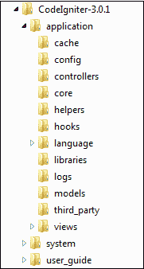

# 解释 CodeIgniter 文件夹结构

> 原文:[https://www . geesforgeks . org/explain-codeigniter-folder-structure/](https://www.geeksforgeeks.org/explain-codeigniter-folder-structure/)

**CodeIgniter** 是一个使用 PHP 构建网站的应用开发框架。它用于在开发应用程序时最小化代码，开发速度也一样快。文件夹结构是 CodeIgniter 的重要组成部分。理解 CodeIgniter 中的文件结构对于开发成功的应用程序非常重要。

当你打开 CodeIgniter 的目录结构时，会有三个主要的文件夹，如下所示:

*   应用
*   系统
*   用户指南

所以，现在我们来看看所有的部分。

**文件夹结构:**

**应用程序:**应用程序文件夹是存储我们正在开发的应用程序的所有代码的地方。它由其他几个文件夹组成。

*   **缓存:**在这个文件夹中，会存储你的应用的所有缓存页面。这有助于提高您的页面访问速度。
*   **配置:**在这个文件夹中，存储了所有的配置文件。使用 database.php 用户可以配置数据库的应用程序和 configure 文件，我们设置我们的基本网址等。
*   **控制器:**在这个文件夹中，它包含了对我们的应用程序和所有服务器端功能的控制。
*   **Core:** 你的应用的所有基类都会存储在这里。
*   **助手:**这将帮助您创建应用程序。
*   **钩子:**这将帮助你修改你的框架的内部工作。
*   **语言:**可以在项目中根据需要使用语言。
*   **日志:**这里将存储与日志相关的所有文件，有时如果您收到错误并且没有收到消息，那么您可以查看它们的解释**。**
*   **模型:**所有的数据库登录都将存储在这里，控制器将在这里请求它们，然后可以使用它们。
*   **第三方:**所有的第三方插件都会存储在这里，在应用中使用。
*   **视图:**这里会存储你所有与应用相关的 HTML 文件。

**系统:**所有与编码相关的文件、库和其他文件都会存储在这里，这将有助于您轻松编码。

该文件夹还包含各种文件夹，解释如下:

*   **核心:**它由 CodeIgniter 的所有核心类组成。请不要试图在这里做任何改变。
*   **数据库:**关于数据库的所有驱动程序和实用程序都会存储在这里。
*   **字体:**所有关于字体的信息和实用程序都存储在这里。
*   **帮助者:**它由所有与帮助者相关的数据组成，如日期、cookie 等**。**
*   **语言:**这里存储的所有语言相关文件 CodeIgniter 都支持多语言 web 应用。
*   **库:**这里将存储库，帮助您轻松创建应用程序，如文件上传、电子邮件、日历。

**User_guide:** 它作为离线 CodeIgniter 指南，帮助你学习 CodeIgniter 各种库的基本功能。你应该通过这个来了解 CodeIgniter。它包含一个**index.php**文件，其中包含设置环境和错误级别的重要内容。如果你不知道，就不要碰这个文件。

**优势:**

*   错误处理
*   可定制性
*   安全
*   用户友好的界面
*   基于 MVC 的系统

**缺点:**

*   缺乏详尽的库
*   缺乏现代命名空间，自动加载器使用