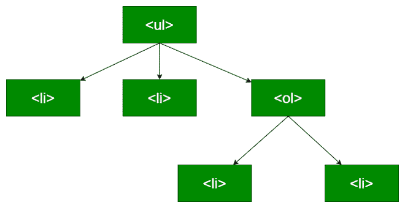
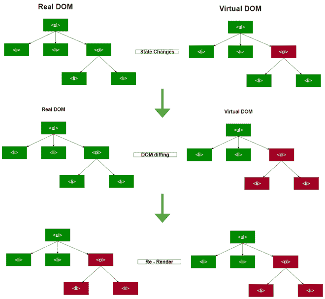

# 解释 DOM 差异

> 原文:[https://www.geeksforgeeks.org/explain-dom-diffing/](https://www.geeksforgeeks.org/explain-dom-diffing/)

在理解什么是 DOM Diffing 之前，我们应该知道什么是 DOM，它的目的是什么。在本文中，我们将了解 DOM 的两个版本，真实和虚拟，然后我们将介绍什么是 DOM 差异。

**什么是 DOM:** 在形式意义上，DOM 是文档的应用编程接口(API)。DOM 定义了文档的逻辑结构，并帮助开发人员访问和操作文档。它非常类似于文档模型。例如，考虑以下 HTML **列表。**

## 超文本标记语言

```
<ul>
  <li></li>
  <li></li>
  <ol>
    <li></li>
    <li></li>
  </ol>
</ul>
```

DOM 表示如下列表:



HTML 列表的 DOM 表示

我们可以看到，**一个 DOM 非常像一棵树**。

现在让我们理解虚拟 DOM 的概念。

让我们从为什么开始回答。每当我们的应用程序的 UI 发生变化时，DOM 就会更新，这意味着整个树都会更新，然后 UI 组件会重新呈现。每次一个小的变化都会使应用程序变慢，因此，用户界面越密集，我们的 DOM 更新就越慢。这就是虚拟 DOM 出现的地方。虚拟 DOM 是上面讨论的真实 DOM 的虚拟表示。现在，当我们的应用程序的用户界面发生状态变化时，只更新虚拟的 DOM，而不是真实的 DOM。接下来要问的是更新虚拟 DOM 如何提高性能。

**DOM Diffing:** 每当 UI 元素的状态发生变化时，就会创建一个新的虚拟 DOM。然后将新的虚拟 DOM 和之前的虚拟 DOM 进行相互比较。这种比较叫做 **DOM diffing** 。

其目的是在真实的 DOM 上执行最少的操作，因此在区分之后，计算更新真实 DOM 的最佳方式，从而有效地更新用户界面。

下图显示了差异过程:



DOM 差异

图片显示真实 DOM 的更新被尽可能推迟。红色节点代表状态变化；然后通过 DOM diffing 计算变化，最后将新的虚拟 DOM 批量更新为真实的 DOM。

**结论:**更新 UI 很贵；批量更新真实的 DOM 提高了重新绘制 UI 的整体性能。