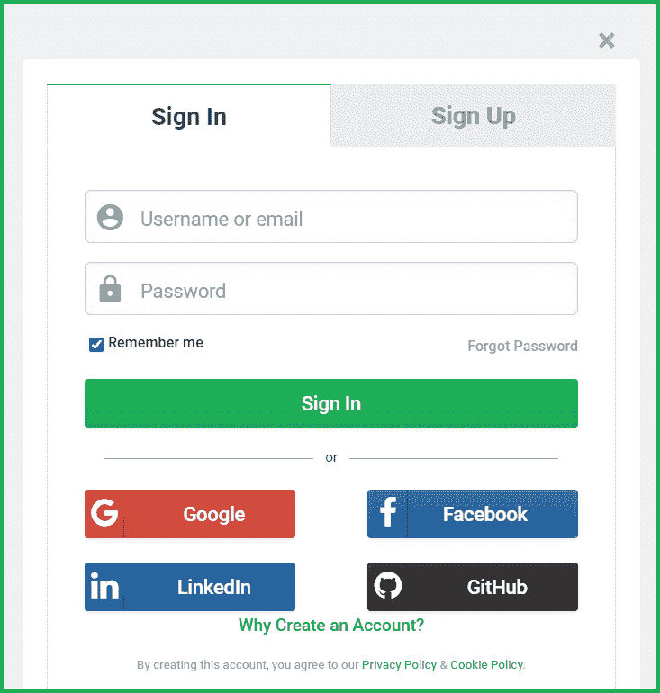

# 解释 OAuth(开放授权)

> 原文:[https://www . geesforgeks . org/explain-oauth-open-authorization/](https://www.geeksforgeeks.org/explain-oauth-open-authorization/)

OAuth 是一个**开放授权标准**(不是认证，OpenID 可以用于认证)。因此，OAuth 不是一个身份验证协议。另一方面，委托协议用于在支持 web 的应用程序和 API 之间传递权限选择。它广泛用于获取用户批准的网站、在线服务和应用程序的用户信息。因此，用户授予服务对信息的访问权限，但您不需要向这些服务提供您的用户凭据，如密码。

支持第三方服务登录的应用程序通常通过提供诸如“使用脸书登录”或“使用谷歌登录”等选项来请求用户进行身份验证。，允许用户使用他们的凭据登录第三方服务。因此，服务向请求应用程序提供访问令牌，证明寻求访问的人的身份。然后，该令牌用于向最终用户的资源发出请求。

**工作:**假设一个人以前注册过一个网站或服务(OAuth 只使用 HTTPS 工作)。然后，用户开始需要访问不同站点或服务的功能/交易。出现以下情况(非常简单):

*   第一个网站使用 OAuth 代表用户连接到第二个网站，显示用户确认的身份。
*   第二个站点创建特定于交易和相关方的一次性令牌和一次性秘密。
*   第一个站点将这个令牌和秘密发送给初始用户的客户端软件。
*   请求令牌和秘密由客户端程序(可能是也可能不是第二个站点)呈现给授权提供商。
*   如果客户端之前没有通过授权提供商的身份验证，可能会提示他或她这样做。认证之后，提示客户授权与第二网站的授权交易。
*   访问令牌由第一网站发送到第二网站，作为代表用户的认证证明。
*   第二个网站允许第一个网站代表用户访问其网站。

OAuth 并不是第一个以这种方式代表最终用户的认证/授权机制。实际上，几个身份验证系统，最著名的是 Kerberos，以类似的方式运行。OAuth 的独特之处在于其跨网络运行的能力和广泛的使用。当早期的计划失败时(由于各种原因)，它在采用率方面是成功的。

**OAuth 机制有三个组成部分:**

*   **OAuth 提供商:**这是像**谷歌**、**脸书**等 OAuth 提供商。
*   **OAuth 客户端:**这是我们共享或验证信息使用的网页。例如，GeeksforGeeks.com
*   **所有者:**登录验证信息共享的用户。

**注意:**对于网络应用上的“登录/注册谷歌”，可以使用谷歌控制台启用 OAuth。

*   OAuth 2.0 客户端标识可以通过谷歌应用编程接口控制台获得。
*   然后，要使用该应用编程接口，从谷歌授权服务器获取一个访问令牌。
*   将请求和访问令牌一起发送给应用编程接口。
*   如果您需要更多时间，请获取刷新令牌。