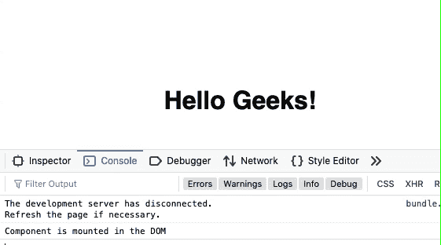
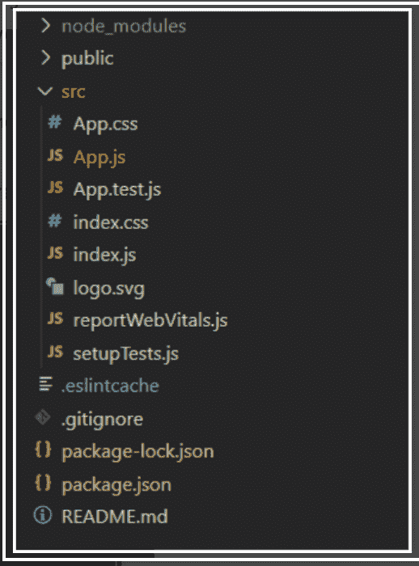
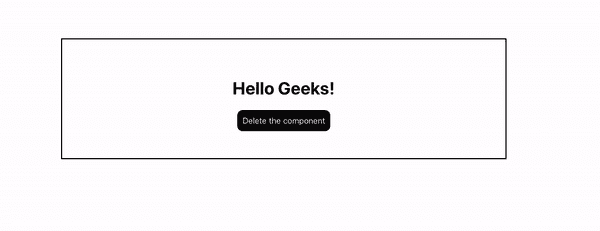

# 解释安装和拆卸的含义

> 原文:[https://www . geesforgeks . org/explain-install-on-and-detail/](https://www.geeksforgeeks.org/explain-the-meaning-of-mounting-and-demounting/)

到目前为止，我们已经看到 React 网络应用程序实际上是一个独立组件的集合，这些组件根据与它们的交互来运行。每个反应组件都有自己的生命周期，组件的生命周期可以定义为在组件存在的不同阶段调用的一系列方法。定义很简单，但是我们所说的不同阶段是什么意思呢？反应组件可以经历如下四个生命阶段。

*   **初始化:**这是用给定的道具和默认状态构造组件的阶段。这是在组件类的构造函数中完成的。
*   **挂载:**挂载是渲染方法本身返回的 JSX 的阶段。
*   **更新:**更新是组件状态更新，应用重绘的阶段。
*   **卸载:**顾名思义，卸载是组件生命周期的最后一步，即从页面中移除组件。

```
Here we will learn about Mounting and Demounting/Unmounting in Detail
```

**挂载:**挂载是组件初始化完成，组件挂载到 DOM 上，并在网页上第一次呈现的组件生命周期阶段。“现在反应”遵循这些预定义函数的命名约定中的默认过程，其中包含“将”的函数在某个特定阶段之前表示，而包含“完成”的函数在该阶段完成之后表示。安装阶段包括如下所述的两个预定义功能。

**component willlmount()函数:**顾名思义，这个函数就在组件挂载到 DOM 之前被调用，也就是说，这个函数在第一次执行 render()函数之前被调用一次。

## App.js

```
import React from "react";

class ComponentOne extends React.Component {
  UNSAFE_componentWillMount() {
    console.log("Component is mounted in the DOM");
  }
  render() {
    return <h1>Hello Geeks!</h1>;
  }
}

class App extends React.Component {
  render() {
    return (
      <div>
        <ComponentOne />
      </div>
    );
  }
}

export default App;
```



**componentDidMount()函数:**与前一个函数类似，该函数在组件安装到 DOM 上后立即被调用，即在第一次执行 render()函数后，该函数被调用一次

## App.js

```
import React from "react";
class App extends React.Component {
  constructor(props) {
    super(props);

    // Initializing the state
    this.state = { color: "lightgreen" };
  }
  componentDidMount() {

    // Changing the state after 2 sec
    // from the time when the component
    // is rendered
    setTimeout(() => {
      this.setState({ color: "wheat" });
    }, 2000);
  }
  render() {
    return (
      <div>
        <p
          style={{
            color: this.state.color,
            backgroundColor: "rgba(0,0,0,0.88)",
            textAlign: "center",
            paddingTop: 20,
            width: 400,
            height: 80,
            margin: "auto",
          }}
        >
          GeeksForGeeks
        </p>
      </div>
    );
  }
}
export default App;
```


**2。拆卸:**这是组件生命周期的最后阶段，即从 DOM 中卸载组件的阶段。以下功能是此阶段的唯一成员。

*   **组件将卸载()函数:**在组件最终从 DOM 中卸载之前调用该函数，即在组件从页面中移除之前调用该函数一次，这表示生命周期结束。

当组件被销毁或从文档对象模型中卸载时，组件卸载()方法允许我们执行反应代码。此方法在反应生命周期的卸载阶段调用，即在组件卸载之前。

所有清理，如使计时器无效、取消网络请求或清理组件中创建的任何订阅，都应该在组件卸载()方法块中编码。

**创建反应应用程序:**

**步骤 1:** 使用以下命令创建一个反应应用程序:

```
npx create-react-app functiondemo
```

**步骤 2:** 创建项目文件夹(即 functiondemo)后，使用以下命令移动到该文件夹:

```
cd functiondemo
```

**项目结构:**如下图。



现在在 App.js 文件中写下以下代码。在这里，App 是我们编写代码的默认组件。

## App.js

```
import React from "react";
class ComponentOne extends React.Component {

  // Defining the componentWillUnmount method
  componentWillUnmount() {
    alert("The component is going to be unmounted");
  }

  render() {
    return <h1>Hello Geeks!</h1>;
  }
}

class App extends React.Component {
  state = { display: true };
  delete = () => {
    this.setState({ display: false });
  };

  render() {
    let comp;
    if (this.state.display) {
      comp = <ComponentOne />;
    }
    return (
      <div>
        {comp}
        <button onClick={this.delete}>
          Delete the component
        </button>
      </div>
    );
  }
}

export default App;
```

**运行应用程序的步骤:**从项目的根目录使用以下命令运行应用程序:

```
npm start
```

**输出:**

