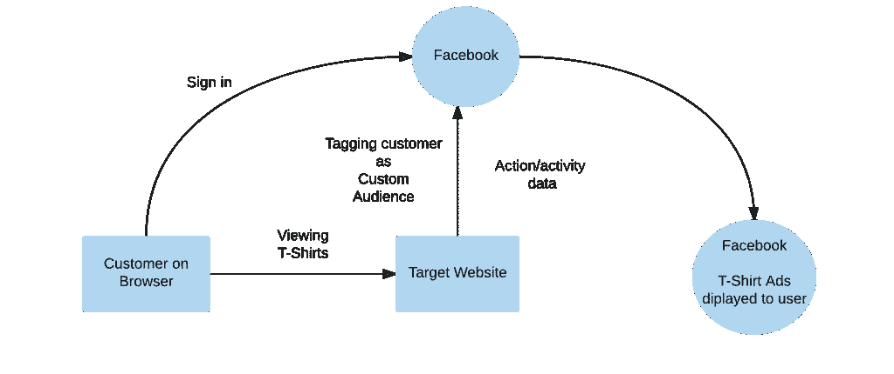

# 脸书如何为你搜索的东西显示广告

> 原文:[https://www . geesforgeks . org/Facebook-display-ads-某物-search/](https://www.geeksforgeeks.org/facebook-display-ads-something-searched/)

有时我们访问一些电子商务网站，检查那里的一些产品，然后离开网站而不下单。然后，当我们打开脸书，我们看到广告完全相同或相似的项目从同一网站。现在你可能想知道脸书是如何知道你在 particar 网站上查看的产品的。如果你是一个数字营销人员，你可能知道这是如何工作的，如果不知道，我们将在本文中揭开这个谜。

在这一切的背后，有一种叫做[像素](https://www.facebook.com/business/a/facebook-pixel)的脸书技术。Pixel 只是**一段 javascript 代码**，对于每个脸书广告客户来说都是独一无二的。这个 javascript 代码放在网站每一页的标题部分。

详见[https://www.facebook.com/business/help/952192354843755](https://www.facebook.com/business/help/952192354843755)。

该代码跟踪页面上的用户活动和事件，并将以下信息发送回脸书–

*   客户访问哪个页面
*   客户对什么产品有看法
*   客户在购物车中添加了哪些产品
*   哪些产品实际上是成功订购的
*   特定于网站等的标准和自定义事件。

它也很少发送类似–
的其他信息

*   浏览器信息
*   国际电脑互联网地址
*   机器信息等。

因此，每当登录其脸书帐户的客户使用相同的浏览器访问网站时，该客户将被标记为该网站的**客户受众**，并且他/她的活动数据将被跟踪并发送回脸书。

如果用户没有登录他/她的脸书帐户并访问该网站，则基于浏览器的 cookie 会与必要的活动记录一起放在浏览器中，稍后当客户使用同一浏览器登录脸书时，它会被标记为自定义受众。

一旦客户被标记，他/她将开始在他/她的脸书个人资料上看到广告。这些广告是根据从网站收到的数据选择的。**这被称为重定目标或重新定位。**

**相关文章:**

*   [谷歌如何运作](https://www.geeksforgeeks.org/google-search-works/)
*   [谷歌排名是如何运作的？](https://www.geeksforgeeks.org/ranking-google-search-works/)
*   [搜索引擎优化(SEO) |基础知识](https://www.geeksforgeeks.org/search-engine-optimization-seo-basics/)
*   [谷歌如何更新自己](https://www.geeksforgeeks.org/how-google-updates-itself/)

本文由 [**阿图尔·库马尔**](https://www.linkedin.com/in/atul-kumar-733b32136/) 供稿。如果你喜欢 GeeksforGeeks 并想投稿，你也可以使用[write.geeksforgeeks.org](https://write.geeksforgeeks.org)写一篇文章或者把你的文章邮寄到 review-team@geeksforgeeks.org。看到你的文章出现在极客博客主页上，帮助其他极客。

如果你发现任何不正确的地方，或者你想分享更多关于上面讨论的话题的信息，请写评论。