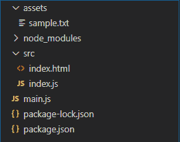
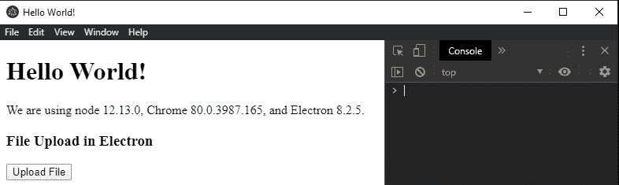
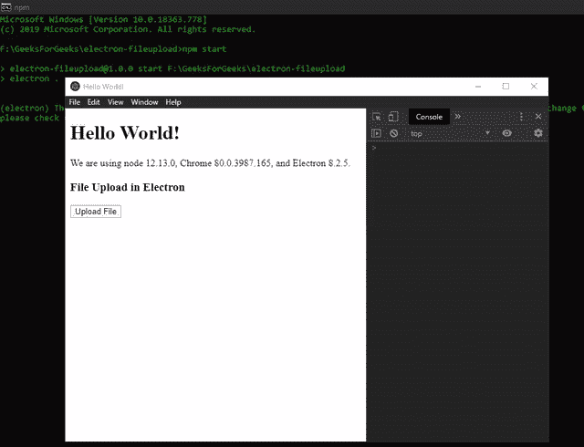
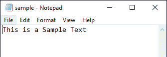

# 电子文档中的文件上传

> 原文:[https://www.geeksforgeeks.org/file-upload-in-electronjs/](https://www.geeksforgeeks.org/file-upload-in-electronjs/)

**[electronijs](https://www.geeksforgeeks.org/introduction-to-electronjs/)**是一个开源框架，用于使用能够在 Windows、macOS 和 Linux 操作系统上运行的**[HTML](https://www.geeksforgeeks.org/html-tutorials/)****[CSS](https://www.geeksforgeeks.org/css-tutorials/)**和 **[JavaScript](https://www.geeksforgeeks.org/javascript-tutorial/)** 等 web 技术构建跨平台原生桌面应用。它将 Chromium 引擎和 [NodeJS](https://www.geeksforgeeks.org/introduction-to-nodejs/) 结合成一个单一的运行时。

任何本机桌面应用程序都应该与系统操作系统环境集成。应用程序应该能够与核心操作系统功能交互，如文件系统、系统托盘等。电子为我们提供了内置的**对话框**模块，显示与文件交互的原生系统对话框。本教程将使用对话框模块的实例方法来演示电子版的文件上传功能。

我们假设您熟悉上述链接中介绍的先决条件。电子要工作， **[节点](https://www.geeksforgeeks.org/introduction-to-nodejs/)** 和 **[npm](https://www.geeksforgeeks.org/node-js-npm-node-package-manager/)** 需要预装在系统中。

**对话模块:**对话模块是**主流程**的一部分。要导入和使用**渲染器进程**中的对话框模块，我们将使用电子**远程**模块。

*   **项目结构:**
    

**示例:**我们将按照给定的步骤开始构建文件上传电子应用程序功能。

*   **Step 1:** Navigate to an Empty Directory to setup the project, and run the following command,

    ```
    npm init
    ```

    生成**包. json** 文件。使用 npm 安装 **[电子](https://www.geeksforgeeks.org/introduction-to-electronjs/)** 。

    ```
    npm install electron --save
    ```

    这将安装所需的**节点 _ 模块**依赖项。使用 npm 安装 **axios** 套装。

    ```
    npm install axios --save
    ```

    这个包是一个基于承诺的面向节点的 HTTP 客户端。这个包用于对 REST APIs 进行 HTTP 调用。有关 *axios* 的更多详细信息，请参考此[链接](https://www.npmjs.com/package/axios)。出于演示目的，在**资源**文件夹中创建**示例. txt** 文件。

    **package.json:**

    ```
    {
      "name": "electron-fileupload",
      "version": "1.0.0",
      "description": "File Upload in Electron",
      "main": "main.js",
      "scripts": {
        "start": "electron ."
      },
      "keywords": [
        "electron"
      ],
      "author": "Radhesh Khanna",
      "license": "ISC",
      "dependencies": {
        "axios": "^0.19.2",
        "electron": "^8.2.5"
      }
    }

    ```

*   **Step 2:** This is the **main.js** file. For the Boilerplate code of the **main.js** file, Refer this [link](https://www.electronjs.org/docs/tutorial/first-app#electron-development-in-a-nutshell). We have modified the code to suit our project needs.

    **main.js:**

    ```
    const { app, BrowserWindow } = require('electron')

    function createWindow () {
      // Create the browser window.
      const win = new BrowserWindow({
        width: 800,
        height: 600,
        webPreferences: {
          nodeIntegration: true
        }
      })

      // Load the index.html of the app.
      win.loadFile('src/index.html')

      // Open the DevTools.
      win.webContents.openDevTools()
    }

    // This method will be called when Electron has finished
    // initialization and is ready to create browser windows.
    // Some APIs can only be used after this event occurs.
    // This method is equivalent to 'app.on('ready', function())'
    app.whenReady().then(createWindow)

    // Quit when all windows are closed.
    app.on('window-all-closed', () => {
      // On macOS it is common for applications and their menu bar
      // To stay active until the user quits explicitly with Cmd + Q
      if (process.platform !== 'darwin') {
        app.quit()
      }
    })

    app.on('activate', () => {
      // On macOS it's common to re-create a window in the  
      // app when the dock icon is clicked and there are no 
      // other windows open.
      if (BrowserWindow.getAllWindows().length === 0) {
        createWindow()
      }
    })

    // In this file, you can include the rest of your 
    // app's specific main process code. You can also 
    // put them in separate files and require them here.
    ```

*   **Step 3:** Create the **index.html** file and **index.js** file within the **src** directory. We will also copy the boilerplate code for the **index.html** file from the above-mentioned link. We have modified the code to suit our project needs.

    **index.html:**

    ```
    <!DOCTYPE html>
    <html>
      <head>
        <meta charset="UTF-8">
        <title>Hello World!</title>
        <!-- https://electronjs.org/docs/tutorial
                               /security#csp-meta-tag -->
        <meta http-equiv="Content-Security-Policy" 
              content="script-src 'self' 'unsafe-inline';" />
      </head>
      <body>
        <h1>Hello World!</h1> We are using node 
        <script>
             document.write(process.versions.node)
        </script>, Chrome 
        <script>
             document.write(process.versions.chrome)
        </script>, and Electron 
        <script>
             document.write(process.versions.electron)
        </script>.

        <h3>File Upload in Electron</h3>
        <button id="upload">Upload File</button>

        <!-- Adding Individual Renderer Process JS File -->
        <script src="index.js"></script>
      </body>
    </html>
    ```

*   **Output:** At this point, our application is set up and we can launch the application to check the GUI Output. To launch the Electron Application, run the Command:

    ```
    npm start
    ```

    

*   **第 4 步:****上传文件**按钮还没有任何相关功能。**对话框显示打开对话框(浏览器窗口，选项)**接受以下参数。
    *   **浏览器窗口:浏览器窗口(可选)****浏览器窗口**实例。该参数允许**对话框**将其自身附加到父窗口，使其成为**模式**。模态窗口是禁用父窗口的子窗口。如果**浏览器窗口**未显示，对话框将不会附加到其上。在这种情况下，它将显示为独立窗口。在上面的代码中，**浏览器窗口**实例没有被传递到对话框，因此单击**上传文件**按钮，对话框作为独立窗口打开。
    *   **选项:对象**它接受以下参数:
        *   **标题:字符串(可选)**对话框窗口显示的标题。
        *   **默认路径:字符串(可选)**点击*上传文件*按钮，默认路径定义的要打开的目录。
        *   **按钮标签:字符串(可选)**确认按钮的自定义标签。如果为空，将使用默认标签。在上面的代码中定义为*上传*。
        *   **消息:字符串(可选)**此参数仅在 *macOS* 中支持。这用于在输入框上方显示自定义消息。
        *   **securityScopedBookmarks:Boolean(可选)**此参数仅在 **macOS** 中支持。该参数用于为苹果应用商店打包时创建**安全范围的书签**。更多详细信息，请参考[链接](https://developer.apple.com/library/archive/documentation/Security/Conceptual/AppSandboxDesignGuide/AppSandboxInDepth/AppSandboxInDepth.html#//apple_ref/doc/uid/TP40011183-CH3-SW16)。
        *   **filters: FileFilter[{}] (Optional)** It is an Array of Objects. It defines an array of file types that can be displayed or selected when we want to limit the user to a specific type. We can define multiple file types object belonging to different categories. The FileFilter object takes in the following parameters,
            *   **名称:字符串**扩展类别的名称。
            *   **扩展:[]** 扩展数组应该由不带通配符或点的扩展组成，如代码所示。要显示所有文件，请使用 ***** 通配符(不支持其他通配符)。更多详细信息，请参考[链接](https://www.electronjs.org/docs/api/structures/file-filter)。

            在上面的代码中，我们希望限制用户只能访问文本文件。因此，我们将名称定义为**文本文件**，扩展名数组定义为 **['txt '，' docx']** 。

        *   **properties: String[] (Optional)** Contains a list of features which are available for the native dialog. It take take in the following values,
            *   **打开文件:**允许选择文件。
            *   **开放目录:**允许选择目录/文件夹。
            *   **多选:**允许在对话框中选择多个文件。
            *   **显示隐藏文件:**在对话框中显示隐藏文件。
            *   **创建目录:**该值仅在 **macOS** 中支持。它允许在对话框中创建新目录。在窗口中，**上下文菜单**在对话框**(在对话框窗口中右键单击)**中预先可用，我们可以从中创建新的文件和目录。
            *   **提示创建:**该值仅在**窗口**中支持。当对话框中输入的文件路径在系统中不存在时，使用该值。此时，它应该提示用户创建。这实际上并不在路径上创建文件，而是允许返回不存在的路径，应用程序可以进一步创建和使用这些路径。
            *   **无解别名:**该值仅在 **macOS** 中受支持。它禁用别名的文件路径到其原始目标的自动解析。所选别名现在将返回别名路径，而不是其目标路径。
            *   **治疗包目录:**该值仅在 **macOS** 中受支持。它对待包裹如**。app** 文件夹，作为目录而不是文件。
            *   **不支持:**该值仅在**窗口**中支持。该值表示正在选择的文件/目录不应添加到最近的文档列表中。

            **注意:**根据官方电子文档，在 **Windows** 和 **Linux** OS 中，打开的对话框不能既是文件选择器又是目录选择器。如果两个**属性**都指定了， **['openFile '，' openDirectory']** 在这些平台上会显示目录选择器，我们将无法选择文件。因此，在代码中，我们为 **win32/linux** 和**达尔文**平台指定了不同的对话框**属性**。

**对话框显示打开对话框(浏览器窗口，选项)**返回**承诺**。它解析为包含以下参数的**对象**，

*   **取消:布尔型**对话框操作是否取消。
*   **文件路径:字符串[]** 用户选择的文件路径数组。如果对话框操作被取消，它将是一个空数组。如果在**属性**中没有提供**多选**值，文件路径数组将返回单个元素。
*   **bookmarks: String[] (Optional)** This String array is supported in **macOS** only. This is returned when the **securityScopedBookmarks** parameter is specified as **true** in the **options** Object.

    **index.js:** 在该文件中添加以下代码片段。

    ```
    const electron = require('electron');
    const path = require('path');

    // Importing dialog module using remote
    const dialog = electron.remote.dialog;

    var uploadFile = document.getElementById('upload');

    // Defining a Global file path Variable to store 
    // user-selected file
    global.filepath = undefined;

    uploadFile.addEventListener('click', () => {
    // If the platform is 'win32' or 'Linux'
        if (process.platform !== 'darwin') {
            // Resolves to a Promise<Object>
            dialog.showOpenDialog({
                title: 'Select the File to be uploaded',
                defaultPath: path.join(__dirname, '../assets/'),
                buttonLabel: 'Upload',
                // Restricting the user to only Text Files.
                filters: [
                    {
                        name: 'Text Files',
                        extensions: ['txt', 'docx']
                    }, ],
                // Specifying the File Selector Property
                properties: ['openFile']
            }).then(file => {
                // Stating whether dialog operation was
                // cancelled or not.
                console.log(file.canceled);
                if (!file.canceled) {
                  // Updating the GLOBAL filepath variable 
                  // to user-selected file.
                  global.filepath = file.filePaths[0].toString();
                  console.log(global.filepath);
                }  
            }).catch(err => {
                console.log(err)
            });
        }
        else {
            // If the platform is 'darwin' (macOS)
            dialog.showOpenDialog({
                title: 'Select the File to be uploaded',
                defaultPath: path.join(__dirname, '../assets/'),
                buttonLabel: 'Upload',
                filters: [
                    {
                        name: 'Text Files',
                        extensions: ['txt', 'docx']
                    }, ],
                // Specifying the File Selector and Directory 
                // Selector Property In macOS
                properties: ['openFile', 'openDirectory']
            }).then(file => {
                console.log(file.canceled);
                if (!file.canceled) {
                  global.filepath = file.filePaths[0].toString();
                  console.log(global.filepath);
                }  
            }).catch(err => {
                console.log(err)
            });
        }
    });
    ```

**输出:**


*   **步骤 5:** 一旦我们从对话框窗口获得了文件路径，我们就可以遵循以下两种方法中的任何一种:
    *   **Approach 1:** Upload the file to a server by making an HTTP POST REST API call and let the server handle the file processing. We will use the **axios** package that was installed earlier to achieve this.
        In **index.js** file, add the following code just after **console.log(global.filepath); }** within the **Promise**
        **index.js:**

        ```
        const fs = require('fs');
        const axios = require('axios');

        if (global.filepath && !file.canceled) {
                 var formData = new FormData();
                 formData.append('file', fs.createReadStream(global.filepath));
                 axios.post('[Custom URL]', formData, {
                 headers: {
                    'Content-Type': 'multipart/form-data'
                   }
                }); 
              } 

        // ...
        ```

        **说明:**我们已经使用 **fs** 模块将文件追加到了一个`formData`对象，并将`Content-Type`头设置为`multipart/form-data`用于 POST 请求。用 REST API 的 URL 替换`[Custom URL]`在服务器端接收文件。一旦我们在服务器端收到文件，我们就可以让服务器处理文件处理并显示相应的响应。

    *   **Approach 2:** Process the file on the system itself by reading/manipulating the contents of the file. We can use the **fs** module to read the contents of the file, and then perform further manipulations as required.
        In **index.js** file, add the following code just after **console.log(global.filepath); }** within the **Promise**

        ```
        const fs = require('fs');
        const fs = require('fs');

        if (global.filepath && !file.canceled) {
          fs.readFile(global.filepath, {encoding: 'utf-8'}, function(err,data) {
             if (!err) {
                  console.log('received data: ' + data);
             } else {
                  console.log(err);
              }
           });
         }

        //...
        ```

        **解释:**我们将从全局文件路径变量读取文件，该变量是用标准`UTF-8`编码从对话框窗口更新的。一旦我们成功地获取了文件的内容，我们就可以根据所需的功能来更新/操作内容。

        **sample.txt:**
        

        **输出:**

        <video class="wp-video-shortcode" id="video-412488-1" width="665" height="509" preload="metadata" controls=""><source type="video/mp4" src="https://media.geeksforgeeks.org/wp-content/uploads/20200507193706/Output-22.mp4?_=1">[https://media.geeksforgeeks.org/wp-content/uploads/20200507193706/Output-22.mp4](https://media.geeksforgeeks.org/wp-content/uploads/20200507193706/Output-22.mp4)</video>