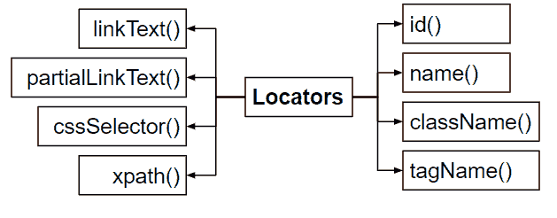

# 使用 Selenium 网络驱动程序查找网页元素

> 原文:[https://www . geesforgeks . org/find-web-elements-use-selenium-web driver/](https://www.geeksforgeeks.org/find-web-elements-using-selenium-webdriver/)

我们可以使用以下两种工具来识别网页中的 web 元素:

1.  **开发者工具**
2.  **萤火虫和火道**

## 开发人员工具–

右键单击网页。导航到 inspect 元素，找到开发人员的工具。

**注意:**有些网站是禁用右键的。例如 IRCTC、银行网站等。要在这些网站上打开开发者工具，请点击“Fn+F12”。

开发人员的工具不是用户友好的，我们不能为它们编写 X 路径和 CSS 选择器。

## FireBug 和 FirePath–

FireBug 是一个附加组件，仅适用于 Firefox 浏览器。它用于识别网页上的网页元素。

Fire path 是 FireBug 的第三方工具，也是一个仅适用于火狐浏览器的插件。通过使用 Fire 路径，我们可以识别网络元素，并且可以编写定制的 X 路径和 CSS 选择器。我们也可以使用这个工具来评估定制的 X 路径。默认情况下，“火路径”会生成一个绝对的“X 路径”。

**注:**

*   使用 FireBug 和 Fire Path 我们可以实现跨浏览器测试。
*   FireBug 和 Fire Path 目前都不支持火狐浏览器版本 quantum，即 57 或更高版本。

**使用萤火虫和火道**的步骤:

I)右键单击网络元素。导航至“消防通道检查”。
ii)如果右键单击被禁用，则通过单击 FireBug 图标打开“火路径”。

**定位符**:定位符用于根据 HTML 标签、属性和 HTML 文本定位网页元素。硒网络驱动程序中有 8 种定位器:

*   **id()** :在网页中搜索网页元素时，此定位器的优先级最高。对于整个网页中的特定 web 元素，它的值总是唯一的，因此当您使用这个定位器时，您不会得到多个匹配。每当 HTML 代码中有 id 属性时，我们就使用这个。
*   **name()** :在任何网页元素的 HTML 代码中，只要有名称属性，我们就使用这个定位器。
*   **className()** :只要 HTML 代码中有类属性，我们就使用这个定位器。
*   **标记名()**:每当有一个网页元素带有唯一的 HTML 标记时，我们就使用这个定位器。
*   **linkText()** :每当有一个链接带有与之相关联的唯一 HTML 文本时，我们就使用这个定位器。
*   **partialLinkText()** :每当网页中有一个链接与一个冗长的文本相关联时，我们使用这个定位器，但是使用链接中的部分 HTML 文本。
*   **cssSelector()** :与 XPath 相比，cssSelector 是一个更快的定位器，使用范围也更广。它比剩下的定位器更复杂，但是最有效，因为在没有某些 html 标签的情况下，我们可以用它来定位 web 元素。
*   **xpath()** :它是一个定位器，用于使用标签、属性和文本来定位 web 元素。我们可以对 HTML 文档和 XML 文档使用 X 路径。XPath 有两种类型，a .绝对 XPath，b .相对 X 路径。

> **绝对和相对 Xpath–**
> 
> **绝对 XPath** :这个 XPath 将 web 元素从根元素定位到所需的子节点。在实时自动化脚本中，我们不应该使用绝对 XPath。
> **注意:**对于动态应用程序，比如 Ajax 应用程序，我们不能使用绝对 XPath。
> 
> **相对 XPath** :是自定义的 XPath，通过使用标签、属性或文本来查找元素。

这些定位器是静态方法，存在于一个名为“by”的抽象类中。在网页上查找和修改网页元素有两种主要方法——

**findElement()** :我们用这个方法来查找网页中的网页元素。它的返回类型是 web 元素是一个接口。这个方法根据定位符来查找网页元素，如果这个方法在网页上找不到网页元素，那么它就会给出 NoSuchElementException。该方法存在于搜索上下文界面中。

**sendKeys()** :我们用这个方法在网页的文本框字段里面输入数据。它采用一个字符序列作为参数，即“字符串”和枚举。它存在于 web 元素界面内部。