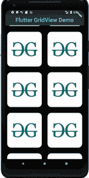

# 颤振–网格视图

> 原文:[https://www.geeksforgeeks.org/flutter-gridview/](https://www.geeksforgeeks.org/flutter-gridview/)

Flutter **GridView** 是一个类似于任何编程语言中的二维数组的小部件。顾名思义，当我们必须在网格上显示一些东西时，就要用到*网格视图*小部件。我们可以在 GridView 上显示图像、文本、图标等。我们可以在 Flutter 中以各种方式实现 GridView:

*   GridView.count()
*   GridView.builder()
*   GridView.custom()
*   GridView.extent()

### **GridView 的构造函数:**

```
GridView(
{Key key,
Axis scrollDirection: Axis.vertical,
bool reverse: false,
ScrollController controller,
bool primary,
ScrollPhysics physics,
bool shrinkWrap: false,
EdgeInsetsGeometry padding,
@required SliverGridDelegate gridDelegate,
bool addAutomaticKeepAlives: true,
bool addRepaintBoundaries: true,
bool addSemanticIndexes: true,
double cacheExtent,
List<Widget> children: const <Widget>[],
int semanticChildCount,
DragStartBehavior dragStartBehavior: DragStartBehavior.start,
Clip clipBehavior: Clip.hardEdge,
ScrollViewKeyboardDismissBehavior keyboardDismissBehavior: ScrollViewKeyboardDismissBehavior.manual,
String restorationId}
)

```

### **GridView . builder 的构造函数:**

```
GridView.builder(
{Key key,
Axis scrollDirection: Axis.vertical,
bool reverse: false,
ScrollController controller,
bool primary,
ScrollPhysics physics,
bool shrinkWrap: false,
EdgeInsetsGeometry padding,
@required SliverGridDelegate gridDelegate,
@required IndexedWidgetBuilder itemBuilder,
int itemCount,
bool addAutomaticKeepAlives: true,
bool addRepaintBoundaries: true,
bool addSemanticIndexes: true,
double cacheExtent,
int semanticChildCount,
DragStartBehavior dragStartBehavior: DragStartBehavior.start,
ScrollViewKeyboardDismissBehavior keyboardDismissBehavior: ScrollViewKeyboardDismissBehavior.manual,
String restorationId,
Clip clipBehavior: Clip.hardEdge}
)

```

### **GridView . count 的构造函数:**

```
GridView.count(
{Key key,
Axis scrollDirection: Axis.vertical,
bool reverse: false,
ScrollController controller,
bool primary,
ScrollPhysics physics,
bool shrinkWrap: false,
EdgeInsetsGeometry padding,
@required int crossAxisCount,
double mainAxisSpacing: 0.0,
double crossAxisSpacing: 0.0,
double childAspectRatio: 1.0,
bool addAutomaticKeepAlives: true,
bool addRepaintBoundaries: true,
bool addSemanticIndexes: true,
double cacheExtent,
List<Widget> children: const <Widget>[],
int semanticChildCount,
DragStartBehavior dragStartBehavior: DragStartBehavior.start,
ScrollViewKeyboardDismissBehavior keyboardDismissBehavior: ScrollViewKeyboardDismissBehavior.manual,
String restorationId,
Clip clipBehavior: Clip.hardEdge}
)

```

### **GridView . custom 的构造函数:**

```
const GridView.custom(
{Key key,
Axis scrollDirection: Axis.vertical,
bool reverse: false,
ScrollController controller,
bool primary,
ScrollPhysics physics,
bool shrinkWrap: false,
EdgeInsetsGeometry padding,
@required SliverGridDelegate gridDelegate,
@required SliverChildDelegate childrenDelegate,
double cacheExtent,
int semanticChildCount,
DragStartBehavior dragStartBehavior: DragStartBehavior.start,
ScrollViewKeyboardDismissBehavior keyboardDismissBehavior: ScrollViewKeyboardDismissBehavior.manual,
String restorationId,
Clip clipBehavior: Clip.hardEdge}
)

```

### **GridView . extent 的构造函数:**

```
GridView.extent(
{Key key,
Axis scrollDirection: Axis.vertical,
bool reverse: false,
ScrollController controller,
bool primary,
ScrollPhysics physics,
bool shrinkWrap: false,
EdgeInsetsGeometry padding,
@required double maxCrossAxisExtent,
double mainAxisSpacing: 0.0,
double crossAxisSpacing: 0.0,
double childAspectRatio: 1.0,
bool addAutomaticKeepAlives: true,
bool addRepaintBoundaries: true,
bool addSemanticIndexes: true,
double cacheExtent,
List<Widget> children: const <Widget>[],
int semanticChildCount,
DragStartBehavior dragStartBehavior: DragStartBehavior.start,
ScrollViewKeyboardDismissBehavior keyboardDismissBehavior: ScrollViewKeyboardDismissBehavior.manual,
String restorationId,
Clip clipBehavior: Clip.hardEdge}
)

```

### **GridView 的属性:**

*   **锚点:**该属性取一个*双*值作为对象来控制零滚动效果。
*   **children delegate:***sliverChildDelegate*是此属性的对象。它提供了一个代表，为*网格视图的孩子们服务。*
*   **剪辑行为:**该属性将*剪辑枚举作为*对象来决定是否剪辑*网格视图*中的内容。
*   **控制器:**该属性将*滚动控制器*类作为对象来控制滚动视图的位置。
*   **draggstartbehavior:**该属性以*draggstartbehavior 枚举*为对象。它控制拖动行为的工作方式。
*   **GridElegate:***sliverGridDelege*类是此属性的对象。它负责在*网格视图*中处理子部件布局的代表。

GridView.count()是一个经常使用的方法，当我们已经知道 Grids 的大小时就会用到它。每当我们需要动态实现 GridView 时，我们都会使用 GridView.builder()。两者就像普通数组和动态数组一样。在 Flutter 中，主要使用两个 GridView。

GridView.count()与一些命名参数一起使用。我们可以在 GridView.count()中使用的属性有:

*   **crossAxisCount:** 定义 GridView 中的列数。
*   **交叉轴配置:**定义沿交叉轴列出的每个子对象之间的像素数。
*   **主轴扫描:**定义沿主轴列出的每个子级之间的像素数。
*   **填充(edgintsgeometry):**它定义了围绕整个小部件列表的空间量。
*   **primary:** 如果为真，则是框架隐式获取的‘滚动控制器’。
*   **scrollDirection:** 定义 GridView 上的项目移动的方向，默认为垂直。
*   **反转:**如果设置为 true，则只是沿主轴反向反转小部件列表。
*   **物理:**它决定了当用户在滚动时到达小部件的末尾或开始时，小部件列表的行为。
*   **shrinkWrap:** 默认情况下，如果它的值为 false，那么可滚动列表在滚动方向上占用的空间与滚动空间一样多，这并不好，因为它占用的内存是内存的浪费，并且应用程序的性能会降低，可能会出现一些错误，因此为了避免滚动时内存泄漏，我们使用 shrinkWrap 包装我们的子小部件，方法是将 shrinkWrap 设置为 true，然后可滚动列表将与其子小部件允许的大小一样大。

## 镖

```
import 'package:flutter/material.dart';

void main() {
  runApp(GeeksForGeeks());
}

class GeeksForGeeks extends StatelessWidget {

  // This widget is the root of your application
  @override
  Widget build(BuildContext context) {
    return MaterialApp(
      home: Scaffold(
        backgroundColor: Colors.black,
        appBar: AppBar(
          backgroundColor: Colors.blueGrey[900],
          title: Center(
            child: Text(
              'Flutter GridView Demo',
              style: TextStyle(
                color: Colors.blueAccent,
                fontWeight: FontWeight.bold,
                fontSize: 30.0,
              ),
            ),
          ),
        ),
        body: GridView.count(
          crossAxisCount: 2,
          crossAxisSpacing: 10.0,
          mainAxisSpacing: 10.0,
          shrinkWrap: true,
          children: List.generate(20, (index) {
              return Padding(
                padding: const EdgeInsets.all(10.0),
                child: Container(
                  decoration: BoxDecoration(
                    image: DecorationImage(
                      image: NetworkImage('img.png'),
                      fit: BoxFit.cover,
                    ),
                    borderRadius:
                    BorderRadius.all(Radius.circular(20.0),),
                  ),
                ),
              );
            },),
        ),
      ),
    );
  }
}
```

**输出:**



Flutter GridView 演示